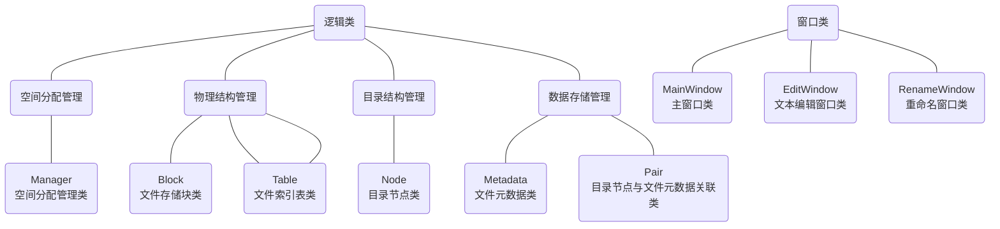

# File Management

[TOC]

## 1 项目介绍

### 1.1 项目简介

**File Management: Virtual file system manager (VFSM)**

**文件管理项目：虚拟文件系统管理器**

本项目是一个虚拟文件系统管理器，目的是为了在一个虚拟环境中创建、管理和存储文件。项目的核心功能包括：

* **内存中的文件存储**：选择一定大小的内存空间来模拟硬盘，用于文件数据的存储。
* **持久性存储**：当文件系统退出时，能够将内存中的数据保存到磁盘文件中，以便在下次启动时可以从磁盘恢复这些数据回内存。
* **文件存储空间管理**：可以使用 FAT 文件系统中的显式链接方式来管理文件的存储空间。
* **空闲空间管理**：可以采用位图（Bitmap）管理空闲空间，这有助于快速查找和更新空闲存储区域。
* **文件目录结构**：设计一个多级目录结构，每个目录项包括文件名、物理地址和文件长度等信息，类似于传统操作系统中的文件目录系统。

这个项目不仅需要对文件的存储和检索有较好的管理，还需处理文件的持久化问题，确保数据的一致性和可恢复性。此外，多级目录结构的设计也是挑战之一，需要考虑如何有效地管理和快速访问这些目录和文件。

### 1.2 项目目的

完成这个虚拟文件系统项目的目的主要集中在以下几个方面：

* **理解文件存储空间的管理**：通过设计和实现文件存储空间管理机制，深入了解文件是如何在存储介质上进行分配和管理的。这包括了解如何使用链接结构或位图来管理文件存储空间的分配和释放。

* **掌握文件的物理结构、目录结构和文件操作**：通过构建文件的物理结构和目录结构，学习文件系统中文件是如何组织的。此外，实现基本的文件操作（如创建、读取、写入、删除文件等）将帮助理解操作系统中文件管理的核心原理。

* **实现简单文件系统管理**：项目从零开始实现一个简单的文件系统，这不仅包括文件的存储和检索，还包括如何将文件系统的状态持久化到磁盘，以及如何在系统启动时恢复这些状态。

* **加深文件系统实现过程的理解**：通过亲手实现一个文件系统，更全面地理解文件系统的设计和运作机制，例如文件的读写流程、空间分配算法、错误处理和数据一致性保障等。

整个项目不仅是一个技术挑战，也是一个学习过程，通过它可以将理论知识转化为实际操作能力，加深对文件系统架构和运作的理解。

### 1.3 项目组成

* `/assets`
存放 `README.md` 文件所需的相关图片资源

* `/code`
项目源代码

  * `/Classes`
  C# 逻辑类

  * `/Icons`
  图标文件

  * `/Windows`
  C# 窗口类

  * `File_Management.csproj`
  C# 项目配置文件

  * `File_Management.csproj.user`
  C# 项目用户配置文件

  * `File_Management.sln`
  解决方案文件

  * `Program.cs`
  应用程序入口文件

* `Demonstration.gif`
项目演示

* `Program.exe`
可执行程序

### 1.4 项目运行

* 双击运行 `Program.exe`

## 2 开发环境

### 2.1 开发环境概述

本项目的开发环境如下：

* 开发环境
  * Windows 11 家庭中文版 23H2
  * Microsoft .NET Core 8.0 SDK
* 开发软件
  * JetBrains Rider 2024.1.2
* 开发语言
  * C#

### 2.2 开发环境搭建

* 安装 [Microsoft .NET Core 8.0 SDK](https://dotnet.microsoft.com/en-us/download/dotnet/8.0)
* 安装 [JetBrains Rider 2024.1.2](https://www.jetbrains.com/rider)

## 3 项目设计

### 3.1 程序主体架构设计

程序的主体架构设计被划分为几个核心部分，每个部分由不同的类负责具体的功能实现。这些类被组织成逻辑类和窗口类两大类别，分别处理后台逻辑和前端用户交互。



#### 3.1.1 逻辑类

逻辑类是文件系统的核心，负责管理文件数据的存储、检索、目录结构和元数据管理。

##### 3.1.1.1 空间分配管理

* **`Manager` 类（空间分配管理类）**：负责整个文件系统的块空间管理。通过维护一个块数组和位图来实现块的分配和释放。此类是系统中空间管理的核心，处理所有与空间分配相关的逻辑，确保数据的物理存储在磁盘或内存块中被有效管理。

##### 3.1.1.2 物理结构管理

* **`Block` 类（文件存储块类）**：代表文件系统中的一个存储块，具有固定容量，主要用于存储文件数据。
* **`Index` 类（文件索引类）**：管理单个文件所占用的多个块的索引，特别是在文件超出单个块大小时，通过索引来跟踪文件内容的位置。
* **`Table` 类（文件索引表类）**：辅助 `Index` 类，用于管理更大文件的多层索引结构，确保大文件的有效存储与访问。

##### 3.1.1.3 目录结构管理

* **`Node` 类（目录节点类）**：表示文件系统中的一个目录节点，可以是文件或文件夹。节点通过树状结构组织，每个节点都可能有子节点，形成完整的目录树。

##### 3.1.1.4 数据存储管理

* **`Metadata` 类（文件元数据类）**：存储关于文件的元数据，如文件名、大小、类型、最后修改时间等。每个文件或目录节点都会关联一个 `Metadata` 实例。
* **`Pair` 类（目录节点与文件元数据关联类）**：将目录节点和其对应的元数据对象关联起来，便于在系统中同时管理文件的逻辑结构和物理属性。

#### 3.1.2 窗口类

窗口类负责用户界面，提供与用户交互的窗口和视图，允许用户进行文件操作如编辑、重命名等。这些类包括：

* **`MainWindow` 类（主窗口类）**：用户界面的入口点，提供文件浏览、文件操作等功能。
* **`EditWindow` 类（文本编辑窗口类）**：允许用户打开和编辑文本文件，同时更新文件的元数据。
* **`RenameWindow` 类（重命名窗口类）**：提供文件或文件夹的重命名功能，处理文件名冲突和更新相关的元数据。

### 3.2 类定义

#### 3.2.1 逻辑类定义

##### 3.2.1.1 `Manager` 类（空间分配管理类）定义

`Manager` 类核心负责整个文件系统中的存储块管理，使用一个位图来追踪哪些块是空闲的，哪些是已占用的。此类方法包括块的分配和释放，确保数据存储的高效性和一致性。该设计允许系统在面对大量文件操作时，快速定位和更新存储状态，是文件系统性能和稳定性的关键。

```csharp
public class Manager
{
    public const int Capacity = 1000000; // 容量
    private Block[] blocks; // 文件存储块
    private bool[] bitMap; // 位图
    private int bitIndex; // 位索引

    // 构造函数
    public Manager() {...}
    // 获取文件存储块
    public Block GetBlock(int idx) {...}
    // 分配文件存储块
    public int AllocateBlock() {...}
    // 移除索引
    public void Remove(int idx) {...}
    // 移除索引表
    public void Remove(List<int> indexList) {...}
    // 写操作
    public Table Write(string data) {...}
}
```

##### 3.2.1.2 `Block` 类（文件存储块类）定义

`Block` 类是文件系统的基本数据单位，每个块具有固定的容量，能够存储文件数据或部分文件数据。它提供基础的读写操作，并能通过内部索引支持连续块的文件存储。这种设计支持了从简单的文本文件到大型数据集的高效处理。

```csharp
public class Block
{
    public const int Capacity = 16; // 容量
    private char[] info = new char[Capacity]; // 信息
    private int length; // 长度
    private Index index = new(); // 索引

    // 写操作
    public void Write(string data) {...}
    // 读操作
    public string Read() {...}
    // 判断索引是否已满
    public bool IsIndexFull() {...}
    // 设置索引
    public bool SetIndex(int idx) {...}
    // 获取索引
    public List<int> GetIndex() {...}
}
```

##### 3.2.1.3 `Index` 类（文件索引类）定义

`Index` 类用于管理文件块的索引信息，是文件系统处理大文件时的关键组件。它能够记录和更新文件数据块的位置，支持快速访问和高效管理。通过维护一个动态的索引列表， `Index` 类确保了文件系统可以灵活地扩展和响应文件大小的变化。

```csharp
public class Index
{
    public List<int> IndexList = []; // 索引列表
    public const int Capacity = 256; // 容量

    // 判断索引列表是否已满
    public bool IsFull() {...}
    // 添加索引
    public bool AddIndex(int idx) {...}
}
```

##### 3.2.1.4 `Table` 类（文件索引表类）定义

`Table` 类是一个更高级的索引管理工具，用于管理大文件的多层索引结构。它可以有效地组织和引用多个数据和索引块，优化了文件访问和存储过程。该类的设计减少了大文件操作的复杂性，提升了系统的整体性能和可扩展性。

```csharp
public class Table(List<int> dataIndexList, List<int> indexIndexList)
{
    public List<int> DataIndexList = dataIndexList; // 数据索引列表
    public List<int> IndexIndexList = indexIndexList; // 索引索引列表
    private const int DataIndexCapacity = 10; // 数据索引列表容量
    private const int IndexIndexCapacity = 3; // 索引索引列表容量

    // 构造函数
    public Table() {...}
    // 判断数据索引列表是否已满
    public bool IsDataListFull() {...}
    // 判断索引索引列表是否已满
    public bool IsIndexListFull() {...}
    // 添加数据索引
    public void AddDataIndex(int idx) {...}
    // 添加索引索引
    public void AddIndexIndex(int idx) {...}
    // 获取数据索引列表
    public List<int> GetDataIndexList() {...}
}
```

##### 3.2.1.5 `Node` 类（目录节点类）定义

`Node` 类代表文件系统中的每一个文件或文件夹，是构建目录树的基本单元。每个节点可以有多个子节点，形成层级结构。 `Node` 类的设计不仅支持文件的逻辑组织，也便于权限管理和快速检索，是用户与文件系统交互的基础。

```csharp
public class Node
{
    public static int counter; // 计数器
    public int FileId; // 文件 ID
    public string FileName = null!; // 文件名
    public string FileType; // 文件类型
    public Node FatherNode; // 文件父节点
    public List<Node> ChildNode; // 文件子节点

    // 构造函数
    public Node() {...}
    // 构造函数
    public Node(string fileName, string fileType) {...}
    // 构造函数
    public Node(string fileName, string fileType, int fileId, Node fatherNode, List<Node> childNode) {...}
    // 添加文件子节点
    public void AddChildNode(Node childNode) {...}
    // 移除文件子节点
    public void RemoveChildNode(Node childNode) {...}
}
```

##### 3.2.1.6 `Metadata` 类（文件元数据类）定义

`Metadata` 类存储文件的详细属性信息，包括文件名、大小、类型、路径和最后修改时间等。这些信息对于文件的管理和维护至关重要，使得文件系统能够提供高效的查询和管理功能，同时支持文件的安全性和完整性检查。

```csharp
public class Metadata
{
    public int FileId; // 文件 ID
    public string FileName; // 文件名
    public string FileSize; // 文件大小
    public string FileType = ""; // 文件类型
    public string FilePath = ""; // 文件路径
    public DateTime ModifiedTime; // 修改时间
    public Table FileIndexTable; // 文件索引表

    // 构造函数
    public Metadata(string fileName, string fileSize) {...}
    // 构造函数
    public Metadata(Node node, string path = "") {...}
    // 构造函数
    public Metadata(int fileId, string fileName, string fileType, string fileSize, string filePath, DateTime modifiedTime, Table fileIndexTable) {...}
}
```

##### 3.2.1.7 `Pair` 类（目录节点与文件元数据关联类）定义

`Pair` 类将目录节点和其对应的文件元数据关联起来，形成一个有机的整体。这种设计简化了文件属性和目录结构之间的同步操作，使得文件管理更为高效和一致，同时降低了数据冗余和错误的风险。

```csharp
public class Pair(Node node, Metadata metadata)
{
    public Node Node = node; // 目录节点
    public Metadata Metadata = metadata; // 文件元数据
}
```

#### 3.2.2 窗口类定义

##### 3.2.2.1 `MainWindow` 类（主窗口类）定义

`MainWindow` 是应用程序的主界面，负责展示文件系统的结构和响应用户的各种文件操作请求。它集成了文件的浏览、创建、编辑、删除和重命名等功能。通过直观的用户界面， `MainWindow` 类使得文件系统的操作简单易懂，同时保持了操作的高效性和准确性。

```csharp
// 主窗口类
public partial class MainWindow : Form
{
    private bool changedFlag; // 修改标记
    private Node rootNode = null!; // 根目录节点
    private Node currentNode = null!; // 当前目录节点
    private Manager manager = null!; // 空间分配管理
    private Dictionary<int, Pair> pairDictionary = null!; // 目录节点与文件元数据关联类字典
    private readonly string currentPath = Directory.GetCurrentDirectory(); // 当前路径
    private Dictionary<int, ListViewItem> listViewItemDirectory = null!; // 文件列表视图项字典
    private TreeNode rootTreeNode = null!;  // 目录树根节点
    private Stack<Node> nodeStack = null!; // 目录节点栈

    // 构造函数
    public MainWindow() {...}
    // 初始化文件视图
    private void InitializeFileView() {...}
    // 初始化文件树视图
    private static void InitializeCreateFileTreeView(TreeNode treeNode, Node node) {...}
    // 更新文件视图
    private void UpdateFileView() {...}
    // 更新文件树视图
    private void UpdateFileTreeView() {...}
    // 更新文件列表视图
    private void UpdateFileListView() {...}
    // 新建操作函数
    private void CreateOperation(string fileType, string ext = "") {...}
    // 打开操作函数
    private void OpenOperation(int fileId) {...}
    // 删除操作函数
    private void DeleteOperation() {...}
    // 重命名操作函数
    private void RenameOperation() {...}
    // 从本地加载虚拟磁盘文件
    private void LoadFromDisk() {...}
    // 保存虚拟磁盘文件至本地
    private void SaveToDisk() {...}
    // 格式化操作函数
    private void ResetOperation() {...}
    // 新建文本文件操作鼠标单击响应函数
    private void CreateTextOperationClick(object sender, EventArgs e) {...}
    // 新建文件夹操作鼠标单击响应函数
    private void CreateFolderOperationClick(object sender, EventArgs e) {...}
    // 打开操作鼠标单击响应函数
    private void OpenOperationClick(object sender, EventArgs e) {...}
    // 删除操作鼠标单击响应函数
    private void DeleteOperationClick(object sender, EventArgs e) {...}
    // 重命名操作鼠标单击响应函数
    private void RenameOperationClick(object sender, EventArgs e) {...}
    // 从本地加载虚拟磁盘文件操作鼠标单击响应函数
    private void LoadOperationClick(object sender, EventArgs e) {...}
    // 保存虚拟磁盘文件至本地操作鼠标单击响应函数
    private void SaveOperationClick(object sender, EventArgs e) {...}
    // 格式化操作鼠标单击响应函数
    private void ResetOperationClick(object sender, EventArgs e) {...}
    // 路径返回按钮鼠标单击响应函数
    private void BackwardButtonClick(object sender, EventArgs e) {...}
    // 路径前进按钮鼠标单击响应函数
    private void ForwardButtonClick(object sender, EventArgs e) {...}
    // 文件列表视图鼠标双击响应函数
    private void FileListViewDoubleClick(object sender, EventArgs e) {...}
    // 主窗口关闭响应函数
    private void MainWindowClose(object sender, FormClosingEventArgs e) {...}
    // 获取文件 ID
    private int GetFileId(ListViewItem item) {...}
    // 检查文件名
    private string CheckFileName(string fileName, string ext = "") {...}
}
```

##### 3.2.2.2 `EditWindow` 类（文本编辑窗口类）定义

`EditWindow` 提供了一个功能丰富的文本编辑界面，用户可以在此修改文本文件的内容。它同步更新文件的元数据，如大小和修改时间，保证文件信息的准确性。此外， `EditWindow` 也处理文件内容的保存和恢复，确保数据的持久性和一致性。

```csharp
public partial class EditWindow : Form
{
    private bool changedFlag; // 修改标记
    private readonly Node node = null!; // 目录节点
    private readonly Metadata fileMetadata = null!; // 文件元数据
    private readonly Dictionary<int, Pair> fileDictionary = null!; // 文件字典
    private readonly Manager manager = null!; // 空间分配管理
    private readonly string fileSize = null!; // 文件大小
    public DelegateMethod.DelegateFunction UpdateCallback = null!; // 更新回调

    // 构造函数
    public EditWindow() {...}
    // 构造函数
    public EditWindow(Node node, Metadata fileMetadata, Dictionary<int, Pair>fileDictionary, Manager manager, string fileSize) {...}
    // 读文本文件
    private void ReadText() {...}
    // 写文本文件
    private void WriteText() {...}
    // 更新文本文件大小
    private void UpdateSize(string sizeBefore, string sizeAfter) {...}
    // 文本内容更改响应函数
    private void TextChange(object sender, EventArgs e) {...}
    // 文本编辑窗口关闭响应函数
    private void EditWindowClose(object sender, FormClosingEventArgs e) {...}
}
```

##### 3.2.2.3 `RenameWindow` 类（重命名窗口类）定义

`RenameWindow` 类处理文件和目录的重命名操作，提供了检查命名冲突和更新文件系统目录结构的功能。通过用户友好的界面，它帮助用户管理文件的组织结构，同时确保文件系统的整洁和有序。

```csharp
public partial class RenameWindow : Form
{
    private readonly Node sourceNode = null!; // 源目录节点
    private readonly Node currentNode = null!; // 当前目录节点
    private readonly Metadata fileMetadata = null!; // 文件元数据
    public DelegateMethod.DelegateFunction UpdateCallback = null!; // 更新回调

    // 构造函数
    public RenameWindow() {...}
    // 构造函数
    public RenameWindow(Node sourceNode, Metadata fileMetadata, Node currentNode) {...}
    // 保存按钮鼠标单击响应函数
    private void SaveButtonClick(object sender, EventArgs e) {...}
    // 取消按钮鼠标单击响应函数
    private void CancelButtonClick(object sender, EventArgs e) {...}
}
```

### 3.3 算法设计

#### 3.3.1 空间分配管理算法设计

在本项目中，空间分配管理算法采用位图技术来管理磁盘空闲块。位图是一种高效的数据结构，它通过一串二进制位来标识每个磁盘块的占用情况，其中1表示块已被占用，0表示块是空闲的。这种方法的优势在于其简单性和低存储需求，允许快速定位到第一个空闲块。

算法步骤：

* **初始化**：在文件系统初始化时，创建一个足够大的位图数组来覆盖所有磁盘块。
* **分配块**：分配文件存储块时，算法扫描位图，找到第一个标记为0的位，并将其设置为1，表示块已被占用。
* **释放块**：当文件被删除或移动时，相关的块在位图中被标记为0，表示它们现在是空闲的。
* **优化**：定期或在低负载期进行碎片整理，优化位图的连续空闲块，以提高未来分配的效率。

#### 3.3.2 物理结构管理算法设计

物理结构管理算法使用索引表来管理文件的物理结构。每个文件都有一个或多个索引表，这些表记录了文件数据存储在磁盘上的位置信息。

算法步骤：

* **单级索引**：为小文件直接在索引表中记录数据块的位置。
* **多级索引**：较大文件使用多级索引，其中一级索引表指向二级索引表，二级索引表再指向实际的数据块。
* **动态扩展**：当文件增长需要更多空间时，动态添加更多索引表项，可能涉及从单级索引升级到多级索引。
* **随机与顺序访问**：支持高效的随机访问和顺序访问，使文件读写操作更为高效。

#### 3.3.3 目录结构管理算法设计

目录结构管理采用树形目录结构，并将文件控制块分为符号目录项和基本目录项，以优化存储效率和访问速度。

算法步骤：

* **树形结构**：所有文件和目录以树形结构组织，每个节点代表一个文件或目录。
* **符号目录项**：存储文件的基础信息，如文件名和文件标识符，用于快速导航和搜索。
* **基本目录项**：存储文件的详细信息，如大小、类型、创建和修改日期、安全属性等。
* **映射**：使用哈希表将符号目录项与基本目录项相关联，以提高查找效率。

#### 3.3.4 数据存储管理算法设计

数据存储管理算法依赖于序列化技术来持久化对象状态，使得程序状态在重新启动后可以被恢复。

算法步骤：

* **序列化**：在程序执行过程中，将对象状态通过序列化转换为一连串的字节序列，并写入到文件中。
* **反序列化**：启动程序时，从文件中读取字节序列，并通过反序列化恢复为原始对象状态。
* **数据一致性**：确保所有写操作在关闭前完成，通过事务日志或检查点技术确保数据一致性和完整性。
* **错误处理**：实现错误检测和处理机制，以应对文件损坏或读写错误，保证系统的稳定运行。

### 3.4 用户交互界面设计

## 4 项目实现

## 5 项目展示


## 6 项目总结

## 7 文档更新日期

2024年6月4日