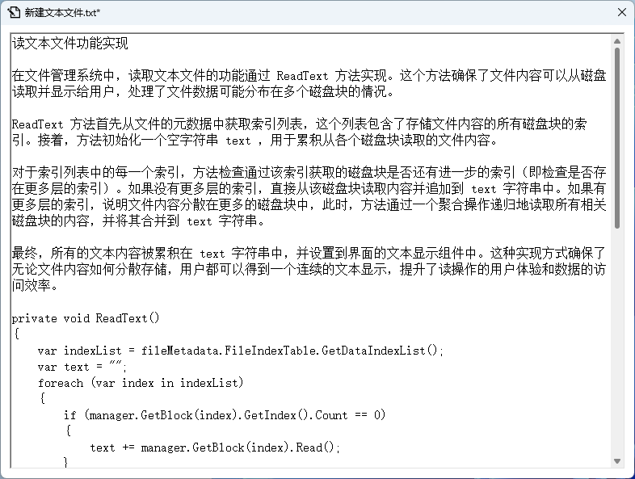

# File Management

## 1 项目介绍

### 1.1 项目简介

**File management: Virtual file system manager (VFSM)**

**文件管理项目：虚拟文件系统管理器**

本项目是一个虚拟文件系统管理器，目的是为了在一个虚拟环境中创建、管理和存储文件。项目的核心功能包括：

* **内存中的文件存储**：选择一定大小的内存空间来模拟硬盘，用于文件数据的存储。
* **持久性存储**：当文件系统退出时，能够将内存中的数据保存到磁盘文件中，以便在下次启动时可以从磁盘恢复这些数据回内存。
* **文件存储空间管理**：可以使用 FAT 文件系统中的显式链接方式来管理文件的存储空间。
* **空闲空间管理**：可以采用位图（Bitmap）管理空闲空间，这有助于快速查找和更新空闲存储区域。
* **文件目录结构**：设计一个多级目录结构，每个目录项包括文件名、物理地址和文件长度等信息，类似于传统操作系统中的文件目录系统。

这个项目不仅需要对文件的存储和检索有较好的管理，还需处理文件的持久化问题，确保数据的一致性和可恢复性。此外，多级目录结构的设计也是挑战之一，需要考虑如何有效地管理和快速访问这些目录和文件。

### 1.2 项目目的

完成这个虚拟文件系统项目的目的主要集中在以下几个方面：

* **理解文件存储空间的管理**：通过设计和实现文件存储空间管理机制，深入了解文件是如何在存储介质上进行分配和管理的。这包括了解如何使用链接结构或位图来管理文件存储空间的分配和释放。

* **掌握文件的物理结构、目录结构和文件操作**：通过构建文件的物理结构和目录结构，学习文件系统中文件是如何组织的。此外，实现基本的文件操作（如创建、读取、写入、删除文件等）将帮助理解操作系统中文件管理的核心原理。

* **实现简单文件系统管理**：项目从零开始实现一个简单的文件系统，这不仅包括文件的存储和检索，还包括如何将文件系统的状态持久化到磁盘，以及如何在系统启动时恢复这些状态。

* **加深文件系统实现过程的理解**：通过亲手实现一个文件系统，更全面地理解文件系统的设计和运作机制，例如文件的读写流程、空间分配算法、错误处理和数据一致性保障等。

整个项目不仅是一个技术挑战，也是一个学习过程，通过它可以将理论知识转化为实际操作能力，加深对文件系统架构和运作的理解。

### 1.3 项目组成

* `/assets`
存放 `README.md` 文件所需的相关图片资源

* `/code`
项目源代码

  * `/Classes`
  C# 逻辑类

  * `/Icons`
  图标文件

  * `/Windows`
  C# 窗口类

  * `File_Management.csproj`
  C# 项目配置文件

  * `File_Management.csproj.user`
  C# 项目用户配置文件

  * `File_Management.sln`
  解决方案文件

  * `Program.cs`
  应用程序入口文件

* `Demonstration.gif`
项目演示

### 1.4 项目运行

#### 1.4.1 直接运行

* 下载 [Release](https://github.com/MinmusLin/Operating_System_Course_Assignments/releases/tag/FileManagement-v1.0) 双击运行 `File_Management.exe`

#### 1.4.2 编译运行

* 安装 [Microsoft .NET Core 8.0 SDK](https://dotnet.microsoft.com/en-us/download/dotnet/8.0)

* 安装 [JetBrains Rider 2024.1.2](https://www.jetbrains.com/rider)

* 通过 JetBrains Rider 打开 `File_Management.sln` 并运行 `File_Management`

## 2 开发环境

### 2.1 开发环境概述

本项目的开发环境如下：

* 开发环境
  * Windows 11 家庭中文版 23H2
  * Microsoft .NET Core 8.0 SDK
* 开发软件
  * JetBrains Rider 2024.1.2
  * Microsoft Visual Studio 2022
* 开发语言
  * C#

### 2.2 开发环境搭建

* 安装 [Microsoft .NET Core 8.0 SDK](https://dotnet.microsoft.com/en-us/download/dotnet/8.0)
* 安装 [JetBrains Rider 2024.1.2](https://www.jetbrains.com/rider)

## 3 项目设计

### 3.1 程序主体架构设计

程序的主体架构设计被划分为几个核心部分，每个部分由不同的类负责具体的功能实现。这些类被组织成逻辑类和窗口类两大类别，分别处理后台逻辑和前端用户交互。


#### 3.1.1 逻辑类

逻辑类是文件系统的核心，负责管理文件数据的存储、检索、目录结构和元数据管理。

##### 3.1.1.1 空间分配管理

* **`Manager` 类（空间分配管理类）**：负责整个文件系统的块空间管理。通过维护一个块数组和位图来实现块的分配和释放。此类是系统中空间管理的核心，处理所有与空间分配相关的逻辑，确保数据的物理存储在磁盘或内存块中被有效管理。

##### 3.1.1.2 物理结构管理

* **`Block` 类（文件存储块类）**：代表文件系统中的一个存储块，具有固定容量，主要用于存储文件数据。
* **`Index` 类（文件索引类）**：管理单个文件所占用的多个块的索引，特别是在文件超出单个块大小时，通过索引来跟踪文件内容的位置。
* **`Table` 类（文件索引表类）**：辅助 `Index` 类，用于管理更大文件的多层索引结构，确保大文件的有效存储与访问。

##### 3.1.1.3 目录结构管理

* **`Node` 类（目录节点类）**：表示文件系统中的一个目录节点，可以是文件或文件夹。节点通过树状结构组织，每个节点都可能有子节点，形成完整的目录树。

##### 3.1.1.4 数据存储管理

* **`Metadata` 类（文件元数据类）**：存储关于文件的元数据，如文件名、大小、类型、最后修改时间等。每个文件或目录节点都会关联一个 `Metadata` 实例。
* **`Pair` 类（目录节点与文件元数据关联类）**：将目录节点和其对应的元数据对象关联起来，便于在系统中同时管理文件的逻辑结构和物理属性。

#### 3.1.2 窗口类

窗口类负责用户界面，提供与用户交互的窗口和视图，允许用户进行文件操作如编辑、重命名等。这些类包括：

* **`MainWindow` 类（主窗口类）**：用户界面的入口点，提供文件浏览、文件操作等功能。
* **`EditWindow` 类（文本编辑窗口类）**：允许用户打开和编辑文本文件，同时更新文件的元数据。
* **`RenameWindow` 类（重命名窗口类）**：提供文件或文件夹的重命名功能，处理文件名冲突和更新相关的元数据。

### 3.2 类设计

#### 3.2.1 逻辑类设计

##### 3.2.1.1 `Manager` 类（空间分配管理类）概述与定义

`Manager` 类核心负责整个文件系统中的存储块管理，使用一个位图来追踪哪些块是空闲的，哪些是已占用的。此类方法包括块的分配和释放，确保数据存储的高效性和一致性。该设计允许系统在面对大量文件操作时，快速定位和更新存储状态，是文件系统性能和稳定性的关键。

```csharp
public class Manager
{
    public const int Capacity = 1000000; // 容量
    private Block[] blocks; // 文件存储块
    private bool[] bitMap; // 位图
    private int bitIndex; // 位索引

    // 构造函数
    public Manager() {...}
    // 获取文件存储块
    public Block GetBlock(int idx) {...}
    // 分配文件存储块
    public int AllocateBlock() {...}
    // 移除索引
    public void Remove(int idx) {...}
    // 移除索引表
    public void Remove(List<int> indexList) {...}
    // 写操作
    public Table Write(string data) {...}
}
```

##### 3.2.1.2 `Block` 类（文件存储块类）概述与定义

`Block` 类是文件系统的基本数据单位，每个块具有固定的容量，能够存储文件数据或部分文件数据。它提供基础的读写操作，并能通过内部索引支持连续块的文件存储。这种设计支持了从简单的文本文件到大型数据集的高效处理。

```csharp
public class Block
{
    public const int Capacity = 16; // 容量
    private char[] info = new char[Capacity]; // 信息
    private int length; // 长度
    private Index index = new(); // 索引

    // 写操作
    public void Write(string data) {...}
    // 读操作
    public string Read() {...}
    // 判断索引是否已满
    public bool IsIndexFull() {...}
    // 设置索引
    public bool SetIndex(int idx) {...}
    // 获取索引
    public List<int> GetIndex() {...}
}
```

##### 3.2.1.3 `Index` 类（文件索引类）概述与定义

`Index` 类用于管理文件块的索引信息，是文件系统处理大文件时的关键组件。它能够记录和更新文件数据块的位置，支持快速访问和高效管理。通过维护一个动态的索引列表， `Index` 类确保了文件系统可以灵活地扩展和响应文件大小的变化。

```csharp
public class Index
{
    public List<int> IndexList = []; // 索引列表
    public const int Capacity = 256; // 容量

    // 判断索引列表是否已满
    public bool IsFull() {...}
    // 添加索引
    public bool AddIndex(int idx) {...}
}
```

##### 3.2.1.4 `Table` 类（文件索引表类）概述与定义

`Table` 类是一个更高级的索引管理工具，用于管理大文件的多层索引结构。它可以有效地组织和引用多个数据和索引块，优化了文件访问和存储过程。该类的设计减少了大文件操作的复杂性，提升了系统的整体性能和可扩展性。

```csharp
public class Table(List<int> dataIndexList, List<int> indexIndexList)
{
    public List<int> DataIndexList = dataIndexList; // 数据索引列表
    public List<int> IndexIndexList = indexIndexList; // 索引索引列表
    private const int DataIndexCapacity = 10; // 数据索引列表容量
    private const int IndexIndexCapacity = 3; // 索引索引列表容量

    // 构造函数
    public Table() {...}
    // 判断数据索引列表是否已满
    public bool IsDataListFull() {...}
    // 判断索引索引列表是否已满
    public bool IsIndexListFull() {...}
    // 添加数据索引
    public void AddDataIndex(int idx) {...}
    // 添加索引索引
    public void AddIndexIndex(int idx) {...}
    // 获取数据索引列表
    public List<int> GetDataIndexList() {...}
}
```

##### 3.2.1.5 `Node` 类（目录节点类）概述与定义

`Node` 类代表文件系统中的每一个文件或文件夹，是构建目录树的基本单元。每个节点可以有多个子节点，形成层级结构。 `Node` 类的设计不仅支持文件的逻辑组织，也便于权限管理和快速检索，是用户与文件系统交互的基础。

```csharp
public class Node
{
    public static int counter; // 计数器
    public int FileId; // 文件 ID
    public string FileName = null!; // 文件名
    public string FileType; // 文件类型
    public Node FatherNode; // 文件父节点
    public List<Node> ChildNode; // 文件子节点

    // 构造函数
    public Node() {...}
    // 构造函数
    public Node(string fileName, string fileType) {...}
    // 构造函数
    public Node(string fileName, string fileType, int fileId, Node fatherNode, List<Node> childNode) {...}
    // 添加文件子节点
    public void AddChildNode(Node childNode) {...}
    // 移除文件子节点
    public void RemoveChildNode(Node childNode) {...}
}
```

##### 3.2.1.6 `Metadata` 类（文件元数据类）概述与定义

`Metadata` 类存储文件的详细属性信息，包括文件名、大小、类型、路径和最后修改时间等。这些信息对于文件的管理和维护至关重要，使得文件系统能够提供高效的查询和管理功能，同时支持文件的安全性和完整性检查。

```csharp
public class Metadata
{
    public int FileId; // 文件 ID
    public string FileName; // 文件名
    public string FileSize; // 文件大小
    public string FileType = ""; // 文件类型
    public string FilePath = ""; // 文件路径
    public DateTime ModifiedTime; // 修改时间
    public Table FileIndexTable; // 文件索引表

    // 构造函数
    public Metadata(string fileName, string fileSize) {...}
    // 构造函数
    public Metadata(Node node, string path = "") {...}
    // 构造函数
    public Metadata(int fileId, string fileName, string fileType, string fileSize, string filePath, DateTime modifiedTime, Table fileIndexTable) {...}
}
```

##### 3.2.1.7 `Pair` 类（目录节点与文件元数据关联类）概述与定义

`Pair` 类将目录节点和其对应的文件元数据关联起来，形成一个有机的整体。这种设计简化了文件属性和目录结构之间的同步操作，使得文件管理更为高效和一致，同时降低了数据冗余和错误的风险。

```csharp
public class Pair(Node node, Metadata metadata)
{
    public Node Node = node; // 目录节点
    public Metadata Metadata = metadata; // 文件元数据
}
```

#### 3.2.2 窗口类设计

##### 3.2.2.1 `MainWindow` 类（主窗口类）概述与定义

`MainWindow` 是应用程序的主界面，负责展示文件系统的结构和响应用户的各种文件操作请求。它集成了文件的浏览、创建、编辑、删除和重命名等功能。通过直观的用户界面， `MainWindow` 类使得文件系统的操作简单易懂，同时保持了操作的高效性和准确性。

```csharp
// 主窗口类
public partial class MainWindow : Form
{
    private bool changedFlag; // 修改标记
    private Node rootNode = null!; // 根目录节点
    private Node currentNode = null!; // 当前目录节点
    private Manager manager = null!; // 空间分配管理
    private Dictionary<int, Pair> pairDictionary = null!; // 目录节点与文件元数据关联类字典
    private readonly string currentPath = Directory.GetCurrentDirectory(); // 当前路径
    private Dictionary<int, ListViewItem> listViewItemDirectory = null!; // 文件列表视图项字典
    private TreeNode rootTreeNode = null!;  // 目录树根节点
    private Stack<Node> nodeStack = null!; // 目录节点栈

    // 构造函数
    public MainWindow() {...}
    // 初始化文件视图
    private void InitializeFileView() {...}
    // 初始化文件树视图
    private static void InitializeCreateFileTreeView(TreeNode treeNode, Node node) {...}
    // 更新文件视图
    private void UpdateFileView() {...}
    // 更新文件树视图
    private void UpdateFileTreeView() {...}
    // 更新文件列表视图
    private void UpdateFileListView() {...}
    // 新建操作函数
    private void CreateOperation(string fileType, string ext = "") {...}
    // 打开操作函数
    private void OpenOperation(int fileId) {...}
    // 删除操作函数
    private void DeleteOperation() {...}
    // 重命名操作函数
    private void RenameOperation() {...}
    // 从本地加载虚拟磁盘文件
    private void LoadFromDisk() {...}
    // 保存虚拟磁盘文件至本地
    private void SaveToDisk() {...}
    // 格式化操作函数
    private void ResetOperation() {...}
    // 新建文本文件操作鼠标单击响应函数
    private void CreateTextOperationClick(object sender, EventArgs e) {...}
    // 新建文件夹操作鼠标单击响应函数
    private void CreateFolderOperationClick(object sender, EventArgs e) {...}
    // 打开操作鼠标单击响应函数
    private void OpenOperationClick(object sender, EventArgs e) {...}
    // 删除操作鼠标单击响应函数
    private void DeleteOperationClick(object sender, EventArgs e) {...}
    // 重命名操作鼠标单击响应函数
    private void RenameOperationClick(object sender, EventArgs e) {...}
    // 从本地加载虚拟磁盘文件操作鼠标单击响应函数
    private void LoadOperationClick(object sender, EventArgs e) {...}
    // 保存虚拟磁盘文件至本地操作鼠标单击响应函数
    private void SaveOperationClick(object sender, EventArgs e) {...}
    // 格式化操作鼠标单击响应函数
    private void ResetOperationClick(object sender, EventArgs e) {...}
    // 路径返回按钮鼠标单击响应函数
    private void BackwardButtonClick(object sender, EventArgs e) {...}
    // 路径前进按钮鼠标单击响应函数
    private void ForwardButtonClick(object sender, EventArgs e) {...}
    // 文件列表视图鼠标双击响应函数
    private void FileListViewDoubleClick(object sender, EventArgs e) {...}
    // 主窗口关闭响应函数
    private void MainWindowClose(object sender, FormClosingEventArgs e) {...}
    // 获取文件 ID
    private int GetFileId(ListViewItem item) {...}
    // 检查文件名
    private string CheckFileName(string fileName, string ext = "") {...}
}
```

##### 3.2.2.2 `EditWindow` 类（文本编辑窗口类）概述与定义

`EditWindow` 提供了一个功能丰富的文本编辑界面，用户可以在此修改文本文件的内容。它同步更新文件的元数据，如大小和修改时间，保证文件信息的准确性。此外， `EditWindow` 也处理文件内容的保存和恢复，确保数据的持久性和一致性。

```csharp
public partial class EditWindow : Form
{
    private bool changedFlag; // 修改标记
    private readonly Node node = null!; // 目录节点
    private readonly Metadata fileMetadata = null!; // 文件元数据
    private readonly Dictionary<int, Pair> fileDictionary = null!; // 文件字典
    private readonly Manager manager = null!; // 空间分配管理
    private readonly string fileSize = null!; // 文件大小
    public DelegateMethod.DelegateFunction UpdateCallback = null!; // 更新回调

    // 构造函数
    public EditWindow() {...}
    // 构造函数
    public EditWindow(Node node, Metadata fileMetadata, Dictionary<int, Pair>fileDictionary, Manager manager, string fileSize) {...}
    // 读文本文件
    private void ReadText() {...}
    // 写文本文件
    private void WriteText() {...}
    // 更新文本文件大小
    private void UpdateSize(string sizeBefore, string sizeAfter) {...}
    // 文本内容更改响应函数
    private void TextChange(object sender, EventArgs e) {...}
    // 文本编辑窗口关闭响应函数
    private void EditWindowClose(object sender, FormClosingEventArgs e) {...}
}
```

##### 3.2.2.3 `RenameWindow` 类（重命名窗口类）概述与定义

`RenameWindow` 类处理文件和目录的重命名操作，提供了检查命名冲突和更新文件系统目录结构的功能。通过用户友好的界面，它帮助用户管理文件的组织结构，同时确保文件系统的整洁和有序。

```csharp
public partial class RenameWindow : Form
{
    private readonly Node sourceNode = null!; // 源目录节点
    private readonly Node currentNode = null!; // 当前目录节点
    private readonly Metadata fileMetadata = null!; // 文件元数据
    public DelegateMethod.DelegateFunction UpdateCallback = null!; // 更新回调

    // 构造函数
    public RenameWindow() {...}
    // 构造函数
    public RenameWindow(Node sourceNode, Metadata fileMetadata, Node currentNode) {...}
    // 保存按钮鼠标单击响应函数
    private void SaveButtonClick(object sender, EventArgs e) {...}
    // 取消按钮鼠标单击响应函数
    private void CancelButtonClick(object sender, EventArgs e) {...}
}
```

### 3.3 算法设计

#### 3.3.1 空间分配管理算法设计

在本项目中，空间分配管理算法采用位图技术来管理磁盘空闲块。位图是一种高效的数据结构，它通过一串二进制位来标识每个磁盘块的占用情况，其中1表示块已被占用，0表示块是空闲的。这种方法的优势在于其简单性和低存储需求，允许快速定位到第一个空闲块。

算法步骤：

* **初始化**：在文件系统初始化时，创建一个足够大的位图数组来覆盖所有磁盘块。
* **分配块**：分配文件存储块时，算法扫描位图，找到第一个标记为0的位，并将其设置为1，表示块已被占用。
* **释放块**：当文件被删除或移动时，相关的块在位图中被标记为0，表示它们现在是空闲的。
* **优化**：定期或在低负载期进行碎片整理，优化位图的连续空闲块，以提高未来分配的效率。

#### 3.3.2 物理结构管理算法设计

物理结构管理算法使用索引表来管理文件的物理结构。每个文件都有一个或多个索引表，这些表记录了文件数据存储在磁盘上的位置信息。

算法步骤：

* **单级索引**：为小文件直接在索引表中记录数据块的位置。
* **多级索引**：较大文件使用多级索引，其中一级索引表指向二级索引表，二级索引表再指向实际的数据块。
* **动态扩展**：当文件增长需要更多空间时，动态添加更多索引表项，可能涉及从单级索引升级到多级索引。
* **随机与顺序访问**：支持高效的随机访问和顺序访问，使文件读写操作更为高效。

#### 3.3.3 目录结构管理算法设计

目录结构管理采用树形目录结构，并将文件控制块分为符号目录项和基本目录项，以优化存储效率和访问速度。

算法步骤：

* **树形结构**：所有文件和目录以树形结构组织，每个节点代表一个文件或目录。
* **符号目录项**：存储文件的基础信息，如文件名和文件标识符，用于快速导航和搜索。
* **基本目录项**：存储文件的详细信息，如大小、类型、创建和修改日期、安全属性等。
* **映射**：使用哈希表将符号目录项与基本目录项相关联，以提高查找效率。

#### 3.3.4 数据存储管理算法设计

数据存储管理算法依赖于序列化技术来持久化对象状态，使得程序状态在重新启动后可以被恢复。

算法步骤：

* **序列化**：在程序执行过程中，将对象状态通过序列化转换为一连串的字节序列，并写入到文件中。
* **反序列化**：启动程序时，从文件中读取字节序列，并通过反序列化恢复为原始对象状态。
* **数据一致性**：确保所有写操作在关闭前完成，通过事务日志或检查点技术确保数据一致性和完整性。
* **错误处理**：实现错误检测和处理机制，以应对文件损坏或读写错误，保证系统的稳定运行。

### 3.4 用户交互界面设计

#### 3.4.1 主窗口界面设计

主窗口界面设计是为了提供一个直观和功能全面的用户体验，使用户能够轻松管理和操作文件系统中的文件和目录。以下是主窗口的各个组成部分及其功能的详细介绍：

* **菜单栏**：菜单栏通常位于窗口的最上方，提供了各种操作的入口，如新建文件、打开文件、保存更改、退出程序等。这些操作通常通过下拉菜单进行组织，允许用户快速访问常用功能。
* **路径返回按钮**：允许用户返回到之前浏览的目录。这类似于浏览器中的后退按钮，帮助用户导航到先前查看的文件夹。
* **路径前进按钮**：与路径返回按钮相对，允许用户前进到之前已后退过的目录。这提供了一种便捷的方式来回到刚刚访问过的路径。
* **当前路径条**：当前路径条显示了用户当前所在的文件系统位置。这通常以面包屑的形式展示，让用户清楚地知道自己所处的目录层级，并能快速返回到任一上级目录。
* **文件树视图**：文件树视图在界面的左侧，提供了一个树形结构来展示整个文件系统的目录结构。用户可以通过展开和折叠树节点来浏览不同的文件夹和子文件夹，这种视图使得目录间的导航变得直观易懂。
* **文件列表视图**：文件列表视图位于窗口的右侧，显示当前选中目录中的所有文件和子目录的详细列表。这个视图通常显示文件或目录的图标、名称、修改日期、文件类型及大小等信息。用户可以通过这个视图来打开、编辑、删除或重命名文件和目录。
* **界面布局**：这种布局设计提供了清晰的视觉分隔，使用户能够轻松区分和操作文件树视图和文件列表视图。整个界面设计考虑了用户的操作习惯，使得文件管理任务更加直观和高效。通过集成这些视图和工具，主窗口旨在提高用户的工作效率，同时保持操作的直观性。


#### 3.4.2 菜单项下拉菜单和鼠标右键菜单设计

本文件管理系统中的菜单设计包括文件菜单、操作菜单和文件列表视图的右键菜单，每个菜单项都通过精心设计的图标、提示和快捷键为用户提供了快速且直观的操作方式。下面详细介绍这些菜单的设计要素：

1. 文件菜单项下拉菜单
   * **图标**：各个功能都配有直观的图标，如打开文件夹使用文件夹图标，保存使用磁盘图标，刷新使用刷新图标，这些图标与功能直接相关，便于用户识别。
   * **提示**：每个菜单项旁边都有相应的文字提示，简洁明了地描述了该功能的作用，例如“保存”、“刷新”等。
   * **快捷键**：提供了便捷的键盘快捷方式，如 Ctrl+L 用于加载，Ctrl+S 用于保存，Ctrl+R 用于刷新，使得用户可以快速访问这些常用功能而不需要通过鼠标点击。


2. 操作菜单项下拉菜单
   * **图标**：操作菜单中的每个选项也有与其功能匹配的图标，如“新建”图标表示创建新文件或文件夹，“打开”图标用于打开文件或文件夹，“删除”和“重命名”分别使用垃圾桶和笔的图标。
   * **提示**：类似文件菜单，操作菜单每项旁边都有清晰的文字提示，指导用户该菜单项的功能。
   * **快捷键**：为了加速操作，如新建文件夹（Ctrl+Shift+N）、新建文件（Ctrl+N），每个操作都设有快捷键，使得用户在不使用鼠标的情况下也能快速执行操作。


3. 文件列表视图鼠标右键菜单
   * **图标**：右键菜单同样包括图标，每个图标都直观地反映了对应操作的性质，例如文件夹图标用于新建文件夹，文件图标用于新建文件。
   * **提示**：右键菜单项包括完整的操作描述，帮助用户理解每个选项的具体作用。
   * **快捷键**：右键菜单同样包括快捷键支持，例如使用 Ctrl+Shift+O 快速打开选中的文件或文件夹，这为熟练用户提供了更快的操作方式。


在本文件管理系统中，文件列表视图的鼠标右键菜单提供了一个灵活的界面，支持对单个或多个选定的文件和文件夹进行各种操作。这包括了新建、打开、删除以及重命名等功能。无论用户是选中单个文本文件、单个文件夹、多个文本文件、多个文件夹，还是混合选中多个文本文件和文件夹，该菜单都能提供相应的批量操作选项，使得管理和组织文件更加高效。

我们考虑了如下用户体验设计：

* **右键菜单的响应**：右键菜单响应快速，即使在大量文件和文件夹被选中时也能迅速加载。
* **视觉反馈**：选中的文件或文件夹在进行操作前会有明显的视觉反馈，如高亮显示，确保用户清楚哪些项目将被操作。
* **错误处理**：在执行操作如删除时，系统提供撤销选项或确认对话框，防止误操作导致数据丢失。


#### 3.4.3 文本编辑窗口界面设计

文本编辑窗口界面提供了一个简洁且功能完备的环境，用于编辑文本文件。以下是文本编辑窗口界面设计：

* **编辑区域**：窗口的主体是一个大的文本编辑区，提供足够的空间让用户编写或修改内容。编辑区域设计为白底黑字，字体清晰，对视力友好，适合长时间编辑工作。
* **滚动条**：编辑区配备了垂直滚动条，允许用户轻松浏览长文本文件。当文本内容超出当前视窗大小时，滚动条自动出现。
* **文本操作**：尽管界面保持简洁，用户依然可以进行基本的文本操作，如剪切、复制、粘贴和撤销。这些功能可以通过键盘快捷键操作，增强了编辑效率。
* **标题栏显示文件名**：窗口的标题栏清晰地显示了当前正在编辑的文本文件的文件名，使用户能够轻松识别自己正在工作的文档。
* **修改状态指示**：如果文本内容自上次保存后被修改，窗口标题栏会添加一个星号（*）作为修改指示。这个简单的视觉提示帮助用户快速识别文件是否已更改，从而防止未保存的修改丢失。
* **即时反馈**：任何更改都会立即在编辑区域显示，确保用户的输入得到快速响应。
* **简化的界面**：避免过多的菜单和工具栏，专注于编辑体验，减少用户操作的学习曲线。


#### 3.4.4 重命名窗口界面设计

重命名窗口提供了一个简洁且直观的用户界面，允许用户快速更改文件或文件夹的名称。以下是重命名窗口界面设计：

* **标题栏**：窗口的标题栏明确显示“重命名”，让用户一眼就能识别当前窗口的功能。
* **文本输入框**：提供了一个文本框，用户可以在其中输入新的文件名。默认情况下，文本框中会预填充当前的文件名，并全选状态，便于用户直接修改。
* **保存按钮（保存(S)）**：点击此按钮将应用新的文件名，并关闭窗口。按钮旁边的括号中的“S”表明用户可以通过按键盘上的“S”键触发此按钮。
* **取消按钮（取消(C)）**：允许用户取消操作并关闭窗口。按钮旁边的括号中的“C”表明可以通过按键盘上的“C”键来触发此按钮。
* **简洁性**：界面去除了所有不必要的元素，专注于重命名功能，确保用户不会感到操作上的混乱。
* **快捷操作**：提供键盘快捷键支持，允许熟练用户更快速地完成操作，提高效率。
* **用户友好**：对话框大小适中，不会覆盖过多的背景信息，确保用户可以在重命名的同时，还能略见其他文件的上下文信息。


#### 3.4.5 提示窗口界面设计

提示窗口（ `MessageBox` ）是一种基本的用户界面元素，用来向用户显示重要的信息或要求用户做出决策。这些提示窗口的设计和使用提高了用户与系统交互的直观性和效率。

在本文件管理系统中，提示窗口（ `MessageBox` ）的实现如下：

```csharp
MessageBox.Show(@"删除操作失败：请选中一个文件或文件夹", @"提示");
MessageBox.Show(@"重命名操作失败：请选中一个文件或文件夹", @"提示");
MessageBox.Show(@"从本地加载虚拟磁盘文件成功", @"提示");
MessageBox.Show(@"保存虚拟磁盘文件至本地：" + currentPath, @"提示");
MessageBox.Show(@"打开操作失败：请选中一个文件或文件夹", @"提示");
MessageBox.Show(@"从本地加载虚拟磁盘文件失败", @"提示");
MessageBox.Show(@"是否保存虚拟磁盘文件至本地？", @"提示", MessageBoxButtons.YesNo)
MessageBox.Show(@"获取文件 ID 失败：未找到该文件或文件夹", @"提示");
MessageBox.Show(@"是否保存文本文件？", @"提示", MessageBoxButtons.YesNo)
```

提示窗口界面设计如下：

* **标题**：每个提示窗口都有一个明确的标题（如“提示”），它简洁地概括了消息的内容或目的，使用户能够快速了解弹窗的上下文。
* **消息内容**：消息内容清楚、精炼，直接告诉用户所面临的情况或问题。例如，当用户未选中文件或文件夹时尝试执行操作，将显示如“删除操作失败：请选中一个文件或文件夹”的消息。
* **按钮**：根据消息的性质，提示窗口可能包括不同的按钮组合。简单的信息确认可能只有一个“确定”按钮，而需要用户决策的情况则可能提供“是”和“否”选项。
* **操作反馈**：通知用户某个操作的结果（成功或失败）。例如，“从本地加载虚拟磁盘文件成功”或“删除操作失败：请选中一个文件或文件夹”。
* **错误警告**：当操作不能继续或输入无效时，提供明确的错误信息，如“获取文件 ID 失败：未找到该文件或文件夹”。
* **确认请求**：在执行可能影响系统状态或数据的操作前，要求用户确认。例如，“是否保存虚拟磁盘文件至本地？”或“是否保存文本文件？”，这类提示通常伴有“是”和“否”按钮，让用户做出决策。


#### 3.4.6 图标设计

图标设计是用户界面中非常关键的一个元素，它直接影响到用户的操作体验和界面的直观性。在你的文件管理系统中，图标的设计旨在提供清晰、一致且直观的视觉提示，帮助用户快速识别各种操作。


设计原则：

* **一致性**：所有图标在风格、色彩和形状上保持一致，以确保界面的整体协调性。
* **简洁性**：图标设计尽量简洁，避免复杂的细节，确保即使在小尺寸下也能清晰识别。
* **直观性**：每个图标的设计都紧密与其功能相关，使得用户能够不经过文字说明就能理解其意义。
* **可识别性**：图标应与其代表的功能直观相关，如垃圾桶图标用于删除操作，文件夹图标用于表示文件夹。

## 4 项目实现

### 4.1 类实现

#### 4.1.1 逻辑类实现

##### 4.1.1.1 `Manager` 类（空间分配管理类）实现

`Manager` 类扮演了空间分配管理的核心角色，确保了存储块的有效分配与管理。这个类使用一个位图和一个存储块数组来跟踪和控制文件系统中每个存储块的使用情况。通过位图，系统能快速检查哪些块是空闲的，从而实现高效的空间分配。

`Manager` 类的构造函数初始化一个指定容量的存储块数组和位图。每个位在位图中初始设置为 `true` ，表示对应的存储块是空闲的。在分配存储块时， `Manager` 类通过位图找到第一个可用的空闲块，将其设置为占用，并更新位图和存储块数组的状态。这种方法使得存储块的分配和释放操作非常高效。

释放存储块时， `Manager` 类将对应的位图位置重新标记为 `true` ，表示该块再次变为空闲。同时，如果存储块包含更多级别的索引，这些索引也会被递归地释放，确保所有相关资源都被正确回收。

写操作是 `Manager` 类的另一个关键功能，它支持将数据写入多个存储块。如果单个块无法容纳全部数据，该类将数据分割，分别存储到多个块中，并通过索引表管理这些块的地址。这样的设计不仅优化了数据的存储效率，还提高了读取速度，因为即使是大文件，系统也可以快速定位到任何部分的数据。

通过这样的实现， `Manager` 类确保了文件系统的稳定性和高效性，使其能够支持复杂的文件操作和大量的数据管理需求。

##### 4.1.1.2 `Block` 类（文件存储块类）实现

`Block` 类定义了一个字符数组 `info` 来存储实际的数据，其大小由 `Capacity` 常量定义，此例中为16字符。这个容量限制确保了 `Block` 的存储始终在可控范围内，便于管理。除了数据存储， `Block` 还维护一个 `Index` 对象，用于管理数据的索引，这对于实现文件数据的连续块存储极为关键。

写操作由 `Write` 方法实现，该方法接受一个字符串 `data` 作为输入，并将其内容存储到 `info` 数组中。如果输入数据长度超过了 `Block` 的容量，只有前 `Capacity` 个字符会被存储，余下的字符将被忽略。这一设计简化了存储操作，但也要求上层管理系统处理数据溢出的情况。

读操作由 `Read` 方法实现，它返回一个新的字符串，内容为 `info` 数组中存储的数据。这使得从 `Block` 中检索信息变得直接且高效。

##### 4.1.1.3 `Index` 类（文件索引类）实现

`Index` 类的主要职责是维护一个索引列表，该列表用于记录文件数据块的位置。索引列表以整数形式存储数据块的索引，每个索引代表文件系统中的一个特定块。为了保证性能和管理的可行性，这个类限制了索引列表的最大容量，常量 `Capacity` 定义为256，意味着每个 `Index` 实例最多可以管理256个数据块的索引。

`Index` 类提供了 `IsFull` 方法来检查索引列表是否达到其容量上限。这一功能对于防止索引列表溢出非常重要，确保了数据的安全性和索引的准确性。

`AddIndex` 方法用于向索引列表中添加新的索引。如果索引列表未满，该方法将新索引添加到列表并返回 `true` ；如果已满，则返回 `false` 。这样的设计使得数据块的索引管理既灵活又高效。

`Index` 类的设计允许文件系统轻松管理大型文件中的数据块分布，尤其是在需要分配或释放数据块时。它不仅提供了必要的功能来跟踪和更新文件数据块的位置，还通过高效的索引管理支持了文件系统的扩展性和响应能力。

##### 4.1.1.4 `Table` 类（文件索引表类）实现

`Table` 类设计用来管理大文件的多层索引结构。它维护两个主要的列表： `DataIndexList` 和 `IndexIndexList` 。 `DataIndexList` 用于存储指向实际数据块的索引，而 `IndexIndexList` 用于存储指向其他索引列表的索引，这支持了更复杂的文件结构，如多级索引系统。这种设计允许 `Table` 类有效管理大量的数据，支持大文件的动态扩展和灵活访问。

`Table` 类提供了一个构造函数，它接受两个列表参数以初始化数据索引和索引索引列表。当无参数提供时，构造函数会创建具有默认容量的列表。

`Table` 类提供了 `IsDataListFull` 和 `IsIndexListFull` 方法，用于检查数据索引列表和索引索引列表是否已达到其容量上限。这保证了索引管理的稳定性和数据安全。

通过 `AddDataIndex` 和 `AddIndexIndex` 方法， `Table` 允许动态地添加新的数据索引和索引索引。这些方法支持在运行时根据需要扩展文件的索引结构。

`Table` 类的设计考虑到了系统集成和性能优化的需求。通过将数据索引和索引索引分开管理， `Table` 类提高了文件访问的灵活性和效率。此外，对于非常大的文件，该设计减少了单个列表的长度，优化了搜索和更新操作的性能。

##### 4.1.1.5 `Node` 类（目录节点类）实现

`Node` 类在设计上包含了几个核心属性： `FileId` 、 `FileName` 、 `FileType` 、 `FatherNode` （父节点）和 `ChildNode` （子节点列表）。 `FileId` 是一个唯一标识符，用于区分文件系统中的每个节点。 `FileName` 和 `FileType` 分别存储文件或文件夹的名称和类型。通过 `FatherNode` 和 `ChildNode` 的属性， `Node` 类实现了一个层级的目录结构，其中每个节点都可以链接到其父节点和多个子节点。

`Node` 类提供了几种构造函数，以适应不同的初始化场景。基础构造函数用于创建默认类型的节点，通常是文件夹；而其他重载版本允许在创建节点时指定文件名、文件类型，甚至包括父节点和子节点列表，使得节点的创建更为灵活和精确。

`Node` 类提供 `AddChildNode` 和 `RemoveChildNode` 方法，允许动态地向节点添加或从节点移除子节点。这些操作更新节点的子节点列表，并适当调整父子关系，保证目录结构的一致性和准确性。

`Node` 类的设计充分考虑了系统集成和性能优化的需求。层级的目录结构使得文件的浏览和访问更为高效，尤其是在处理大型复杂的文件系统时。此外，节点间的父子关系管理通过引用而非复制实现，优化了内存使用和性能。

##### 4.1.1.6 `Metadata` 类（文件元数据类）实现

在文件管理系统中， `Metadata` 类承担了存储和管理文件元数据的重要角色。此类详细记录了文件的基本属性，如文件名、大小、类型、路径及最后修改时间等。通过提供这些详细的信息， `Metadata` 类极大地增强了文件系统的查询效率和文件管理的能力，同时也支持了文件的安全性和完整性检查。

`Metadata` 类设计为具有广泛的属性，以存储关于文件的各种必要信息，并提供了几个构造函数以适应不同的初始化场景。

在系统集成方面， `Metadata` 类通过其详细的属性和方法，为文件系统提供了强大的后端支持，使得文件的搜索、访问和管理更加高效。例如，通过 `FileIndexTable` 的使用，大型文件可以被有效地分割和索引，支持快速定位和访问文件的特定部分。

##### 4.1.1.7 `Pair` 类（目录节点与文件元数据关联类）实现

在文件管理系统中， `Pair` 类扮演着关键的角色，将目录节点与其对应的文件元数据关联起来，从而形成一个统一的数据结构。这种设计极大地简化了文件属性和目录结构之间的同步操作，提升了文件管理的效率和一致性，同时降低了数据冗余和错误的风险。

`Pair` 类的主要功能是维护目录节点（ `Node` ）和文件元数据（ `Metadata` ）之间的关系。每个 `Pair` 实例都包含一个 `Node` 对象和一个 `Metadata` 对象，这两个对象在文件系统中互为补充。

在文件系统的实际应用中， `Pair` 类作为连接文件结构和文件元数据的桥梁，确保了操作的高效执行。例如，在执行文件搜索、备份或恢复等操作时， `Pair` 类提供的信息可以直接用来校验数据完整性，更新文件属性，或同步文件状态。

#### 4.1.2 窗口类实现

##### 4.1.2.1 `MainWindow` 类（主窗口类）实现

`MainWindow` 类作为应用程序的主界面，在文件管理系统中具有至关重要的作用，它不仅展示文件系统的结构，还负责响应用户的各种文件操作请求，如浏览、创建、编辑、删除和重命名文件。该类通过一个直观的用户界面，使文件系统的操作简单易懂，同时确保了操作的高效性和准确性。

在实现方面， `MainWindow` 类整合了多种功能和视图，提供了一个全面的交互环境。它包括文件树视图和文件列表视图，这两个视图分别显示了文件系统的层次结构和当前选中目录的内容。通过这些视图，用户可以直观地看到文件和文件夹的组织，并进行相应的操作。

此外， `MainWindow` 类实现了一个动态的导航系统，包括前进和后退按钮，允许用户在文件系统的不同部分之间灵活导航。同时，类中还集成了对文件操作的直接支持，如打开、保存、删除和重命名文件，这些操作都通过图形用户界面中的按钮和菜单项直接访问。

`MainWindow` 的构造函数中初始化了所有必要的组件和视图，设置了窗口的基本属性，并通过一系列的方法调用来构建起初始的文件视图和目录结构。这些方法包括初始化文件树视图、更新文件列表和处理各种用户操作（如文件创建和删除等）。此外，该窗口类还处理了一些高级功能，如从磁盘加载和保存文件，以及在关闭窗口时提示用户保存未保存的更改。

##### 4.1.2.2 `EditWindow` 类（文本编辑窗口类）实现

`EditWindow` 类在文件管理系统中提供了一个功能丰富的文本编辑界面，使用户能够修改文本文件的内容。此类不仅支持基本的文本编辑功能，还同步更新与文件相关的元数据，如大小和修改时间，确保了文件信息的准确性。此外， `EditWindow` 类还负责处理文件内容的保存和恢复，确保数据的持久性和一致性。

`EditWindow` 类的构造函数接收多个参数，包括代表文件的节点（ `Node` ），文件的元数据（ `Metadata` ），以及其他支持数据结构，如文件字典和空间分配管理器（ `Manager` ）。这些参数共同工作，为编辑操作提供必要的上下文信息和支持。在窗口初始化时，它会从文件元数据中读取并显示文件内容，并设置窗口标题为当前文件名。

##### 4.1.2.3 `RenameWindow` 类（重命名窗口类）实现

在文件管理系统中， `RenameWindow` 类提供了重命名文件和目录的关键功能，帮助用户管理文件的组织结构，同时确保文件系统的整洁和有序。该类通过一个用户友好的界面，使用户能够轻松地更新文件或目录的名称，同时检查潜在的命名冲突，并更新文件系统的目录结构。

`RenameWindow` 类集成了多个关键功能，旨在提供一个全面的重命名解决方案。通过实例化时传递的 `sourceNode` （源目录节点）、 `fileMetadata` （文件元数据），以及 `currentNode` （当前目录节点），类可以精确地定位需要重命名的文件，并根据上下文环境处理重命名逻辑。

界面上， `RenameWindow` 提供了一个文本输入框供用户输入新的文件名，并通过按钮操作提交新名称或取消操作。在用户提交新名称时，类中的 `SaveButtonClick` 方法被触发，该方法首先检查当前目录下是否存在同名文件或目录，避免命名冲突。如果存在同名项，系统自动为文件名添加编号，如(1)，(2)等，以区分不同的文件。

具体到命名冲突的处理， `RenameWindow` 使用正则表达式匹配和比较现有文件名，确保新命名不与现有文件或目录名重复。如果发现重复，系统通过递增编号的方式自动调整新文件名，直到找到一个唯一的文件名为止。这种自动化处理极大地简化了用户操作，并防止了因命名冲突可能导致的错误。

完成命名后， `RenameWindow` 更新相关的 `fileMetadata` 和 `sourceNode` 以反映新的文件名，并记录最后修改时间。类中还绑定了一个 `UpdateCallback` ，这是一个委托方法，用于更新整个文件系统视图，确保界面上显示的信息与系统的实际数据保持一致。

### 4.2 算法实现

#### 4.2.1 空间分配管理算法实现

在文件管理系统中，空间分配管理的实现采用位图技术，这是一种通过二进制位来表示磁盘块占用状态的简单而高效的数据结构。在这种方案中，每个位代表一个磁盘块的状态，其中1表示块已被占用，而0表示块是空闲的。利用位图，系统可以迅速定位到第一个空闲块，从而有效地分配存储空间。位图的优势在于其操作的高速性和对存储空间的低需求，特别适用于快速访问和管理大量的磁盘块。尽管位图在处理大型磁盘时可能导致较大的内存消耗，系统设计了机制以优化性能和存储效率。

#### 4.2.2 物理结构管理算法实现

物理结构管理在文件管理系统中通过索引表实现，每个文件通过其索引表来定位存储在磁盘上的数据块。这些索引表可能直接指向数据块或进一步指向其他索引块，形成一个多级索引结构。这种方法支持大文件的有效管理，因为它允许文件动态地扩展其占用的物理空间，并支持随机和顺序访问数据。通过使用索引表，文件系统能够提高磁盘利用率，并支持文件大小的动态更改。

#### 4.2.3 目录结构管理算法实现

目录结构管理采用树形结构来组织文件和目录，每个节点在树中代表一个文件或目录。为了提高效率和减少存储空间的占用，目录项被分为符号目录项和基本目录项。符号目录项存储关键信息如文件名和文件标识，而基本目录项包含文件的详细属性如修改时间和地址。通过这种分离，文件系统可以快速地进行文件搜索，同时减少了因频繁访问大量详细信息所需的I/O操作。

#### 4.2.4 数据存储管理算法实现

数据存储管理算法依赖于C#的序列化技术来持久化程序中的对象状态。通过序列化，文件系统可以将对象状态保存到二进制文件中，在程序重新启动时通过反序列化恢复这些对象。这种方法不仅确保了程序状态的持久性，也支持了数据的一致性和完整性。此外，序列化支持复杂对象结构的存储和恢复，是现代文件管理系统中数据持久化的关键技术。

### 4.3 功能实现

#### 4.3.1 文件树视图功能实现

在文件管理系统中，文件树视图功能的实现是通过两个关键的方法完成的： `InitializeCreateFileTreeView` 和 `UpdateFileTreeView` 。这两个方法共同工作，以动态地构建和更新文件树视图，提供一个直观的界面，使用户能够看到文件系统的层级结构。

`InitializeCreateFileTreeView` 方法是一个递归函数，它负责根据文件系统的目录节点（ `Node` 类的实例）构建树节点（ `TreeNode` 类的实例）。在这个过程中，每个目录节点被检查其子节点，为每个子节点创建一个新的树节点，并根据文件类型设置相应的图标。如果子节点是文本文件，就设置特定的图标以区分它们。这个方法递归地为每个子节点执行相同的操作，直到所有的子节点都被添加到树中，从而形成完整的树状结构。

`UpdateFileTreeView` 方法用于初始化或更新文件树视图的整体结构。它首先清空现有的树视图，然后创建一个表示根目录的新的树节点，并使用 `InitializeCreateFileTreeView` 方法填充这个根节点的所有子节点。最后，它将根节点添加到树视图中，并展开所有节点以便用户可以看到完整的文件目录结构。

这种设计使得文件树视图不仅可以在应用启动时初始化，还可以在文件系统更新（如添加、删除文件或目录）后刷新视图。通过提供这样一个动态更新的文件树视图，系统极大地增强了用户界面的互动性和用户的操作体验，使得用户可以直观地浏览和管理文件和目录。

```csharp
private static void InitializeCreateFileTreeView(TreeNode treeNode, Node node)
{
    foreach (var child in node.ChildNode)
    {
        var childNode = new TreeNode(child.FileName);
        if (child.FileType == "文本文件")
        {
            childNode.ImageIndex = 1;
            childNode.SelectedImageIndex = 1;
        }

        InitializeCreateFileTreeView(childNode, child);
        treeNode.Nodes.Add(childNode);
    }
}

private void UpdateFileTreeView()
{
    FileTreeView.Nodes.Clear();
    rootTreeNode = new TreeNode("根目录");
    InitializeCreateFileTreeView(rootTreeNode, rootNode);
    FileTreeView.Nodes.Add(rootTreeNode);
    FileTreeView.ExpandAll();
}
```

#### 4.3.2 文件列表视图功能实现

在文件管理系统中，文件列表视图功能通过 `InitializeFileView` 和 `UpdateFileListView` 方法实现，这两个方法负责初始化和更新文件列表视图，以展示当前目录下的所有文件和子目录。

`InitializeFileView` 方法是文件列表视图的初始化函数。它首先清空当前的文件列表视图和文件树视图，然后创建一个新的根目录节点并添加到文件树视图中，同时展开该视图以显示所有内容。此外，这个方法设置 `currentNode` 为根节点，并更新路径文本显示为“> 根目录”，这为用户提供了当前位置的直观显示。

`UpdateFileListView` 方法则负责根据当前目录节点（ `currentNode` ）更新文件列表视图。该方法首先清空当前的列表视图，并为每个子节点（文件或目录）创建一个新的列表项（ `ListViewItem` ）。这些列表项包含文件的名称、修改时间、类型和大小等详细信息，并根据文件类型设置相应的图标（文件夹或文件）。为了管理和引用这些列表项，方法中使用了一个字典（ `listViewItemDirectory` ），将每个文件的ID与其对应的列表项相关联。这种设计允许快速访问和更新文件的显示信息。

这两个方法的实现确保了文件列表视图能够准确反映文件系统的当前状态，允许用户浏览和管理文件和文件夹。通过这种动态更新的列表视图，系统提高了用户操作的效率和准确性，使得文件管理更加直观和便捷。

```csharp
private void InitializeFileView()
{
    FileListView.Items.Clear();
    FileTreeView.Nodes.Clear();
    rootTreeNode = new TreeNode("根目录");
    FileTreeView.Nodes.Add(rootTreeNode);
    FileTreeView.ExpandAll();
    currentNode = rootNode;
    PathText.Text = @"> 根目录\";
}

private void UpdateFileListView()
{
    listViewItemDirectory = new Dictionary<int, ListViewItem>();
    FileListView.Items.Clear();
    foreach (var child in currentNode.ChildNode)
    {
        var file = pairDictionary[child.FileId].Metadata;
        var item = new ListViewItem([
            file.FileName,
            file.ModifiedTime.ToString(CultureInfo.CurrentCulture),
            file.FileType,
            file.FileSize
        ], file.FileType == "文件夹" ? 0 : 1);
        listViewItemDirectory[file.FileId] = item;
        FileListView.Items.Add(item);
    }
}
```

#### 4.3.3 从本地加载虚拟磁盘文件功能实现

在文件管理系统中，从本地加载虚拟磁盘文件的功能是通过 `LoadFromDisk` 方法实现的，该方法关键在于从硬盘上读取序列化的数据文件，并反序列化为文件系统中使用的对象。这一功能是文件系统运行时数据恢复的重要组成部分，确保了系统关闭后数据的持久性和完整性。

方法首先创建了一个 `BinaryFormatter` 对象，用于处理对象的序列化和反序列化。接下来，方法分别打开三个数据文件：文件对应关系字典（ `FileDictionary.dat` ）、根节点（ `FileRootNode.dat` ）和管理器状态（ `FileManager.dat` ）。每个文件都通过一个独立的 `FileStream` 读取，并使用 `BinaryFormatter` 进行反序列化，恢复成在文件系统运行期间使用的各种核心对象。这些对象包括文件的元数据关联字典、目录树的根节点以及空间分配管理器。

此外，方法还读取了一个包含文件计数器状态的文件（ `FileCount.dat` ），该计数器用于跟踪文件系统中文件的数量，以确保文件创建时可以分配唯一的标识符。读取这个文件后，将内容转换为整数并更新 `Node` 类的静态计数器 `counter` ，保持文件标识符的连续性。

在所有数据成功加载后， `LoadFromDisk` 方法调用 `InitializeFileView` 方法来刷新界面，显示加载的数据，并最终通过一个消息框通知用户“从本地加载虚拟磁盘文件成功”。这样的设计不仅保证了数据的一致性和完整性，也优化了用户体验，使得用户可以无缝地继续之前的工作。

通过这个实现，文件管理系统能够有效地管理和维护关键数据，支持复杂的文件操作并确保数据在系统关闭和重新启动之间的安全存储和恢复。

```csharp
private void LoadFromDisk()
{
    var binaryFormatter = new BinaryFormatter();
    using (var fileDictStream = new FileStream(Path.Combine(currentPath, "FileDictionary.dat"), FileMode.Open,
                FileAccess.Read, FileShare.Read))
        pairDictionary = (binaryFormatter.Deserialize(fileDictStream) as Dictionary<int, Pair>)!;
    using (var fileRootNodeStream = new FileStream(Path.Combine(currentPath, "FileRootNode.dat"), FileMode.Open,
                FileAccess.Read, FileShare.Read))
        rootNode = (binaryFormatter.Deserialize(fileRootNodeStream) as Node)!;
    using (var fileManagerStream = new FileStream(Path.Combine(currentPath, "FileManager.dat"), FileMode.Open,
                FileAccess.Read, FileShare.Read))
        manager = (binaryFormatter.Deserialize(fileManagerStream) as Manager)!;
    var content = "";
    using (var streamReader = new StreamReader(Path.Combine(currentPath, "FileCount.dat")))
        while (streamReader.ReadLine() is { } line)
            content += line;
    Node.counter = int.Parse(content);
    InitializeFileView();
    MessageBox.Show(@"从本地加载虚拟磁盘文件成功", @"提示");
}
```

#### 4.3.4 保存虚拟磁盘文件至本地功能实现

在文件管理系统中，保存虚拟磁盘文件至本地的功能通过 `SaveToDisk` 方法实现，这个方法负责将当前文件系统的状态持久化到本地磁盘。此功能是确保文件系统数据在系统关闭或意外中断后能够被恢复的关键。

`SaveToDisk` 方法的实现涉及序列化文件系统中的几个核心组件：文件对应关系字典（ `pairDictionary` ）、根节点（ `rootNode` ）、空间分配管理器（ `manager` ）以及文件计数器（ `Node.counter` ）。这些组件的状态被序列化并保存到指定的数据文件中，以便在需要时可以重新加载并恢复文件系统的运行状态。

方法首先创建一个 `BinaryFormatter` 对象，这是 .NET 提供的一个用于序列化和反序列化对象的工具。接着，方法依次打开或创建四个文件： `FileDictionary.dat` 、 `FileRootNode.dat` 、 `FileManager.dat` 和 `FileCount.dat`。对于前三个文件，方法使用 `BinaryFormatter.Serialize` 方法将 `pairDictionary` 、 `rootNode` 和 `manager` 对象序列化到相应的文件流中。这三个文件分别存储了文件的元数据关联信息、文件系统的目录树结构和空间分配状态，它们的准确保存是文件系统数据一致性的基础。

对于文件计数器，由于它是一个简单的整数值，方法选择使用 `StreamWriter` 直接将其转换为字符串形式写入 `FileCount.dat` 文件。这个步骤确保了在文件系统中创建新文件时能够分配唯一的文件标识符。

在所有数据成功序列化并写入文件后，方法通过显示一个消息框，向用户确认数据已经被保存到指定的路径（ `currentPath` ），这为用户提供了明确的反馈，增强了用户对系统行为的信心。

这种方法的设计不仅保证了文件系统在关闭或重启后数据的完整性和一致性，而且通过有效管理序列化过程中的资源使用（如文件流的打开和关闭），优化了性能并减少了错误发生的可能性。

```csharp
private void SaveToDisk()
{
    var binaryFormatter = new BinaryFormatter();
    using (var fileDictionaryStream =
            new FileStream(Path.Combine(currentPath, "FileDictionary.dat"), FileMode.Create))
        binaryFormatter.Serialize(fileDictionaryStream, pairDictionary);
    using (var fileRootNodeStream = new FileStream(Path.Combine(currentPath, "FileRootNode.dat"), FileMode.Create))
        binaryFormatter.Serialize(fileRootNodeStream, rootNode);
    using (var fileManagerStream = new FileStream(Path.Combine(currentPath, "FileManager.dat"), FileMode.Create))
        binaryFormatter.Serialize(fileManagerStream, manager);
    using (var fileCountStream =
            new FileStream(Path.Combine(currentPath, "FileCount.dat"), FileMode.Create, FileAccess.Write))
    using (var streamWriter = new StreamWriter(fileCountStream))
        streamWriter.WriteLine(Node.counter.ToString());
    MessageBox.Show(@"保存虚拟磁盘文件至本地：" + currentPath, @"提示");
}
```

#### 4.3.5 格式化功能实现

在文件管理系统中，格式化功能的实现主要通过 `ResetOperation` 方法来完成，该方法负责重置文件系统到其初始状态。这个功能对于清理系统和重新开始是非常重要的，它确保了所有用户数据和系统设置都可以被彻底清除，从而为新的文件组织提供了干净的环境。

`ResetOperation` 方法的实现细节体现了对系统状态全面的重置。首先，方法将 `changedFlag` 设置为 `false` ，表示当前没有未保存的更改。这是重要的一步，因为它防止系统在格式化后误报有未保存的更改。

接着，方法重新初始化了文件系统的核心组件：创建一个新的根目录节点 `rootNode` 并将其设置为 "根目录"，这是文件树的最顶层节点。同时， `currentNode` 被设置为这个新的根节点，表示当前的工作目录是根目录。

此外， `manager` 对象也被重新实例化，这个新的 `Manager` 实例将负责处理后续的文件空间分配。同时， `pairDictionary` ，即文件和元数据对应关系的字典，被清空并重新初始化。这保证了所有之前的文件元数据都被移除，文件系统回到了初始的空状态。

最后， `nodeStack` 也被重新实例化，它是一个用来支持文件导航操作（如进入子目录和返回上级目录）的栈。 `InitializeFileView` 方法随后被调用来更新用户界面，反映出文件系统已经被重置。

这个格式化操作确保了文件系统可以在不重启软件的情况下，快速回到初始状态。通过彻底清除和重新初始化所有核心数据结构， `ResetOperation` 提供了一种有效的方式来管理和控制文件系统的整体状态，这对于测试、维护或重新配置系统非常有用。

```csharp
private void ResetOperation()
{
    changedFlag = false;
    rootNode = new Node("根目录", "文件夹");
    currentNode = rootNode;
    manager = new Manager();
    pairDictionary = new Dictionary<int, Pair>();
    nodeStack = new Stack<Node>();
    InitializeFileView();
}
```

#### 4.3.6 新建文本文件或文件夹功能实现

在文件管理系统中，新建文本文件或文件夹的功能通过 `CreateOperation` 方法实现，该方法不仅创建新的节点（文件或文件夹），而且确保新节点正确地集成到当前文件系统的目录结构中。这个功能对于用户来说是基础且频繁使用的，因此其实现的效率和正确性对整个系统的用户体验至关重要。

`CreateOperation` 方法首先将 `changedFlag` 设置为 `true` ，标记文件系统的状态已改变，这对于后续的保存操作是一个重要提示。随后，方法调用 `CheckFileName` 函数生成一个唯一的文件名，避免在同一目录下创建重名的文件或文件夹。这个函数根据提供的基础文件名（如"新建文本文件"或"新建文件夹"）和可能的扩展名（对于文件），检查当前目录下是否存在同名文件，并按需调整名称以避免冲突。

一旦得到合适的文件名，方法创建一个新的 `Node` 实例，表示新的文件或文件夹。此节点随即被添加到当前目录节点 `currentNode` 的子节点列表中，这是通过调用 `currentNode.AddChildNode(newNode)` 实现的。此操作确保了新节点在文件树中的正确位置。

为了管理新节点的元数据，方法尝试从 `pairDictionary` 中获取当前节点的元数据。这个字典存储了系统中所有节点与其元数据的映射关系。获取到父节点的元数据后，方法使用这些信息（如文件路径）来创建新节点的元数据。如果当前节点是根节点，其路径设为"根目录"；否则，使用父节点的文件路径。新的元数据对象 `@new` 随后被创建，并与新节点一起存入 `pairDictionary` ，确保新节点的所有相关信息都被正确管理。

最后， `UpdateFileView` 方法被调用来更新文件视图，反映出新创建的文件或文件夹。这确保了用户界面即时显示了所有的改变，提供了即时的反馈给用户。

这种实现方式不仅确保了文件系统的数据一致性和操作的直观性，也使得新建文件或文件夹的过程简单、直接且无误差，极大地增强了用户的操作体验和系统的可靠性。

```csharp
private void CreateOperation(string fileType, string ext = "")
{
    changedFlag = true;
    var fileName = CheckFileName("新建" + fileType, ext);
    var newNode = new Node(fileName, fileType);
    currentNode.AddChildNode(newNode);
    Metadata fatherMetadata = null!;
    if (pairDictionary.TryGetValue(currentNode.FileId, out var value)) fatherMetadata = value.Metadata;

    // ReSharper disable once ConditionIsAlwaysTrueOrFalseAccordingToNullableAPIContract
    var fatherPath = fatherMetadata == null ? "根目录" : fatherMetadata.FilePath;
    var @new = new Metadata(newNode, fatherPath);
    pairDictionary[newNode.FileId] = new Pair(newNode, @new);
    UpdateFileView();
}
```

#### 4.3.7 打开文本文件或文件夹功能实现

在文件管理系统中，打开文本文件或文件夹的功能由 `OpenOperation` 方法实现，这是一个核心功能，使用户能够交互式地浏览文件系统并编辑文件。这个方法通过处理不同类型的文件节点（文件或文件夹），为用户提供了一种直接的方式来访问和修改文件内容。

`OpenOperation` 方法首先通过文件ID从 `pairDictionary` 中检索相应的节点和元数据。这个字典是系统中存储节点与其元数据映射的关键数据结构，允许快速地访问任何文件的详细信息。获取到节点和元数据后，方法根据节点的类型（文件夹或文本文件）执行不同的操作：

如果节点是文件夹：方法将当前节点 `currentNode` 设置为被打开的文件夹节点，更新路径文本 `PathText` 来反映当前的文件路径，并启用后退按钮 `BackwardButton` （因为现在可以导航回上一层目录）。此外，清空导航栈 `nodeStack` ，因为已经进入了新的目录层级。最后，调用 `UpdateFileListView` 更新文件列表视图，显示新打开的文件夹中的内容。

如果节点是文本文件：方法创建一个新的 `EditWindow` 实例，这是一个文本编辑窗口，用于编辑选中的文本文件。在这个窗口的构造过程中，传递当前节点、其元数据、文件管理字典 `pairDictionary` 、空间管理器 `manager` 以及文件大小 `fileSize` 。这样做是为了确保文本编辑窗口具有操作文件所需的所有信息。编辑窗口还配置了一个更新回调 `UpdateCallback` ，当文件被修改并保存后，可以触发文件视图的更新。最后，显示这个编辑窗口，允许用户对文本文件内容进行修改。

这种实现方式通过灵活处理文件和目录的打开操作，不仅提升了用户界面的响应性和交互性，也确保了文件操作的逻辑正确性和数据一致性。无论是浏览文件夹还是编辑文本文件， `OpenOperation` 方法都为用户提供了直接且高效的操作路径，增强了文件系统的可用性和功能性。

```csharp
private void OpenOperation(int fileId)
{
    var node = pairDictionary[fileId].Node;
    var metadata = pairDictionary[fileId].Metadata;
    var fileSize = metadata.FileSize;
    switch (node.FileType)
    {
        case "文件夹":
            {
                currentNode = node;
                PathText.Text = @"> " + metadata.FilePath;
                BackwardButton.Enabled = true;
                nodeStack.Clear();
                UpdateFileListView();
                break;
            }
        case "文本文件":
            {
                var txtInputWindow = new EditWindow(node, metadata, pairDictionary, manager, fileSize);
                txtInputWindow.UpdateCallback = UpdateFileView;
                txtInputWindow.Show();
                break;
            }
    }
}
```

#### 4.3.8 删除文本文件或文件夹功能实现

在文件管理系统中，删除文本文件或文件夹的功能通过 `DeleteOperation` 方法实现。这个方法负责从文件系统中移除选定的文件或目录，并确保相关资源得到适当处理，这是维护文件系统健康和整洁的重要操作。

`DeleteOperation` 方法首先检查是否有文件或文件夹被选中。如果没有选中任何项，方法会弹出一个消息框提示用户“删除操作失败：请选中一个文件或文件夹”，并终止操作。这种预检查确保了后续操作的有效性，防止执行无目标的删除操作。

一旦确认有选中项，方法将 `changedFlag` 标记为 `true` ，表示文件系统的状态已更改，这是跟踪更改并在必要时提示用户保存的关键标志。随后，方法遍历所有选中的文件列表项。对于每个项，通过 `GetFileId` 方法获取其文件ID，并从 `pairDictionary` 中检索相应的元数据和节点信息。

对于每个要删除的文件或目录，方法首先从其元数据中获取文件索引表，并调用 `manager.Remove` 方法来释放这些索引对应的磁盘块。这一步是清理磁盘空间的关键，确保不会留下无用的数据块。接着，从当前节点 `currentNode` 的子节点中移除对应的文件或目录节点，并从 `pairDictionary` 中移除其条目，彻底清除所有与该文件或目录相关的引用。

完成所有删除操作后， `UpdateFileView` 方法被调用来刷新文件视图，确保界面上的信息反映了最新的文件系统状态。这不仅提供了即时的反馈给用户，也帮助用户直观地看到删除操作的结果。

通过这样的实现， `DeleteOperation` 方法提供了一个安全、有效且用户友好的方式来管理文件和目录的删除。它通过确保每一步操作都精确无误，不仅维护了文件系统的整洁性，还保证了系统资源的最优使用。

```csharp
private void DeleteOperation()
{
    if (FileListView.SelectedItems.Count == 0)
    {
        MessageBox.Show(@"删除操作失败：请选中一个文件或文件夹", @"提示");
        return;
    }

    changedFlag = true;
    foreach (ListViewItem item in FileListView.SelectedItems)
    {
        var fileId = GetFileId(item);
        var metadata = pairDictionary[fileId].Metadata;
        var indexList = metadata.FileIndexTable.GetDataIndexList();
        manager.Remove(indexList);
        currentNode.RemoveChildNode(pairDictionary[fileId].Node);
        pairDictionary.Remove(fileId);
    }

    UpdateFileView();
}
```

#### 4.3.9 重命名文本文件或文件夹功能实现

在文件管理系统中，重命名文本文件或文件夹的功能由 `RenameOperation` 方法和 `RenameWindow` 类共同实现。这个功能为用户提供了一个界面友好且直观的方式来修改文件或目录的名称，同时确保文件系统的命名唯一性和一致性。

首先，在 `MainWindow` 类中， `RenameOperation` 方法负责触发重命名操作。当用户尝试执行重命名操作时，此方法首先检查是否有且仅有一个文件或文件夹被选中。如果没有符合条件的对象被选中，会弹出一个提示框通知用户需要选中一个文件或文件夹。这个预检查确保了后续操作的针对性和有效性。

如果检查通过， `RenameOperation` 设置 `changedFlag` 为 `true` ，标记文件系统状态已更改。方法接着获取选中项的详细信息，包括文件ID、对应的节点和元数据，并创建一个 `RenameWindow` 实例。这个窗口类被设计为提供具体的重命名界面，允许用户输入新的文件名，并处理名称冲突和更新操作。在 `RenameWindow` 的实例化过程中，当前节点和文件的元数据被传递作为参数，确保重命名操作可以访问和修改正确的数据。

在 `RenameWindow` 类中， `SaveButtonClick` 方法处理用户在窗口中点击保存按钮的事件。此方法首先更新文件的修改时间，然后读取用户输入的新文件名。为了防止命名冲突，方法执行一个检查过程，其中遍历当前目录的所有子节点，并通过正则表达式检查是否存在同名文件。如果存在同名文件，会根据已有的名称生成一个唯一的新名称，例如通过添加数字后缀。

最后，更新文件的元数据和节点名称，调用 `UpdateCallback` 更新文件视图，以反映名称的更改，然后关闭重命名窗口。这种设计不仅确保了操作的直观性和用户友好性，也通过细致的命名冲突处理保障了文件系统的数据一致性和稳定性。

通过这样的实现，重命名功能强化了文件管理系统的用户交互体验，使用户能够方便地管理和组织他们的文件和目录。

```csharp
public partial class MainWindow : Form
{
    ...
    private void RenameOperation()
    {
        if (FileListView.SelectedItems.Count != 1)
        {
            MessageBox.Show(@"重命名操作失败：请选中一个文件或文件夹", @"提示");
            return;
        }

        changedFlag = true;
        var item = FileListView.SelectedItems[0];
        var fileId = GetFileId(item);
        var node = pairDictionary[fileId].Node;
        var metadata = pairDictionary[fileId].Metadata;
        var renameBox = new RenameWindow(node, metadata, currentNode);
        renameBox.UpdateCallback = UpdateFileView;
        renameBox.Show();
    }
    ...
}

public partial class RenameWindow : Form
{
    ...
    private void SaveButtonClick(object sender, EventArgs e)
    {
        fileMetadata.ModifiedTime = DateTime.Now;
        var fileName = InputText.Text;
        var sameNameFile = new List<int>();
        var name = fileName;
        foreach (var match in from child in currentNode.ChildNode
                 where child.FileType == fileMetadata.FileType
                 let childFileName = Regex.Replace(child.FileName, $"{Regex4()}|\\.txt$", "")
                 where childFileName == name
                 select child.FileType == "文件夹" ? Regex2().Match(child.FileName) : Regex3().Match(child.FileName))
        {
            if (!match.Success)
            {
                sameNameFile.Add(0);
                continue;
            }

            var index = int.Parse(Regex1().Match(match.Value).Value);
            sameNameFile.Add(index);
        }

        for (var i = 0; i < currentNode.ChildNode.Count + 1; i++)
        {
            if (sameNameFile.Contains(i)) continue;
            if (i != 0) fileName += "(" + i + ")";
            break;
        }

        if (fileMetadata.FileType == "文本文件") fileName += ".txt";
        fileMetadata.FileName = fileName;
        sourceNode.FileName = fileName;
        UpdateCallback();
        Close();
    }
    ...
}
```

#### 4.3.10 路径返回功能实现

`BackwardButtonClick` 方法使用户能够回到当前目录的上一级目录。首先，该方法检查当前节点是否已经是根节点，如果是，则无需进行任何操作，直接返回。这个检查防止了对根目录的无效操作尝试。

如果当前节点不是根节点，方法将当前节点推入一个栈 `nodeStack` 中，该栈用于存储用户之前访问过的节点，支持后续的前进操作。然后，将当前节点更新为其父节点。更新后，方法检查新的当前节点是否为根节点，以便相应地更新路径文本 `PathText` 。如果是根节点，路径文本显示为“> 根目录”；否则，显示为当前节点的完整路径。

最后，调用 `UpdateFileListView` 方法更新文件列表视图，反映新的当前目录的内容。这种设计不仅确保了用户可以直观地看到目录结构的变化，也保持了界面与实际数据状态的同步。

```csharp
private void BackwardButtonClick(object sender, EventArgs e)
{
    if (currentNode.FileId == rootNode.FileId) return;
    ForwardButton.Enabled = true;
    nodeStack.Push(currentNode);
    currentNode = currentNode.FatherNode;
    if (currentNode.FileId == rootNode.FileId)
    {
        PathText.Text = @"> 根目录\";
    }
    else
    {
        PathText.Text = @"> " + pairDictionary[currentNode.FileId].Metadata.FilePath;
    }

    UpdateFileListView();
}
```

#### 4.3.11 路径前进功能实现

`ForwardButtonClick` 方法处理用户点击前进按钮的事件，允许用户返回到之前通过后退操作访问过的节点。首先，该方法检查 `nodeStack` 是否为空，如果为空，则表示没有可以前进的节点，方法直接返回。

如果栈中有节点，方法从栈中弹出一个节点，并将其设置为当前节点。这反映了用户在之前操作中后退过的路径。随后，更新路径文本 `PathText` 显示当前节点的完整路径。

与后退操作类似，前进操作也调用 `UpdateFileListView` 方法来更新文件列表视图，确保视图中显示的是当前目录的内容。同时，启用后退按钮 `BackwardButton` ，因为现在用户可以再次后退到前一个节点。

```csharp
private void ForwardButtonClick(object sender, EventArgs e)
{
    if (nodeStack.Count == 0) return;
    currentNode = nodeStack.Pop();
    PathText.Text = @"> " + pairDictionary[currentNode.FileId].Metadata.FilePath;
    BackwardButton.Enabled = true;
    UpdateFileListView();
}
```

#### 4.3.12 读文本文件功能实现

在文件管理系统中，读取文本文件的功能通过 `ReadText` 方法实现。这个方法确保了文件内容可以从磁盘读取并显示给用户，处理了文件数据可能分布在多个磁盘块的情况。

`ReadText` 方法首先从文件的元数据中获取索引列表，这个列表包含了存储文件内容的所有磁盘块的索引。接着，方法初始化一个空字符串 `text` ，用于累积从各个磁盘块读取的文件内容。

对于索引列表中的每一个索引，方法检查通过该索引获取的磁盘块是否还有进一步的索引（即检查是否存在更多层的索引）。如果没有更多层的索引，直接从该磁盘块读取内容并追加到 `text` 字符串中。如果有更多层的索引，说明文件内容分散在更多的磁盘块中，此时，方法通过一个聚合操作递归地读取所有相关磁盘块的内容，并将其合并到 `text` 字符串。

最终，所有的文本内容被累积在 `text` 字符串中，并设置到界面的文本显示组件中。这种实现方式确保了无论文件内容如何分散存储，用户都可以得到一个连续的文本显示，提升了读操作的用户体验和数据的访问效率。

```csharp
private void ReadText()
{
    var indexList = fileMetadata.FileIndexTable.GetDataIndexList();
    var text = "";
    foreach (var index in indexList)
    {
        if (manager.GetBlock(index).GetIndex().Count == 0)
        {
            text += manager.GetBlock(index).Read();
        }
        else
        {
            text = manager.GetBlock(index).GetIndex()
                .Aggregate(text, (current, idx) => current + manager.GetBlock(idx).Read());
        }
    }

    Text.Text = text;
}
```

#### 4.3.13 写文本文件功能实现

写文本文件的功能通过 `WriteText` 方法实现，该方法负责将用户的更改保存回磁盘。这个过程涉及到更新文件的元数据，以及管理磁盘空间的重新分配。

`WriteText` 方法首先从界面组件获取当前文本内容，并计算新的文件大小，更新文件元数据中的文件大小信息。文件大小按照文本长度乘以每个字符的字节数（这里假设为4字节）计算，并附加单位“B”表示字节。

在更新文件大小之前，方法调用 `manager.Remove` 方法移除所有旧的磁盘块索引，这是为了释放由旧内容占用的磁盘空间。随后，调用 `manager.Write` 方法将新的文本内容写入磁盘，并获取新的文件索引表。这个新索引表包含了所有存储新内容的磁盘块的索引，确保了文件元数据的准确性。

这种实现方式通过有效管理文件的存储和索引，确保了写操作的数据一致性和磁盘空间的有效使用。无论用户如何修改文件内容，系统都能保证数据的安全存储和及时更新。

```csharp
private void WriteText()
{
    var text = Text.Text;
    fileMetadata.FileSize = text.Length * 4 + "B";
    manager.Remove(fileMetadata.FileIndexTable.GetDataIndexList());
    fileMetadata.FileIndexTable = manager.Write(text);
}
```

#### 4.3.14 更新文本文件大小功能实现

在文件管理系统中，更新文本文件大小的功能通过 `UpdateSize` 方法实现。这个方法不仅更新了单个文件的大小信息，还递归地更新了包含该文件的所有父目录的大小信息，确保整个文件系统的大小信息准确无误。

`UpdateSize` 方法首先计算文件大小的变化量（ `delta` ）。这是通过从参数 `sizeBefore` 和 `sizeAfter` 中提取数字并计算它们的差值来完成的。这两个参数分别代表文件大小更新前后的值，通常这些值包含数字和可能的单位（如“KB”，“MB”等）。方法使用正则表达式 `Regex1()` 和 `Regex2()` 来从这些字符串中提取数字部分。

一旦计算出大小变化量，方法开始遍历文件的目录结构，从当前文件节点开始，递归地更新每一个父节点的文件大小。对于每个节点，方法首先检索与该节点对应的元数据，这是通过查找 `fileDictionary` 实现的，这个字典存储了所有文件节点及其元数据的映射。

对于每个父节点的元数据，方法更新其修改时间为当前时间，并计算新的文件大小。这是通过将原始大小（从 `currentNode.FileSize` 中提取）加上变化量 `delta` 来实现的。正则表达式 `Regex3()` 用于从大小字符串中提取数字部分，而 `Regex4()` 和 `Regex5()` 用于处理可能存在的单位。

新计算的大小值和单位重新组合后，更新回 `currentNode.FileSize` 。这个过程一直重复到达根节点或者没有更高层的父节点为止。

这个方法的设计确保了文件系统中关于文件大小的信息总是最新且一致的，这对于管理磁盘空间和用户界面显示非常重要。通过递归更新所有父目录的文件大小，系统能够提供精确的磁盘使用数据，帮助用户做出存储管理决策。此外，实时更新文件和目录的修改时间也增加了文件系统的透明度和追踪能力。

```csharp
private void UpdateSize(string sizeBefore, string sizeAfter)
{
    var delta = int.Parse(Regex1().Match(sizeAfter).Value) - int.Parse(Regex2().Match(sizeBefore).Value);
    var fatherNode = node.FatherNode;
    while (fileDictionary.ContainsKey(fatherNode.FileId))
    {
        var currentNode = fileDictionary[fatherNode.FileId].Metadata;
        currentNode.ModifiedTime = DateTime.Now;
        var newSize = int.Parse(Regex3().Match(currentNode.FileSize).Value) + delta;
        currentNode.FileSize = newSize + (Regex4().Match(currentNode.FileSize).Value == ""
            ? "B"
            : Regex5().Match(currentNode.FileSize).Value);
        fatherNode = fatherNode.FatherNode;
    }
}
```

## 5 项目展示


### 5.1 文件树视图功能展示


### 5.2 文件列表视图功能展示


### 5.3 从本地加载虚拟磁盘文件功能展示


### 5.4 保存虚拟磁盘文件至本地功能展示


### 5.5 格式化功能展示


### 5.6 新建文本文件或文件夹功能展示


### 5.7 打开文本文件或文件夹功能展示


### 5.8 删除文本文件或文件夹功能展示


### 5.9 重命名文本文件或文件夹功能展示


### 5.10 路径返回功能展示


### 5.11 路径前进功能展示


### 5.12 读文本文件功能展示




### 5.13 写文本文件功能展示


### 5.14 更新文本文件大小功能展示


## 6 项目总结

本项目是一个虚拟文件系统管理器（VFSM），旨在模拟真实文件系统的行为，包括文件的存储、检索、目录结构管理以及数据的持久化。在项目实施过程中，采用了多种关键技术和设计模式，同时也遇到了一些技术难点，但最终这些挑战转化为了宝贵的收获和对操作系统文件管理的深入理解。

### 6.1 技术应用

* **位图空间管理**：使用位图数据结构来高效管理磁盘空闲块，快速定位和分配未使用的存储空间。
* **FAT风格的文件索引**：借鉴FAT文件系统中的链接方式，利用索引表管理文件的物理结构，支持小文件的直接索引和大文件的多级索引。
* **树形目录结构**：采用树状结构组织文件和目录，通过符号目录项和基本目录项区分文件基本信息和详细属性，提升存储效率和访问速度。
* **序列化技术**：利用序列化和反序列化技术，确保程序状态的持久化和恢复，维持数据的一致性和完整性。
* **图形用户界面**：设计直观的GUI，包括主窗口、编辑窗口和重命名窗口，增强用户操作的便捷性和体验感。

### 6.2 技术难点与解决策略

* **空间分配与回收**：通过位图技术，解决了磁盘空间的有效管理和快速查找，但在文件删除后的空间回收和碎片整理方面需定期优化。
* **文件索引与扩展**：小文件与大文件的索引策略不同，需动态调整索引表结构，确保文件读写操作的效率。
* **目录结构优化**：多级目录结构设计要求高效查找算法，哈希表的引入提高了文件和目录的检索速度。
* **数据持久化**：序列化和反序列化保证了程序状态的保存和恢复，但需处理数据一致性问题，如事务日志和检查点技术的应用。
* **用户界面设计**：平衡界面美观与功能实用性，确保用户操作流畅，如文件树视图和文件列表视图的集成。

### 6.3 收获与理解

* **文件系统原理**：深入理解了文件系统中文件存储空间的管理机制，以及文件物理结构、目录结构的构建原理。
* **数据管理技巧**：掌握了空间分配、索引管理、目录优化和数据持久化的具体实现，增强了数据管理技能。
* **系统设计思维**：通过亲手实现文件系统，全面理解了系统设计的复杂性和重要性，包括读写流程、空间分配算法、错误处理和数据一致性保障。
* **编程实践能力**：项目实施提升了编程技能，特别是 C# 语言的运用，以及使用 .NET Core SDK 和 JetBrains Rider 进行开发的经验。
* **用户交互设计**：学会了如何设计用户友好的界面，提升用户体验，以及菜单、按钮和窗口布局的重要性。

## 7 文档更新日期

2024年7月3日
