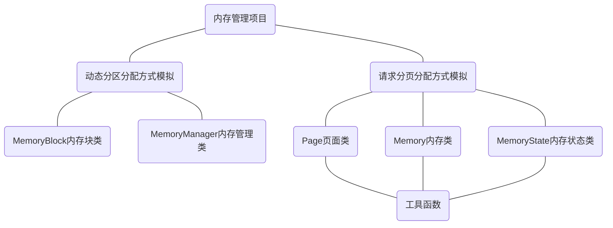
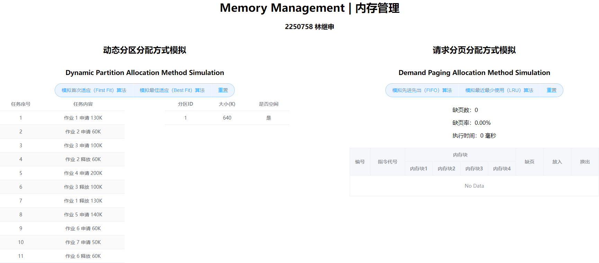

# Memory Management

## 1 项目介绍

### 1.1 项目简介

**Memory management: Dynamic partition allocation method simulation and demand paging allocation method simulation**

**内存管理项目：动态分区分配方式模拟和请求分页分配方式模拟**

本内存管理项目通过模拟实际的内存分配和页面管理机制来理解和掌握操作系统中内存管理的基本原理和技术。项目分为两大部分：动态分区分配方式模拟和请求分页分配方式模拟。

#### 1.1.1 动态分区分配方式模拟简介

这一部分的模拟旨在通过首次适应（First Fit）算法和最佳适应（Best Fit）算法来管理内存的分配和回收，并显示每次分配和回收后的空闲分区链的情况。模拟的初始状态为640K的可用内存，通过一系列的作业申请和释放操作来观察和学习不同算法对内存管理的影响。

* **首次适应（First Fit）算法**：在内存分区链中寻找第一个能满足作业内存需求的空闲区域进行分配。此算法简单，但可能导致较大的内存碎片。
* **最佳适应（Best Fit）算法**：在内存分区链中寻找能完全满足作业需求且最小的空闲区域进行分配。此方法尽量保持大的空闲分区，但搜索和维护成本相对较高。

请求序列如下：

1. 作业 1 申请 130K
2. 作业 2 申请 60K
3. 作业 3 申请 100K
4. 作业 2 释放 60K
5. 作业 4 申请 200K
6. 作业 3 释放 100K
7. 作业 1 释放 130K
8. 作业 5 申请 140K
9. 作业 6 申请 60K
10. 作业 7 申请 50K
11. 作业 6 释放 60K

通过模拟，可以观察每次申请和释放后，空闲内存分区链的变化，以此了解不同算法的内存利用效率和管理策略。

#### 1.1.2 请求分页分配方式模拟简介

这部分模拟是为了展示和学习请求分页管理系统在操作系统中的实际运作。假设每个页面可存放10条指令，分配给一个作业的内存块为4。这里将模拟一个作业的执行过程，该作业由320条指令组成，其地址空间为32页。初始时，所有页面未加载到内存中。

* **页面调度**：在作业执行过程中，若访问的指令已在内存中，则直接访问；若不在内存中，则发生缺页，此时将页面调入内存。若内存块已满，需要根据页面置换算法替换一页。
* **页面置换算法**：选择先进先出（FIFO）算法和最近最少使用（LRU）算法。FIFO算法根据页面调入内存的顺序进行置换，而LRU算法基于页面的访问频率进行置换，优先替换最少使用的页面。
* **指令访问顺序**：作业中指令访问顺序按照如下原则形成，50%指令顺序执行，25%均匀分布在前半部分地址空间，25%均匀分布在后半部分地址空间，以模拟实际中的程序局部性原理。

### 1.2 项目目的

#### 1.2.1 动态分区分配方式模拟目的

* **理解动态分区存储管理的概念**：通过模拟首次适应和最佳适应算法，学生可以直观地了解操作系统如何根据不同的策略管理动态内存分配。
* **掌握分配算法的实现**：通过编程实现这些算法，学生将加深对内存分配过程的细节以及算法的工作原理的理解。
* **分析不同算法的效率和适用性**：通过观察和比较不同算法在处理同一请求序列时的表现，学生可以理解每种算法的优缺点及其适用场景。

#### 1.2.2 请求分页分配方式模拟目的

* **理解页面管理机制**：模拟一个作业的执行过程中的页面调度和置换，使学生理解页表、地址转换以及页面调入/调出的工作原理。
* **掌握页面置换算法**：实现并比较FIFO和LRU两种不同的页面置换算法，学生可以深入了解这些算法如何影响作业的执行效率和系统的整体性能。
* **评估缺页率和性能**：通过计算作业执行过程中的缺页率，学生将学会如何分析和评估内存管理策略的效率。

#### 1.2.3 综合目的

* **培养实际问题解决能力**：通过模拟真实世界的内存管理问题，学生将提高解决复杂系统问题的能力。
* **增强编程和算法设计技能**：实际编写和优化内存管理算法，提升学生的编程能力及算法设计技能。
* **提高系统思维能力**：理解操作系统中各个组件如何协同工作，加深对系统架构的整体理解。

### 1.3 项目组成

* `/assets`
存放 `README.md` 文件所需的相关图片资源

* `/code`
项目源代码

  * `/src`
  代码文件

    * `App.vue`
    父组件

    * `classes.ts`
    TypeScript 类

    * `main.ts`
    前端应用程序入口

    * `utils.ts`
    工具函数

  * `index.html`
  首页入口

  * `package.json`
  项目依赖配置文件

  * `tsconfig.json`
  TypeScript 配置文件

  * `tsconfig.node.json`
  Node.js 配置文件

  * `vite.config.ts`
  Vite 构建工具配置文件

* `Demonstration.gif`
项目演示

### 1.4 项目运行

#### 1.4.1 直接运行

* 下载 [Release](https://github.com/MinmusLin/Operating_System_Course_Assignments/releases/tag/MemoryManagement-v1.0) 部署 `Memory_Management` 在服务器上运行

#### 1.4.2 编译运行

* 搭建 Vite + Vue 开发环境

* 使用 JetBrains WebStorm 打开前端应用程序，启动终端

* 安装项目相关依赖
  ```bash
  cnpm install
  ```

* 启动项目开发模式
  ```bash
  npm run dev
  ```

  或通过 `vite` 启动项目
  ```bash
  vite
  ```

* 在浏览器中转到 `localhost:5173`

## 2 开发环境

### 2.1 开发环境概述

本项目的开发环境如下：

* 开发环境
  * Windows 11 家庭中文版 23H2
* 开发软件
  * JetBrains PyCharm 2023.3.3
* 开发框架
  * Vue.js
* 开发语言
  * HTML
  * CSS
  * TypeScript

### 2.2 开发环境搭建

* 安装 [Node.js v20.12.1 x64](https://nodejs.org)，默认安装路径为 `C:\Program Files\nodejs` ，安装过程中不选择 `Automatically install the necessary tools. Note that this will also install Chocolatey. The script will pop-up in a new window after the installation completes.`

* 使用管理员权限打开命令提示符（下同）

* 在 Node.js 安装路径下创建 `node_cache` 文件夹
  ```bash
  mkdir "C:/Program Files/nodejs/node_cache"
  ```

* 在 Node.js 安装路径下创建 `node_global` 文件夹
  ```bash
  mkdir "C:/Program Files/nodejs/node_global"
  ```

* npm 修改 cache 配置
  ```bash
  npm config set cache "C:/Program Files/nodejs/node_cache"
  ```

* npm 修改 prefix 配置
  ```bash
  npm config set prefix "C:/Program Files/nodejs/node_global"
  ```

* npm 安装 cnpm
  ```bash
  npm install -g cnpm
  ```

* 添加用户变量 `NODE_PATH` ，变量值为 `C:\Program Files\nodejs\node_modules`

* 在系统变量 `Path` 中添加环境变量 `C:\Program Files\nodejs\node_global`

* cnpm 安装 Vue
  ```bash
  cnpm install vue -g
  ```

* cnpm 安装 Vue 命令行工具
  ```bash
  cnpm install vue-cli -g
  ```

至此，本项目的开发环境搭建完成。

## 3 项目设计

### 3.1 程序主体架构设计



项目分为两个主要部分：动态分区分配方式模拟和请求分页分配方式模拟。每一部分都涉及不同的类和功能，下面将逐一进行说明。

#### 3.1.1 动态分区分配方式模拟

这一部分的设计目的是通过模拟内存块的分配和回收来展示首次适应算法和最佳适应算法的工作原理。主要涉及的类有：

* **`MemoryBlock` 内存块类**：这个类用于表示内存中的一个块，包含属性如块的大小、是否为空闲，以及一个唯一的标识符。这个类是动态分区分配的基础。

* **`MemoryManager` 内存管理类**：该类负责管理内存块的分配和释放。它包含一个内存块列表和方法来实现首次适应算法和最佳适应算法。此外，还有方法来释放内存块和合并连续的空闲内存块。

#### 3.1.2 请求分页分配方式模拟

这一部分的设计用于模拟请求分页系统的页面调度和页面置换过程。主要涉及的类有：

* **`Page` 页面类**：这个类代表内存中的一页，每页存放一定数量的指令。该类提供基本的页面信息，例如页面编号和存储的指令。

* **`Memory` 内存类**：该类模拟实际的内存，其中包含一定数量的页面框架和一个方法用于确定页面是否已经加载到内存中。此类支持两种页面置换算法：先进先出（FIFO）和最近最少使用（LRU）。

* **`MemoryState` 内存状态类**：用于记录内存操作的日志。它记录了每次指令访问的详细信息，包括页面是否发生了缺页，哪个页面被调入或调出。

#### 3.1.3 工具函数

工具函数是整个项目中用于支持各类功能的函数集合，如指令序列的生成、模拟执行过程中的页面调度和置换等。这些函数与页面类、内存类和内存状态类紧密协作，共同完成请求分页分配方式模拟的核心功能。

```typescript
// 生成指令序列
function generateInstructionSequence() {...}

// 模拟 FIFO 置换算法
export function fifoSimulation() {...}

// 模拟 LRU 置换算法
export function lruSimulation() {...}
```

### 3.2 类设计

#### 3.2.1 `MemoryBlock` 内存块类设计

##### 3.2.1.1 类定义

`MemoryBlock` 类代表内存中的一个单独块。它用于动态分区分配模拟，记录每个内存块的状态和信息。

```typescript
export class MemoryBlock {
    id: number  // 唯一标识符，用于识别每个内存块
    size: number  // 内存块的大小，以某种单位（如KB）计量
    isFree: boolean  // 布尔值，表示内存块是否为空闲状态

    constructor() {...}
}
```

##### 3.2.1.2 函数接口定义

| 函数接口 | 功能 |
| :--- | :--- |
| `constructor()` | 构造函数 |

#### 3.2.2 `MemoryManager` 内存管理类设计

##### 3.2.2.1 类定义

`MemoryManager` 类负责管理所有的内存块。它提供了动态内存分配和回收的功能，以及内存块的管理。

```typescript
export class MemoryManager {
    memoryBlocks: MemoryBlock[] = [{id: 1, size: 640, isFree: true}]  // 存放所有内存块的数组
    lastId: number = 1  // 记录最后一个被分配的内存块的ID，用于生成新内存块的唯一标识符

    firstFit(size: number): void {...}
    bestFit(size: number): void {...}
    allocateMemory(block: MemoryBlock, size: number): void {...}
    releaseMemory(id: number): void {...}
    mergeMemory(): void {...}
    getMemoryBlocks(): MemoryBlock[] {...}
}
```

##### 3.2.2.2 函数接口定义

| 函数接口 | 功能 |
| :--- | :--- |
| `firstFit(size: number)` | 实现首次适应算法，分配指定大小的内存 |
| `bestFit(size: number)` | 实现最佳适应算法，为请求分配最匹配的内存块 |
| `allocateMemory(block: MemoryBlock, size: number)` | 在给定的内存块中分配指定大小的内存 |
| `releaseMemory(id: number)` | 根据内存块 ID 释放内存，并尝试合并相邻的空闲内存块 |
| `mergeMemory()` | 合并连续的空闲内存块以减少内存碎片 |
| `getMemoryBlocks()` | 返回当前所有内存块的状态，用于监控和调试 |

#### 3.2.3 `Page` 页面类设计

##### 3.2.3.1 类定义

`Page` 类表示内存中的一页。在请求分页分配方式模拟中，每页包含固定数量的指令。

```typescript
export class Page {
    id: number  // 页面的编号，唯一标识一个页面
    instructions: number[]  // 存放在该页面上的指令集，通常为一个整数数组

    constructor(id: number) {...}
}
```

##### 3.2.3.2 函数接口定义

| 函数接口 | 功能 |
| :--- | :--- |
| `constructor(id: number)` | 构造函数 |

#### 3.2.4 `Memory` 内存类设计

##### 3.2.4.1 类定义

`Memory` 类模拟操作系统中的内存，特别是处理页面调入和调出的逻辑。

```typescript
export class Memory {
    size: number  // 内存中可以存放的页面数
    method: 'FIFO' | 'LRU'  // 页面置换算法，如 FIFO 或 LRU
    pages: Page[]  // 当前加载在内存中的页面数组
    lastUsedTime: number[]  // 对于 LRU 算法，记录每页的最后使用时间

    constructor(size: number, method: 'FIFO' | 'LRU') {...}
    hasInstruction(instruction: number, time: number = 0): boolean {...}
}
```

##### 3.2.4.2 函数接口定义

| 函数接口 | 功能 |
| :--- | :--- |
| `constructor(size: number, method: 'FIFO' \| 'LRU')` | 构造函数 |
| `hasInstruction(instruction: number, time: number = 0)` | 检查指定的指令是否已在内存中，并在 LRU 算法下更新页面的最后使用时间 |

#### 3.2.5 `MemoryState` 内存状态类设计

##### 3.2.5.1 类定义

`MemoryState` 类用于记录内存操作的详细日志，以便于分析和调试页面置换和内存分配的行为。

```typescript
export class MemoryState {
    logs: {
        id: number  // 编号
        instructionId: number  // 指令代号
        pages: (string | number)[]  // 内存块
        isPageFault: boolean  // 缺页
        insertedBlock: string | number  // 放入
        removedPage: string | number  // 换出
    }[]  // 存放每次内存操作的详细日志

    constructor() {...}
    addLog(id: number, instructionId: number, memory: Memory, isPageFault: boolean, insertedBlock: number | null, removedPage: number | null): void {...}
}
```

##### 3.2.5.2 函数接口定义

| 函数接口 | 功能 |
| :--- | :--- |
| `constructor()` | 构造函数 |
| `addLog(id: number, instructionId: number, memory: Memory, isPageFault: boolean, insertedBlock: number \| null, removedPage: number \| null)` | 添加一条日志记录，包括操作 ID，指令 ID，当前内存中的页面，是否发生缺页，以及相关页面的调入或调出信息 |

### 3.3 算法设计

#### 3.3.1 动态分区分配算法设计

动态分区分配算法用于管理内存的分配和回收，尤其是在有多个进程请求和释放内存的情况下。

##### 3.3.1.1 首次适应（First Fit）算法

首次适应算法查找第一个足够大的空闲内存块来满足请求。它从内存块的开始部分开始搜索，直到找到第一个符合要求的空闲块。

**优点：**
* 简单快速，尤其是在内存前部有足够空间的情况下。
* 减少算法的查找时间，尤其是当内存被频繁请求时。

**缺点：**
* 可能导致内存碎片，尤其是在内存块的前端频繁分配和释放的情况下。
* 随着时间的推移，可能需要更长的时间来查找合适的空闲块。

##### 3.3.1.2 最佳适应（Best Fit）算法

最佳适应算法寻找能够最紧凑地满足请求的最小空闲内存块。这种方法尝试最大化大内存块的保留，以便于处理大规模的内存请求。

**优点：**
* 可以更有效地利用内存，减少大块空间的浪费。
* 长期来看，能够保留更大的空闲块，有助于满足大量的内存请求。

**缺点：**
* 查找最佳匹配块的过程可能比首次适应算法更耗时。
* 可能导致许多小的空闲内存块，难以被后续的大请求利用。

#### 3.3.2 请求分页分配算法设计

请求分页分配算法主要处理页表和物理内存之间的映射问题，尤其关注如何处理页面调入和替换。

##### 3.3.2.1 先进先出（FIFO）算法

先进先出算法是最简单的页面替换算法，它总是选择最早进入内存的页面进行替换。

**优点：**
* 实现简单，易于管理。
* 公平地按照页面进入内存的时间顺序进行替换。

**缺点：**
* 不考虑页面的使用频率，可能会替换掉经常使用的页面，导致效率低下。

##### 3.3.2.2 最近最少使用（LRU）算法

最近最少使用算法基于页面的使用频率来决定页面替换，优先替换最长时间未被使用的页面。

**优点：**
* 更贴近实际应用的需求，可以有效地减少页面调入调出的次数，提高系统的性能。
* 适用于大多数实际应用，因为它利用了局部性原理。

**缺点：**
* 实现复杂度较高，需要记录每个页面的访问历史。
* 性能开销较大，尤其是在页面数量多的情况下。

### 3.4 用户交互界面设计

#### 3.4.1 清晰提示

* 页面顶部设有大号标题，每个模拟部分都有明确的子标题，清楚地区分了不同的功能区域。
* 每个模拟部分的操作区都包括了细节化的任务列表和内存状态显示，通过 `el-table` 组件呈现，每列都有明确的标签如“任务序号”、“任务内容”、“是否空闲”等。
* 表格的每个细节都旨在帮助用户理解当前内存管理状态或模拟的具体步骤，增加了操作的透明度。



#### 3.4.2 Element Plus 组件库统一样式

* 整个界面使用了 Element Plus 组件库，确保了各个组件如按钮、表格、消息框等在视觉上的一致性和现代感。
* 统一的组件样式使得用户界面整洁美观，同时也使得开发更为高效，因为可以重用组件和样式。

#### 3.4.3 按钮组设计

* 使用 `el-button-group `包含了一系列操作按钮，使得用户可以轻松选择执行不同的模拟算法，如“模拟首次适应（First Fit）算法”和“模拟最佳适应（Best Fit）算法”。
* 按钮具有一致的样式（如类型为 `primary` ，大小为 `large` ），并且每个按钮都明确标注了其功能，增强了界面的直观性和易用性。


#### 3.4.4 Stripe 样式表格

* 表格使用了斑马纹（stripe）样式，这不仅增强了表格的可读性，也使得数据行间的区分更为清晰。
* 斑马纹样式帮助用户更快地跟踪和分析模拟数据，尤其是在数据行较多时。


#### 3.4.5 反馈机制

* 使用 `ElMessage` 组件提供即时反馈，每当用户进行操作如启动一个模拟、重置模拟时，都会在屏幕上方显示一个消息框，说明操作的结果，如“动态分区分配方式模拟已完成”。
* 消息框包括关闭按钮和自动消失功能，不会过度干扰用户的其他操作。

```typescript
ElMessage({
      showClose: true,
      message: message + taskSequence.value[currentTask.value].description,
      type: 'success',
      duration: 2000
    })
```


## 4 动态分区分配方式模拟实现

### 4.1 `MemoryManager` 内存管理类实现

在 `MemoryManager` 类中， `allocateMemory` ， `releaseMemory` ，和 `mergeMemory` 方法是核心的功能，用于处理内存的分配和回收。

#### 4.1.1 `allocateMemory` 方法实现

```typescript
allocateMemory(block: MemoryBlock, size: number): void {
    if (block.size === size) {
        block.isFree = false
    } else {
        const remainingSize = block.size - size
        block.size = size
        block.isFree = false
        this.memoryBlocks.push({id: ++this.lastId, size: remainingSize, isFree: true})
    }
}
```

这个方法负责在指定的内存块中分配所需的内存大小。方法的实现如下：

* **完全匹配**：首先检查如果块的大小恰好等于请求的大小，将该块标记为不空闲（ `isFree` = `false` ）。
* **部分分配**：如果块的大小大于请求的大小，块被部分使用：
  * 更新原块的大小为请求的大小。
  * 将原块标记为已分配（不空闲）。
  * 创建一个新的 `MemoryBlock` ，包含剩余的空闲内存大小，添加到内存块列表中。

#### 4.1.2 `releaseMemory` 方法实现

```typescript
releaseMemory(id: number): void {
    const blockIndex = this.memoryBlocks.findIndex(block => block.id === id && !block.isFree)
    if (blockIndex !== -1) {
        this.memoryBlocks[blockIndex].isFree = true
        this.mergeMemory()
    }
}
```

这个方法负责释放指定ID的内存块，并尝试合并相邻的空闲内存块。方法的实现如下：

* **查找内存块**：使用 `findIndex` 方法在内存块列表中查找具有指定ID且当前为非空闲状态的内存块。
* **释放内存块**：如果找到这样的内存块，将其标记为空闲（ `isFree` = `true` ）。
* **合并内存块**：调用 `mergeMemory` 方法尝试合并相邻的空闲内存块。

#### 4.1.3 `mergeMemory` 方法实现

```typescript
mergeMemory(): void {
    this.memoryBlocks.sort((a, b) => a.id - b.id)
    let blockIndex = 0
    while (blockIndex < this.memoryBlocks.length - 1) {
        if (this.memoryBlocks[blockIndex].isFree && this.memoryBlocks[blockIndex + 1].isFree) {
            this.memoryBlocks[blockIndex].size += this.memoryBlocks[blockIndex + 1].size
            this.memoryBlocks.splice(blockIndex + 1, 1)
        } else {
            blockIndex++
        }
    }
}
```

这个方法负责合并所有相邻的空闲内存块，以减少内存碎片。方法的实现如下：

* **排序内存块**：首先按照内存块的ID进行排序，以确保内存块按顺序处理。
* **遍历内存块列表**：遍历内存块列表，检查每个空闲块是否可以与下一个空闲块合并。
* **合并内存块**：如果当前块和下一个块都是空闲的，将它们合并为一个块，更新大小并从列表中删除下一个块。
* **继续检查**：继续检查下一个内存块，直到没有更多可合并的块为止。

### 4.2 算法实现

#### 4.2.1 首次适应（First Fit）算法实现

```typescript
firstFit(size: number): void {
    for (let block of this.memoryBlocks) {
        if (block.isFree && block.size >= size) {
            this.allocateMemory(block, size)
            return
        }
    }
}
```

首次适应算法寻找内存块列表中的第一个足够大的空闲块来满足内存请求。算法的实现如下：

* **遍历内存块列表**：通过循环遍历 `memoryBlocks` 数组中的每一个 `MemoryBlock` 对象。
* **检查条件**：对于每个内存块，检查它是否是空闲的（ `isFree` == `true` ）并且它的大小是否大于或等于请求的大小（ `block.size` >= `size` ）。
* **分配内存**：当找到第一个符合条件的内存块时，调用 `allocateMemory` 方法来在该内存块中分配请求的内存，并结束循环。
* **退出**：一旦内存分配完成，函数通过 `return` 语句退出，不再检查剩余的内存块。

在 `App.vue` 中定义如下序列：

```typescript
const firstFitSequence = [
  () => memoryManager.value.firstFit(130),
  () => memoryManager.value.firstFit(60),
  () => memoryManager.value.firstFit(100),
  () => memoryManager.value.releaseMemory(2),
  () => memoryManager.value.firstFit(200),
  () => memoryManager.value.releaseMemory(3),
  () => memoryManager.value.releaseMemory(1),
  () => memoryManager.value.firstFit(140),
  () => memoryManager.value.firstFit(60),
  () => memoryManager.value.firstFit(50),
  () => memoryManager.value.releaseMemory(6)
]
```

#### 4.2.2 最佳适应（Best Fit）算法实现

```typescript
bestFit(size: number): void {
    let bestBlock: MemoryBlock | null = null
    for (let block of this.memoryBlocks) {
        if (block.isFree && block.size >= size) {
            if (!bestBlock || block.size < bestBlock.size) {
                bestBlock = block
            }
        }
    }
    if (bestBlock) {
        this.allocateMemory(bestBlock, size)
    }
}
```

最佳适应算法查找所有空闲内存块中能够满足内存请求且最小的块来进行分配，从而尽可能保留大的内存块以应对未来可能的大内存请求。算法的实现如下：

* **初始化最佳块变量**：定义一个变量 `bestBlock` 来存储找到的最佳匹配的内存块，初始化为 `null` 。
* **遍历内存块列表**：循环检查每个内存块是否满足空闲（ `isFree` == `true` ）且大小大于或等于请求的条件（ `block.size` >= `size` ）。
* **选择最佳匹配块**：在满足条件的内存块中，进一步选择大小最小的块作为最佳匹配。这通过比较 `bestBlock` 的大小与当前块的大小来实现。
* **记录最佳匹配**：更新 `bestBlock` 为当前遍历到的内存块，如果它更小且满足需求。
* **分配内存**：遍历结束后，如果找到了最佳匹配的内存块（ `bestBlock` != `null` ），使用 `allocateMemory` 方法在此块中分配内存。

在 `App.vue` 中定义如下序列：

```typescript
const bestFitSequence = [
  () => memoryManager.value.bestFit(130),
  () => memoryManager.value.bestFit(60),
  () => memoryManager.value.bestFit(100),
  () => memoryManager.value.releaseMemory(2),
  () => memoryManager.value.bestFit(200),
  () => memoryManager.value.releaseMemory(3),
  () => memoryManager.value.releaseMemory(1),
  () => memoryManager.value.bestFit(140),
  () => memoryManager.value.bestFit(60),
  () => memoryManager.value.bestFit(50),
  () => memoryManager.value.releaseMemory(6),
]
```

## 5 请求分页分配方式模拟实现

### 5.1 生成指令序列实现

在请求分页分配方式模拟中，生成指令序列的方法是核心之一，用于模拟程序的执行过程。这一过程尝试模仿实际程序执行时指令的访问模式，包括局部性原理的展示。下面是该函数实现的详细步骤：

* **初始化变量**
  * `executionOrder` ：用于存储生成的执行顺序。
  * `count` ：用于追踪生成的指令数量，保证最终生成320条指令。
* **随机选择指令**
  * 在0到319之间随机选择一个指令索引 `m` ，作为起始指令。
  * 将指令 `m` 添加到 `executionOrder` 列表中，并更新 `count` 。
* **顺序执行下一条指令**
  * 检查 `m + 1` 是否仍在有效范围内（小于320），如果是，则添加到 `executionOrder` 中，并更新 `count` 。
* **随机跳转到前地址部分**
  * 如果 `m` 大于0，意味着存在前地址部分。在0到 `m - 1` 范围内随机选择一个新的指令索引 `m1` 。
  * 添加 `m1` 到 `executionOrder` 中，并更新 `count` 。
  * 检查 `m1 + 1` 是否在有效范围内（小于 `m` ），如果是，则添加到 `executionOrder` 中，并更新 `count` 。
* **随机跳转到后地址部分**
  * 检查 `m + 2` 是否小于320，从 `m + 2` 到319之间随机选择一个新的指令索引 `m2` 。
  * 添加 `m2` 到 `executionOrder` 中，并更新 `count` 。
  * 检查 `m2 + 1` 是否仍在有效范围内（小于320），如果是，则添加到 `executionOrder` 中，并更新 `count` 。
* **重复过程**
  * 继续上述步骤，直到 `count` 达到320。
* **修正最终序列**
  * 如果由于循环中的多次添加导致 `executionOrder` 的长度超过320，移除最后一个元素以确保序列长度恰好为320。

```typescript
function generateInstructionSequence() {
    let executionOrder = []
    let count = 0
    while (count < 320) {
        let m = Math.floor(Math.random() * 320)
        executionOrder.push(m)
        count++
        if (m + 1 < 320) {
            executionOrder.push(m + 1)
            count++
        }
        if (m > 0 && count < 320) {
            let m1 = Math.floor(Math.random() * m)
            executionOrder.push(m1)
            count++
            if (m1 + 1 < m) {
                executionOrder.push(m1 + 1)
                count++
            }
        }
        if (m + 2 < 320 && count < 320) {
            let m2 = m + 2 + Math.floor(Math.random() * (318 - m))
            executionOrder.push(m2)
            count++
            if (m2 + 1 < 320) {
                executionOrder.push(m2 + 1)
                count++
            }
        }
    }
    if (executionOrder.length > 320) {
        executionOrder.pop()
    }
    return executionOrder
}
```

局部性原理的体现：
* **时间局部性**：通过顺序执行紧随其后的指令（如 `m + 1` ），模拟了程序中循环或连续执行指令的情况。
* **空间局部性**：通过在相近的地址空间内跳转执行（如从 `m` 到 `m1` 和 `m2` ），模拟了程序中访问相邻内存位置的行为。

### 5.2 算法实现

#### 5.2.1 先进先出（FIFO）算法实现

先进先出（FIFO）算法是一种基本的页面置换算法，它总是移除最先进入内存的页面。该算法假设内存中页面的进入顺序决定了它们被替换的顺序。

实现步骤：

* **初始化**：创建一个 `MemoryState` 对象记录日志，生成页面对象列表，初始化内存模型，并生成执行指令序列。
* **遍历指令**：遍历每条指令，通过指令编号计算页面ID（ `pageId = Math.floor(i / 10)` ）。
* **检查页面存在性**：使用 `memory.hasInstruction(i)` 方法检查当前指令是否已经在内存中。
* **处理缺页**：
  * 如果页面不在内存中（缺页），检查内存是否已满。如果内存未满，选择第一个空位；如果内存已满，使用FIFO策略选择最早进入的页面进行替换（通过维护的 `index` 指示）。
  * 替换页面，并更新替换页面的时间戳。
  * 记录操作到日志，增加缺页计数。
  * 循环更新索引 `index` ，以循环覆盖内存中的页面。
* **返回结果**：返回包括缺页数、缺页率和操作日志的结果对象。

```typescript
export function fifoSimulation() {
    const log = new MemoryState()
    let pages = Array.from({length: 32}, (_, i) => new Page(i))
    let memory = new Memory(4, 'FIFO')
    let instructions = generateInstructionSequence()
    let pageFaults = 0
    let index = 0
    let count = 0
    for (let i of instructions) {
        count++
        let pageId = Math.floor(i / 10)
        if (!memory.hasInstruction(i)) {
            let removedPage = memory.pages.length >= memory.size ? memory.pages[index].id : null
            memory.pages[index] = pages[pageId]
            memory.lastUsedTime[index] = count
            pageFaults++
            log.addLog(count, i, memory, true, index, removedPage)
            index = (index + 1) % 4
        } else {
            log.addLog(count, i, memory, false, null, null)
        }
    }
    return {pageFaults: pageFaults, pageFaultRate: pageFaults / 320, logs: log.logs}
}
```

#### 5.2.2 最近最少使用（LRU）算法实现

最近最少使用（LRU）算法是一种更高级的页面置换算法，优先替换最长时间未被使用的页面。

实现步骤：

* **初始化**：同FIFO，初始化日志记录、页面列表、内存模型和指令序列。
* **遍历指令**：同FIFO，遍历每条指令，并计算其页面ID。
* **检查页面存在性**：使用 `memory.hasInstruction(i, count)` 方法检查页面是否在内存中。传入当前时间 `count` 更新页面的最后使用时间。
* **处理缺页**：
  * 若当前页面不在内存中（缺页），首先尝试找到内存中的一个空位。
  * 如果没有空位，使用 `memory.lastUsedTime.indexOf(Math.min(...memory.lastUsedTime))` 查找最长时间未使用的页面，并进行替换。
  * 更新替换的页面信息，包括页面ID和最后使用时间。
  * 记录操作到日志，增加缺页计数。
* **返回结果**：返回包括缺页数、缺页率和操作日志的结果对象。

```typescript
export function lruSimulation() {
    const log = new MemoryState()
    let pages = Array.from({length: 32}, (_, i) => new Page(i))
    let memory = new Memory(4, 'LRU')
    let instructions = generateInstructionSequence()
    let pageFaults = 0
    let count = 0
    let index = 0
    for (let i of instructions) {
        count++
        let pageId = Math.floor(i / 10)
        if (!memory.hasInstruction(i, count)) {
            index = memory.pages.findIndex(page => page === undefined)
            if (index === -1) {
                index = memory.lastUsedTime.indexOf(Math.min(...memory.lastUsedTime))
            }
            let removedPage = memory.pages[index] ? memory.pages[index].id : null
            memory.pages[index] = pages[pageId]
            memory.lastUsedTime[index] = count
            pageFaults++
            log.addLog(count, i, memory, true, index, removedPage)
        } else {
            log.addLog(count, i, memory, false, null, null)
        }
    }
    return {pageFaults: pageFaults, pageFaultRate: pageFaults / 320, logs: log.logs}
}
```

## 6 项目展示


## 7 项目总结

本项目通过模拟动态分区分配方式和请求分页分配方式，深入探讨了操作系统内存管理的基本原理和实现技术。以下是对本项目的几个关键方面的总结：

### 7.1 动态分区分配方式模拟

* **实现算法**：本部分实现了首次适应算法和最佳适应算法，用于动态管理内存的分配和回收。
* **效率和碎片问题**：首次适应算法虽快速但容易产生碎片，而最佳适应算法虽然能减少碎片但搜索效率较低。
* **内存块管理**：内存块的合并功能有效减少了内存碎片，提高了内存使用效率。

### 7.2 请求分页分配方式模拟

* **页面置换算法**：实现了FIFO和LRU两种页面置换算法，有效模拟了页面调度过程中的缺页处理和页面替换。
* **性能评估**：通过模拟不同的置换策略，评估了算法在不同情况下的表现，如缺页率和处理效率。
* **程序局部性原理**：通过特定的指令访问序列，展示了程序运行中的时间局部性和空间局部性特点。

### 7.3 用户交互和界面设计

* **清晰的用户界面**：项目使用 Element Plus 组件库构建了直观且响应迅速的用户界面，支持用户直观地观察和操作模拟过程。
* **交互设计**：设计了细致的操作流程和即时反馈机制，提升了用户体验，使用户能够轻松管理和观察内存分配和页面置换的动态变化。

## 8 文档更新日期

2024年6月4日