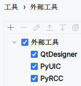

# Process Management

## 项目介绍

### 项目简介

**Process management: Elevator scheduling**

**进程管理项目：电梯调度**

本电梯调度系统是一个基于线程的模拟程序，用于管理一个20层楼宇内的五部互联电梯。程序的主要特点包括：

* **用户界面**
  * 每部电梯都配有一套按键，包括数字键（1-20层），开门键、关门键、上行键、下行键以及报警键。
  * 每层楼以及每部电梯门口装有上行和下行按钮，以及用于显示电梯当前状态的数码显示器。
* **联动功能**
  * 五部电梯通过内部通信系统相互联结。当任一电梯的某个按钮被按下时，其他电梯中相应的按钮也会被激活，表明该命令被系统接收并广播至所有电梯。
* **电梯调度算法**
  * 所有电梯在初始状态时均位于第一层。
  * 电梯在没有接收到请求时应保持当前位置静止，不进行无谓的移动。
  * 调度算法需要设计以优化电梯的响应时间和运行效率，例如考虑当前电梯的方向、请求的楼层位置以及电梯间的协调等因素。
* **技术实现**
  * 系统采用多线程技术，每部电梯由一个独立的线程控制，以模拟电梯的独立运行和实时响应。
  * 程序应包括错误处理和状态监测，以保证系统在各种情况下的稳定运行。

### 项目目的

* **操作系统调度模拟**
  * 电梯调度系统可以看作是一个操作系统进程调度的微缩模型。在这个系统中，每部电梯都可以视为一个进程，电梯调度算法则模拟了操作系统的进程调度器。
  * 通过模拟电梯的请求、响应和运动，可以深入理解操作系统中的进程调度策略，如何管理多个进程（电梯）同时请求资源（移动到特定楼层）的情况。
* **多线程编程方法**
  * 在该项目中，使用多线程来模拟多部电梯的并行操作，这有助于学习和实践如何在特定环境下有效使用多线程。
  * 多线程编程是操作系统广泛使用的技术，理解和掌握这一技术可以更好地理解现代操作系统的并发和并行处理能力。
* **学习调度算法**
  * 调度算法是操作系统设计中的核心部分，电梯调度算法的设计和优化可以提供关于如何处理多个请求并优化资源分配的直观理解。
  * 电梯调度算法的设计和实现旨在模拟操作系统中的短作业优先、轮转调度等算法，通过调整和优化这些算法，可以深入学习算法对系统性能的影响。
* **实践中的理论应用**
  * 通过实际编写和测试电梯调度系统，可以将理论知识转化为实践经验，更好地理解诸如线程安全、竞态条件和死锁等并发编程问题。

### 项目组成

* `/assets`
存放 `README.md` 文件所需的相关图片资源

* `/code`
项目源代码

  * `main.py`
  程序的入口点，负责初始化程序并处理电梯调度逻辑

  * `ui_design.py`
  用户界面的具体实现代码，通过 PyUIC 转换而来

  * `ui_design.ui`
  描述用户界面的布局和视觉元素，通过 QtDesigner 设计

* `Demonstration.mp4`
项目演示视频

## 开发环境

### 开发环境概述

本项目的开发环境如下：

* 开发环境
  * Windows 11 家庭中文版 23H2
  * Anaconda 24.4.0
  * PyQt5 5.15.9
  * PyQt5-tools 5.15.9.3.3
  * PyInstaller 6.6.0
* 开发软件
  * JetBrains PyCharm 2023.2.1
* 开发语言
  * Python 3.8.0

### 开发环境搭建

* 从[官方网站](https://www.anaconda.com)下载并安装 Anaconda

  

* 查找 Anaconda 安装目录。定位系统中Anaconda安装的目录，通常在 Windows 系统上是这样的路径： `C:\Users\<Username>\Anaconda3`

* 设置 Anaconda 环境变量
  * 打开开始菜单并搜索“环境变量”，或者导航到 `控制面板` > `系统和安全` > `系统` > `高级系统设置` > `环境变量`
  * 在环境变量窗口中，找到系统变量部分，点击“新建”并添加以下变量：
    * 变量名： `ANACONDA_HOME`
    * 变量值：你的 Anaconda 安装目录的路径（例如， `C:\Users\<Username>\Anaconda3` ）
  * 接下来，找到系统变量中的 `Path` 变量，选择它，然后点击“编辑”
  * 在路径列表中添加以下两个条目：
    * `%ANACONDA_HOME%`
    * `%ANACONDA_HOME%\Scripts`
  * 点击“确定”保存更改并关闭所有窗口
  * 重启计算机以应用更改

* 验证安装。设置环境变量后，打开一个新的终端或命令提示符窗口，输入 `conda --version` 来验证 Anaconda 现在是否已经在系统的 `PATH` 中，并且可以从任何目录访问

  

* 更新 conda 包，此命令将当前 conda 环境中的所有包更新到最新版本

  ```bash
  conda update --all
  ```

* 创建 PyQt5 conda 环境，Python 版本指定 3.8

  ```bash
  conda create -n pyqt5 python==3.8
  ```

* 激活 PyQt5 conda 环境

  ```bash
  conda activate pyqt5
  ```

* 安装 PyQt5、PyQt5-tools 和 PyInstaller

  ```bash
  pip install PyQt5 PyQt5-tools PyInstaller
  ```

* 打开 PyCharm，转到 `设置` > `项目` > `Python 解释器` > `添加解释器` > `Conda 环境` > `使用现有环境` ，选择 `pyqt5` ， 点击确定

  

* 转到 `设置` > `工具` > `外部工具` ，分别对 QtDesigner、PyUIC、PyRCC 进行如下设置（路径应根据本机路径进行改动）：

  

  * QtDesigner
    * 程序： `C:\Users\lenovo\miniconda3\envs\pyqt5\Lib\site-packages\qt5_applications\Qt\bin\designer.exe`
    * 实参：无
    * 工作目录： `$FileDir$`
  * PyUIC
    * 程序： `C:\Users\lenovo\miniconda3\envs\pyqt5\Scripts\pyuic5.exe`
    * 实参： `$FileName$ -o $FileNameWithoutExtension$.py`
    * 工作目录： `$FileDir$`
  * PyRCC
    * 程序： `C:\Users\lenovo\miniconda3\envs\pyqt5\Scripts\pyrcc5.exe`
    * 实参： `$FileName$ -o $FileNameWithoutExtension$_rc.py`
    * 工作目录： `$FileDir$`

至此，本项目的开发环境搭建完成。

## 项目设计

### 程序主体架构设计

### 常变量和全局变量设计

#### 常变量设计

在本电梯调度系统中，为了提高代码的可读性和可维护性，项目采用了常量的设计方式来管理系统中各种不变的参数。通过定义常变量，如电梯数量（ `ELEVATOR_NUM` ）、楼层数量（ `FLOOR_NUM` ）、以及刷新时间间隔等，使得这些值在整个项目中易于管理和修改。

使用常变量的好处显而易见，它不仅使得代码结构更清晰，也使得程序更加灵活。当系统需求发生变化，或需要对电梯的配置参数进行调整时，开发者可以快速地在一个集中的位置修改这些常量值，而无需深入底层代码进行多点修改。这极大地减少了出错的可能性，并简化了代码的维护工作。

```python
ELEVATOR_NUM = 5  # 电梯数量
FLOOR_NUM = 20  # 楼层数量
REFRESH_INTERVAL = 30  # 刷新时间间隔
THREAD_INTERVAL = 100  # 线程时间间隔
FLOOR_TRAVEL_TIME = 1000  # 电梯上下楼时间
DOOR_TOGGLE_TIME = 2000  # 电梯开关门时间
ELEVATOR_RUNNING_COLOR = (153, 204, 255)  # 电梯运行状态颜色
ELEVATOR_DOOR_COLOR = (153, 255, 153)  # 电梯开关门状态颜色
BUTTON_DEFAULT_COLOR = (255, 255, 255)  # 按钮默认状态颜色
WARNING_BUTTON_COLOR = (255, 124, 128)  # 按钮报警状态颜色
BUTTON_WARNING_STYLE = f'''
QPushButton:enabled {{
    background-color: rgb(255, 124, 128);
    color: black;
    border: 1px solid rgb(208, 208, 208);
    border-radius: 4px;
}}
'''  # 按钮报警状态（启用状态）样式
BUTTON_CLICKED_STYLE = f'''
QPushButton:disabled {{
    background-color: rgb(255, 255, 0);
    color: black;
    border: 1px solid rgb(208, 208, 208);
    border-radius: 4px;
}}
'''  # 按钮选中状态（禁用状态）样式
```

#### 全局变量设计

### 枚举类设计

### 类设计

#### `MainWindow` 类（窗口类）设计

#### `ElevatorTask` 类（电梯任务类）设计

#### `ElevatorThread` 类（电梯进程类）设计

#### `ElevatorController` 类（电梯控制类）设计

### 电梯调度算法设计

### 用户交互设计

## 项目实现

## 项目展示

## 项目总结

## 文档更新日期

2024年5月7日