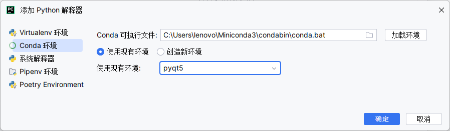
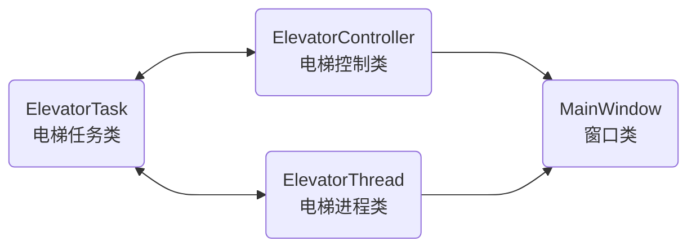
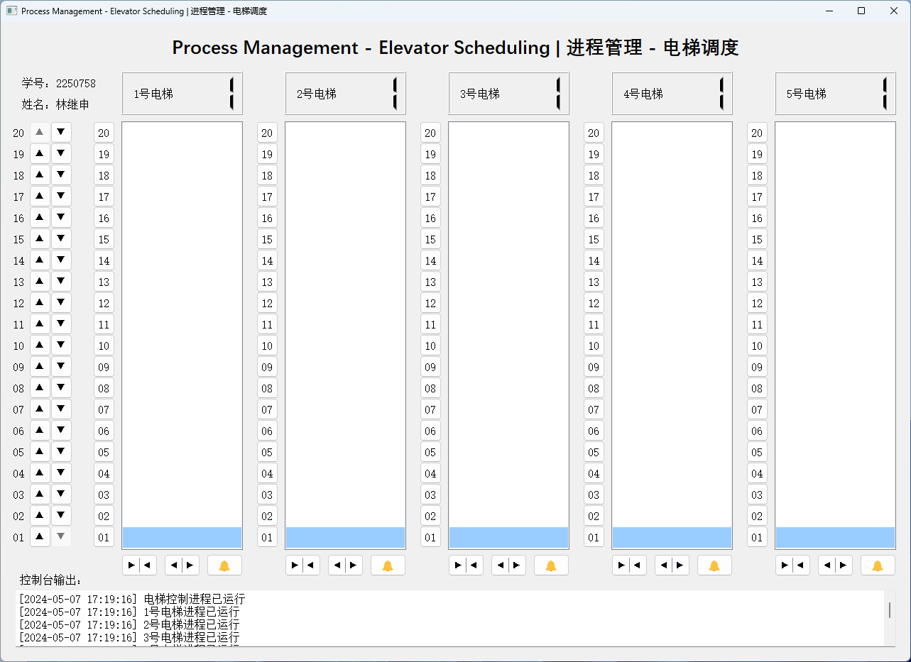
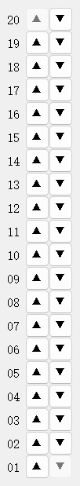
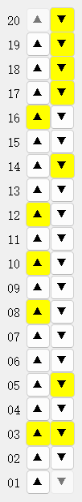
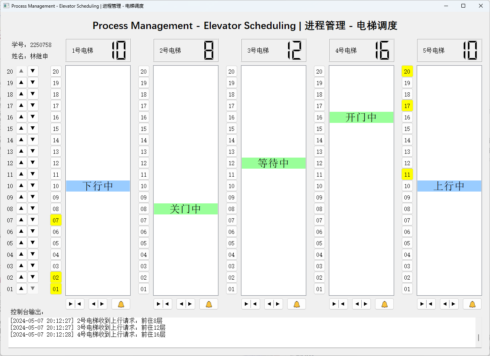
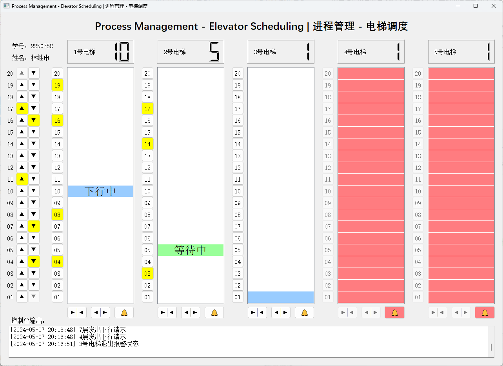
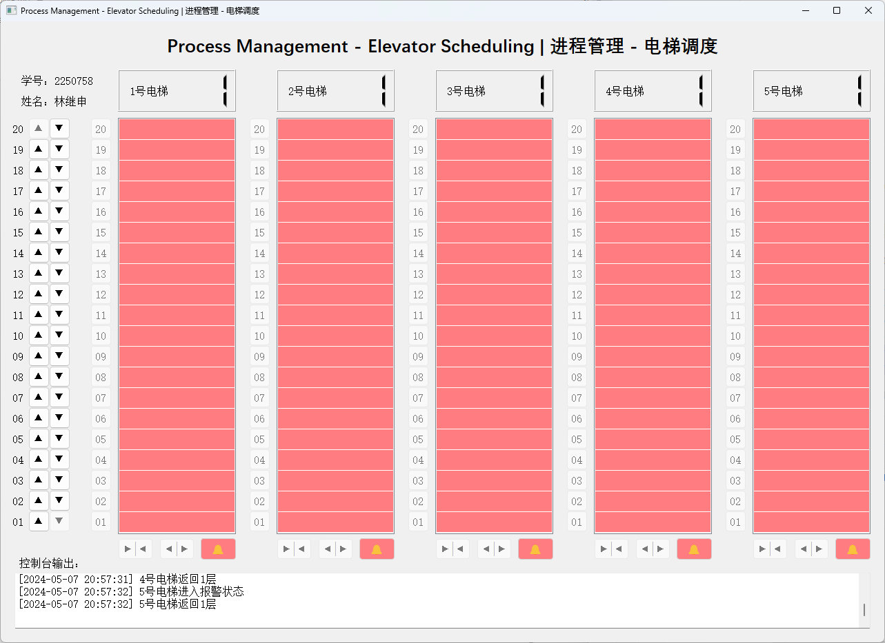
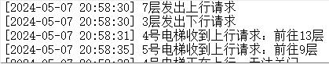

# Process Management

## 1 项目介绍

### 1.1 项目简介

**Process management: Elevator scheduling**

**进程管理项目：电梯调度**

本电梯调度系统是一个基于线程的模拟程序，用于管理一个20层楼宇内的五部互联电梯。程序的主要特点包括：

* **用户界面**
  * 每部电梯都配有一套按键，包括数字键（1-20层），开门键、关门键、上行键、下行键以及报警键。
  * 每层楼以及每部电梯门口装有上行和下行按钮，以及用于显示电梯当前状态的数码显示器。
* **联动功能**
  * 五部电梯通过内部通信系统相互联结。当任一电梯的某个按钮被按下时，其他电梯中相应的按钮也会被激活，表明该命令被系统接收并广播至所有电梯。
* **电梯调度算法**
  * 所有电梯在初始状态时均位于第一层。
  * 电梯在没有接收到请求时应保持当前位置静止，不进行无谓的移动。
  * 调度算法需要设计以优化电梯的响应时间和运行效率，例如考虑当前电梯的方向、请求的楼层位置以及电梯间的协调等因素。
* **技术实现**
  * 系统采用多线程技术，每部电梯由一个独立的线程控制，以模拟电梯的独立运行和实时响应。
  * 程序应包括错误处理和状态监测，以保证系统在各种情况下的稳定运行。

### 1.2 项目目的

* **操作系统调度模拟**
  * 电梯调度系统可以看作是一个操作系统进程调度的微缩模型。在这个系统中，每部电梯都可以视为一个进程，电梯调度算法则模拟了操作系统的进程调度器。
  * 通过模拟电梯的请求、响应和运动，可以深入理解操作系统中的进程调度策略，如何管理多个进程（电梯）同时请求资源（移动到特定楼层）的情况。
* **多线程编程方法**
  * 在该项目中，使用多线程来模拟多部电梯的并行操作，这有助于学习和实践如何在特定环境下有效使用多线程。
  * 多线程编程是操作系统广泛使用的技术，理解和掌握这一技术可以更好地理解现代操作系统的并发和并行处理能力。
* **学习调度算法**
  * 调度算法是操作系统设计中的核心部分，电梯调度算法的设计和优化可以提供关于如何处理多个请求并优化资源分配的直观理解。
  * 电梯调度算法的设计和实现旨在模拟操作系统中的短作业优先、轮转调度等算法，通过调整和优化这些算法，可以深入学习算法对系统性能的影响。
* **实践中的理论应用**
  * 通过实际编写和测试电梯调度系统，可以将理论知识转化为实践经验，更好地理解诸如线程安全、竞态条件和死锁等并发编程问题。

### 1.3 项目组成

* `/assets`
存放 `README.md` 文件所需的相关图片资源

* `/code`
项目源代码

  * `main.py`
  程序入口点，负责初始化程序并处理电梯调度逻辑

  * `ui_design.py`
  用户界面的具体实现代码，通过 PyUIC 转换而来

  * `ui_design.ui`
  描述用户界面的布局和视觉元素，通过 QtDesigner 设计

* `Demonstration.gif`
项目演示

### 1.4 项目运行

#### 1.4.1 直接运行

* 下载 [Release]() 双击运行 `Process_Management.exe`

#### 1.4.2 编译运行

* 搭建 PyQt5 开发环境

* 在 `code` 文件夹激活 PyQt5 conda 环境

  ```bash
  conda activate pyqt5
  ```

* 通过 Python 脚本运行程序

  ```bash
  python ./main.py
  ```

## 2 开发环境

### 2.1 开发环境概述

本项目的开发环境如下：

* 开发环境
  * Windows 11 家庭中文版 23H2
  * Anaconda 24.4.0
  * PyQt5 5.15.9
  * PyQt5-tools 5.15.9.3.3
  * PyInstaller 6.6.0
* 开发软件
  * JetBrains PyCharm 2023.2.1
* 开发语言
  * Python 3.8.0

### 2.2 开发环境搭建

* 从[官方网站](https://www.anaconda.com)下载并安装 Anaconda

* 查找 Anaconda 安装目录。定位系统中Anaconda安装的目录，通常在 Windows 系统上是这样的路径： `C:\Users\<Username>\Anaconda3`

* 设置 Anaconda 环境变量
  * 打开开始菜单并搜索“环境变量”，或者导航到 `控制面板` > `系统和安全` > `系统` > `高级系统设置` > `环境变量`
  * 在环境变量窗口中，找到系统变量部分，点击“新建”并添加以下变量：
    * 变量名： `ANACONDA_HOME`
    * 变量值：你的 Anaconda 安装目录的路径（例如， `C:\Users\<Username>\Anaconda3` ）
  * 接下来，找到系统变量中的 `Path` 变量，选择它，然后点击“编辑”
  * 在路径列表中添加以下两个条目：
    * `%ANACONDA_HOME%`
    * `%ANACONDA_HOME%\Scripts`
  * 点击“确定”保存更改并关闭所有窗口
  * 重启计算机以应用更改

* 验证安装。设置环境变量后，打开一个新的终端或命令提示符窗口，输入 `conda --version` 来验证 Anaconda 现在是否已经在系统的 `PATH` 中，并且可以从任何目录访问

* 更新 conda 包，此命令将当前 conda 环境中的所有包更新到最新版本

  ```bash
  conda update --all
  ```

* 创建 PyQt5 conda 环境，Python 版本指定 3.8

  ```bash
  conda create -n pyqt5 python==3.8
  ```

* 激活 PyQt5 conda 环境

  ```bash
  conda activate pyqt5
  ```

* 安装 PyQt5、PyQt5-tools 和 PyInstaller

  ```bash
  pip install PyQt5 PyQt5-tools PyInstaller
  ```

* 打开 PyCharm，转到 `设置` > `项目` > `Python 解释器` > `添加解释器` > `Conda 环境` > `使用现有环境` ，选择 `pyqt5` ， 点击确定

  

* 转到 `设置` > `工具` > `外部工具` ，分别对 QtDesigner、PyUIC、PyRCC 进行如下设置（路径应根据本机路径进行改动）：
  * QtDesigner
    * 程序： `C:\Users\lenovo\miniconda3\envs\pyqt5\Lib\site-packages\qt5_applications\Qt\bin\designer.exe`
    * 实参：无
    * 工作目录： `$FileDir$`
  * PyUIC
    * 程序： `C:\Users\lenovo\miniconda3\envs\pyqt5\Scripts\pyuic5.exe`
    * 实参： `$FileName$ -o $FileNameWithoutExtension$.py`
    * 工作目录： `$FileDir$`
  * PyRCC
    * 程序： `C:\Users\lenovo\miniconda3\envs\pyqt5\Scripts\pyrcc5.exe`
    * 实参： `$FileName$ -o $FileNameWithoutExtension$_rc.py`
    * 工作目录： `$FileDir$`

至此，本项目的开发环境搭建完成。

## 3 项目设计

### 3.1 程序主体架构设计



在电梯调度系统中，四个核心类 `ElevatorTask` 、 `ElevatorController` 、 `ElevatorThread` 和 `MainWindow` 通过精心设计的接口和明确的责任分工协同工作，确保电梯调度系统的高效运行和用户界面的交互性。以下程序主体架构设计：

* **`ElevatorTask`（电梯任务类）**
  * 此类定义了电梯的运行任务，包括目标楼层、运行方向和任务状态。
  * 它作为任务信息的封装，被 `ElevatorController` 用来分配任务到合适的电梯，并被 `ElevatorThread` 用来实际执行这些任务。
* **`ElevatorController`（电梯控制类）**
  * 作为电梯调度的中心，此类负责决定哪一个电梯来执行哪一个任务。
  * 它根据电梯当前的状态、位置以及任务的方向和位置，采用算法选择最合适的电梯来完成任务。
  * 它还负责将任务添加到选定电梯的队列中，这些操作通过 `ElevatorTask` 类的实例进行管理。
* **`ElevatorThread`（电梯进程类）**
  * 每个电梯都由一个 `ElevatorThread` 实例在后台运行，模拟电梯的物理运动（上下移动和开关门操作）。
  * 这个类使用 `ElevatorTask` 实例来获取其应执行的具体任务，并按照 `ElevatorController` 的调度执行。
  * 它周期性地更新电梯的当前楼层和状态，同时检查并响应任何可能的报警状态。
* **`MainWindow`（窗口类）**
  * 这是用户交互的界面，使用 PyQt5 创建。
  * 它展示电梯的当前状态，接收用户的输入（如电梯楼层按钮的点击），并显示电梯的实时运动。
  * 用户界面通过与 `ElevatorThread` 的交互更新电梯的状态显示，并通过 `ElevatorController` 接收新的用户请求，转换为 `ElevatorTask` 并进行处理。

通过这样的设计，MainWindow提供了一个直观的界面让用户与电梯系统交互，ElevatorController作为调度中心合理地分配任务给适当的电梯，而ElevatorThread确保电梯按预定任务运行。ElevatorTask则在这一切中扮演了任务数据的携带者和传递者的角色。这种架构不仅确保了系统的模块化和扩展性，也提高了电梯调度系统的效率和响应速度。

### 3.2 枚举类设计

在电梯调度系统中，使用枚举类来表示电梯状态和任务状态。主要出于以下几点考虑：

  * 枚举类的命名常量提高了代码的可读性和可维护性，使状态信息一目了然。
  * 枚举限定值集合，有助于减少无效状态值的使用，从而降低代码中的错误风险。
  * 枚举使状态的比较和验证更为便捷和准确，在逻辑判断中可以直接使用枚举常量进行匹配。
  * 枚举将相关常数封装在一起，有助于组织和管理电梯调度系统中的状态和任务状态，实现清晰的逻辑结构。

#### 3.2.1 电梯运行状态枚举类

```python
class ElevatorState(Enum):
    DOWNWARD = -1  # 电梯下行状态
    STATIONARY = 0  # 电梯静止状态
    UPWARD = 1  # 电梯上行状态
    WARNING = 2  # 电梯报警状态
    DOOR_OPERATING = 3  # 电梯开关门状态
```

#### 3.2.2 电梯任务状态枚举类

```python
class ElevatorTaskState(Enum):
    PENDING = 0  # 任务尚未分配状态
    IN_PROGRESS = 1  # 任务正在等待状态
    COMPLETED = 2  # 任务已完成状态
```

### 3.3 类设计

#### 3.3.1 `MainWindow` 类（窗口类）设计

##### 3.3.1.1 类概述

`MainWindow` 类负责使用 PyQt5 创建一个功能齐全的电梯调度系统的主窗口。它定义并初始化各种电梯控制组件，包括楼层显示屏、开门和关门按钮、报警按钮以及电梯内外的楼层请求按钮。它通过连接按钮点击事件的回调函数来处理用户的电梯请求，并通过定时器周期性更新电梯状态和界面。该类集成了控制台输出、按钮交互，以模拟多部电梯的正常运行、上下行调度和状态报警等功能。

##### 3.3.1.2 函数接口设计

| 函数接口 | 功能 |
| :--- | :--- |
| `def __init__()` | 初始化窗口类 |
| `def init_ui_components()` | 初始化 UI 组件 |
| `def console_output(message)` | 控制台输出信息 |
| `def elevator_open_door_button_clicked(elevator_index)` | 电梯开门按钮点击事件函数 |
| `def elevator_close_door_button_clicked(elevator_index)` | 电梯关门按钮点击事件函数 |
| `def elevator_warning_button_clicked(elevator_index)` | 电梯报警按钮点击事件函数 |
| `def to_floor_elevator_button_clicked(elevator_index, floor_index)` | 电梯楼层按钮点击事件函数 |
| `def upward_or_downward_elevator_button_clicked(floor_index, move_direction)` | 电梯上行或下行按钮点击事件函数 |
| `def update_elevator_state(elevator_index, floor_index, background_color=BUTTON_DEFAULT_COLOR, message='')` | 更新电梯状态 |
| `def update()` | 窗口更新函数 |

#### 3.3.2 `ElevatorTask` 类（电梯任务类）设计

##### 3.3.2.1 类概述

`ElevatorTask` 类负责定义一个电梯调度任务，包含目标楼层、运行方向以及任务状态的属性。它通过 `target_floor` 指定电梯目标楼层， `move_direction` 决定电梯的运行方向（上行或下行），并用 `task_state` 表示当前任务的状态，如等待执行或已完成。此类的实例用于管理和协调不同楼层的电梯请求，在电梯调度系统中发挥重要的调度作用。

##### 3.3.2.2 函数接口设计

| 函数接口 | 功能 |
| :--- | :--- |
| `def __init__(target_floor, move_direction, task_state=ElevatorTaskState.PENDING)` | 初始化电梯任务类 |

#### 3.3.3 `ElevatorThread` 类（电梯进程类）设计

##### 3.3.3.1 类概述

`ElevatorThread` 类负责模拟电梯的独立运行进程，通过继承 `QThread` 提供多线程并行处理的能力。该类使用电梯索引来跟踪每个电梯的状态，并提供电梯在楼层间移动（ `floor_travel` ）、开关门（ `door_toggle` ）和报警处理（ `warning_handler` ）的功能。线程的主要循环（ `run` 方法）会根据当前任务队列动态地调整电梯的运行方向，优先执行与当前电梯状态一致的楼层请求，同时监控可能出现的报警状态并及时处理。这一类旨在确保多部电梯在调度程序中协同工作，有效响应各个楼层的内部和外部请求。

##### 3.3.3.2 函数接口设计

| 函数接口 | 功能 |
| :--- | :--- |
| `def __init__(elevator_index)` | 初始化电梯进程类 |
| `def floor_travel(move_direction)` | 电梯上下楼操作 |
| `def door_toggle()` | 电梯开关门操作 |
| `def warning_handler()` | 电梯报警处理 |
| `def run()` | 运行电梯线程 |

#### 3.3.4 `ElevatorController` 类（电梯控制类）设计

##### 3.3.4.1 类概述

`ElevatorController` 类继承自 `QThread` ，用于提供电梯调度的核心逻辑。它在 `allocate_elevator` 方法中基于当前电梯的运行状态、任务方向以及楼层距离来为每个任务选择最合适的电梯，并通过 `add_elevator_task` 将任务添加到对应电梯的请求队列中。该类的 `run` 方法会不断循环检查任务列表，根据任务的状态、方向和楼层来合理分配和调整电梯的任务队列。通过这种方式， `ElevatorController` 确保多部电梯高效运行、协同处理各楼层的请求，实现了电梯系统的智能调度。

##### 3.3.4.2 函数接口设计

| 函数接口 | 功能 |
| :--- | :--- |
| `def __init__()` | 初始化电梯控制类 |
| `def allocate_elevator(elevator_task)` | 为电梯任务分配电梯 |
| `def add_elevator_task(elevator_index, elevator_task, descending=False)` | 添加电梯任务 |
| `def run()` | 运行电梯控制进程 |

### 3.4 电梯调度算法设计

本项目实现了一个电梯调度算法，以为新的电梯任务找到一个最合适的电梯来执行该任务，即寻找距离目标楼层最近的电梯。本电梯调度算法基于**先来先服务（FCFS）调度算法**和**LOOK调度算法**，智能地考虑了电梯的当前状态和运行方向来优化任务的分配。以下是该算法详细介绍：

#### 3.4.1 算法流程与逻辑

* **初始化参数**
  * 初始化为一个较大值（楼层数加一），用于存储计算出的最小距离。
  * 初始化记录距离最小的电梯索引变量。
* **遍历每部电梯**
  * 跳过处于警报状态的电梯，因为这些电梯无法正常运行。
* **计算到目标楼层的距离**
  * 首先确定电梯的起始楼层。如果电梯正在向上或向下运行，会相应地调整其楼层（预测下一步的位置）。
  * 根据电梯的运行方向，获取其任务队列（向上或向下的队列）。
* **距离计算逻辑**
  * 如果电梯当前没有任务，直接计算电梯当前楼层与目标楼层的绝对距离。
  * 如果电梯的运行方向与任务方向一致，并且目标楼层在电梯的运行路径上，也计算当前楼层与目标楼层的绝对距离。
  * 如果以上条件不成立，计算当前楼层到任务队列中最远楼层的距离，再加上最远楼层到目标楼层的距离。这种情况处理了电梯运行方向与任务方向不一致或目标楼层不在当前路径上的情况。
* **选择最佳电梯**
  * 如果计算出的距离小于当前记录的最小距离，则更新最小距离和目标电梯索引。
* **返回结果**
  * 函数最终返回距离最近的电梯索引，用于执行新的电梯任务。

#### 3.4.2 算法特点与优势

此电梯调度算法不仅提高了电梯系统的整体效率，还通过减少乘客等待时间和电梯空转时间，优化了电梯的运行效率，是一个高效且实用的电梯调度解决方案。

* **效率与响应性**：通过选择最近的电梯来减少乘客的等待时间，提高系统的响应性和效率。
* **智能决策**：算法考虑了电梯的当前运行状态和方向，更加智能地匹配任务，减少了不必要的电梯运行时间。
* **动态调整**：算法能够动态地根据电梯的实时状态进行调整，使得电梯调度更加灵活和适应性强。

### 3.5 用户交互界面设计

#### 3.5.1 用户交互界面设计概述

本电梯调度程序使用 QtDesigner 设计了用户友好的交互界面。界面组成部分及相关 Qt 组件如下：

* 标题区（ `QLabel` ）
* 作者信息区（ `QLabel` ）
* 外部控制面板
  * 楼层显示提示（ `QLabel` ）
  * 上行电梯按钮（ `QPushButton` ）
  * 下行电梯按钮（ `QPushButton` ）
* 电梯控制面板
  * 电梯楼层显示屏（ `QLabel` 和 `QLCDNumber` ）
  * 电梯运行状态显示区（ `QListWidget` ）
  * 电梯楼层按钮（ `QPushButton` ）
  * 电梯关门按钮（ `QPushButton` ）
  * 电梯开门按钮（ `QPushButton` ）
  * 电梯报警按钮（ `QPushButton` ）
* 控制台窗口（ `QLabel` 和 `QPlainTextEdit` ）



#### 3.5.2 用户交互界面设计理念

本电梯调度程序的用户交互界面考虑了多个电梯的管理和监控需求，使用了 QtDesigner 进行设计，确保**用户友好性**和**功能全面性**。

本项目的用户交互界面设计理念如下：

* **清晰的模块划分**：界面清晰地将每个电梯的控制面板分开显示，每个模块包含单独的楼层按钮、电梯运行状态显示和控制按钮（如门控、警报等），这种布局使得操作者可以快速、直观地管理和监控多部电梯的状态。
* **直观的楼层导航**：每部电梯旁边的楼层按钮清晰标注，配有上下行箭头按钮，使用户可以轻松设置电梯的目的楼层。这种设计减少了操作的复杂性，提升了界面的用户友好度。
* **实时状态反馈**：通过底部的控制台窗口和电梯运行状态显示区，实时显示电梯的运行日志和状态变更，增强了操作的透明度和可追踪性。
* **一致性与可访问性**：界面的风格和操作逻辑在各个部分保持一致，使用了标准化的 Qt 组件，如 `QPushButton` 、 `QLabel` 、 `QLCDNumber` 等，这不仅确保了界面的美观性，也保证了不同用户的易用性。
* **紧急措施可用性**：每部电梯控制面板均配备有报警按钮，确保在紧急情况下可以快速作出反应，提高了系统的安全性。

#### 3.5.3 用户交互界面设计亮点

##### 3.5.3.1 外部控制面板设计亮点

外部控制面板设计亮点如下：

* 对每一层提供了清晰的楼层提示
* 按钮被点击和未被点击的状态具有统一的样式
* 点击上行或下行电梯按钮时提供高亮显示，并且该按钮在当前请求完成之前不可以重复点击（禁用状态），该按钮在当前请求完成之后恢复启用状态
* 底层的下行电梯按钮和顶层的上行电梯按钮始终不可点击（禁用状态）
* 使用符号 `▲` 和 `▼` 为电梯按钮的功能提供直观显示

 

##### 3.5.3.2 电梯控制面板设计亮点

电梯控制面板设计亮点如下：

* 电梯楼层显示屏实时显示当前电梯索引和电梯所处楼层，清晰直观
* 对每一层提供了清晰的楼层提示
* 按钮被点击和未被点击的状态具有统一的样式
* 点击电梯楼层按钮时提供高亮显示，并且该按钮在当前请求完成之前不可以重复点击（禁用状态），该按钮在当前请求完成之后恢复启用状态
* 使用符号 `▶|◀` 、 `◀|▶` 和 `🔔` 为电梯按钮的功能提供直观显示
* 当电梯进入报警状态时，电梯报警按钮提供高亮显示，电梯楼层按钮和开关门按钮被禁用，不可点击
* 当电梯退出报警状态时，电梯报警按钮取消高亮显示，电梯楼层按钮和开关门按钮被启用，可以点击
* 电梯运行状态显示区动态显示电梯当前所处楼层和电梯运行状态，并提供色彩区分
  * 电梯静止状态，背景颜色浅蓝色
  * 电梯上行状态，背景颜色浅蓝色，显示文字“上行中”
  * 电梯下行状态，背景颜色浅蓝色，显示文字“下行中”
  * 电梯开门状态，背景颜色浅绿色，显示文字“开门中”
  * 电梯等待状态，背景颜色浅绿色，显示文字“等待中”
  * 电梯关门状态，背景颜色浅绿色，显示文字“关门中”
  * 电梯报警状态，背景颜色浅红色







##### 3.5.3.3 控制台窗口设计亮点

控制台窗口是电梯调度系统中一个关键的界面元素，其设计精细且功能丰富，为操作者提供了全面的系统运行信息，确保了操作的高效性和透明度。



控制台窗口设计亮点：

* **实时信息输出**：通过 `MainWindow` 类的 `console_output` 方法，系统可以将关键操作和状态变更实时输出到控制台窗口，使操作者能够即时获取电梯的运行状态，包括电梯的上下行动作、门的开关状态以及电梯报警状态等。这种实时反馈对于维护电梯的正常运行和及时响应潜在问题至关重要。
* **事件时间标记**：每个输出信息前都标注有发生时间，格式为 `[日期时间]` ，这不仅有助于记录和回顾事件发生的具体时刻，也使得问题诊断和系统监控更为方便和有效。时间戳的精确记录是系统透明度和可追踪性的关键因素。
* **广泛的事件覆盖**：控制台窗口能够输出广泛的事件信息，包括但不限于电梯的请求处理、位置更新、门操作处理及报警状态变更。这样的设计确保了系统每一个重要动作都能被记录和显示，极大地增强了系统的可管理性和用户对系统状态的掌握。
* **故障与警报处理**：特别是在电梯遇到故障或用户触发报警时，控制台窗口能够快速地显示相关信息。

```python
console_output('电梯控制进程已运行')
console_output(f'{elevator_index + 1}号电梯收到上行请求：前往{floor_index + 1}层')
console_output(f'{elevator_index + 1}号电梯收到下行请求：前往{floor_index + 1}层')
console_output(f'{elevator_index + 1}号电梯位于{floor_index + 1}层')
console_output(f'{elevator_index + 1}号电梯进程已运行')
console_output(f'{elevator_index + 1}号电梯正在下行，无法开门')
console_output(f'{elevator_index + 1}号电梯已开门')
console_output(f'{elevator_index + 1}号电梯正在上行，无法开门')
console_output(f'{elevator_index + 1}号电梯处于报警状态')
console_output(f'{elevator_index + 1}号电梯正在开关门')
console_output(f'{elevator_index + 1}号电梯正在下行，无法关门')
console_output(f'{elevator_index + 1}号电梯已关门')
console_output(f'{elevator_index + 1}号电梯正在上行，无法关门')
console_output(f'{elevator_index + 1}号电梯处于报警状态')
console_output(f'{elevator_index + 1}号电梯正在开关门')
console_output(f'{elevator_index + 1}号电梯退出报警状态')
console_output(f'{elevator_index + 1}号电梯进入报警状态')
console_output(f'{elevator_index + 1}号电梯返回1层')
console_output(f'{elevator_index + 1}号电梯处于报警状态')
console_output(f'{floor_index + 1}层发出上行请求')
console_output(f'{floor_index + 1}层发出下行请求')
console_output('所有电梯均处于报警状态')
```

## 4 项目实现

### 4.1 常变量和全局变量

#### 4.1.1 常变量

在本电梯调度系统中，为了提高代码的可读性和可维护性，项目采用了常量的设计方式来管理系统中各种不变的参数。通过定义常变量，如电梯数量（ `ELEVATOR_NUM` ）、楼层数量（ `FLOOR_NUM` ）、以及刷新时间间隔等，使得这些值在整个项目中易于管理和修改。

使用常变量的好处显而易见，它不仅使得代码结构更清晰，也使得程序更加灵活。当系统需求发生变化，或需要对电梯的配置参数进行调整时，开发者可以快速地在一个集中的位置修改这些常量值，而无需深入底层代码进行多点修改。这极大地减少了出错的可能性，并简化了代码的维护工作。

```python
ELEVATOR_NUM = 5  # 电梯数量
FLOOR_NUM = 20  # 楼层数量
REFRESH_INTERVAL = 30  # 刷新时间间隔
THREAD_INTERVAL = 100  # 线程时间间隔
FLOOR_TRAVEL_TIME = 1000  # 电梯上下楼时间
DOOR_TOGGLE_TIME = 2000  # 电梯开关门时间
ELEVATOR_RUNNING_COLOR = (153, 204, 255)  # 电梯运行状态颜色
ELEVATOR_DOOR_COLOR = (153, 255, 153)  # 电梯开关门状态颜色
BUTTON_DEFAULT_COLOR = (255, 255, 255)  # 按钮默认状态颜色
WARNING_BUTTON_COLOR = (255, 124, 128)  # 按钮报警状态颜色
BUTTON_WARNING_STYLE = f'''
QPushButton:enabled {{
    background-color: rgb(255, 124, 128);
    color: black;
    border: 1px solid rgb(208, 208, 208);
    border-radius: 4px;
}}
'''  # 按钮报警状态（启用状态）样式
BUTTON_CLICKED_STYLE = f'''
QPushButton:disabled {{
    background-color: rgb(255, 255, 0);
    color: black;
    border: 1px solid rgb(208, 208, 208);
    border-radius: 4px;
}}
'''  # 按钮选中状态（禁用状态）样式
```

#### 4.1.2 全局变量

全局变量是电梯调度系统中至关重要的组件，为电梯调度和多线程操作提供状态管理和数据共享。每个全局变量的作用如下：

* `mutex` ：互斥锁，由 `QMutex` 实现，用于在多线程操作中实现同步和互斥。它能够避免不同线程之间对全局数据的竞争或条件冲突，确保数据访问的一致性和安全性。
* `elevator_up_queue` ：一个包含 `ELEVATOR_NUM` 个子列表的二维列表，每个子列表代表各台电梯的上行目标楼层队列。各个队列中的目标楼层将按照请求的顺序执行。这个列表确保上行的请求能够按照指定顺序分配并调度。
* `elevator_down_queue` ：与 `elevator_up_queue` 类似，该变量包含每台电梯的下行目标楼层队列。下行请求在这里按照顺序排列，保证了电梯系统能正确地处理各楼层的下行请求。
* `elevator_task_list` ：一个包含所有电梯任务的列表，保存了当前所有等待处理的外部楼层请求。这些任务由 `ElevatorTask` 类实例化，包含目标楼层、方向和状态等信息，是任务调度的重要基础数据。
* `elevator_state` ：一个包含每台电梯当前状态的列表，初始状态为 `STATIONARY` （静止状态）。状态可以是上行（ `UPWARD` ）、下行（ `DOWNWARD` ）、报警（ `WARNING` ）或其他，反映了每台电梯的实时运行状态。
* `elevator_current_floor` ：每台电梯当前楼层的位置列表，初始值为 `0` ，代表每台电梯的起始位置。在程序运行时，这个列表将动态更新电梯的当前位置，用于计算任务的距离和分配最优电梯。
* `elevator_door_operating_progress` ：一个保存每台电梯当前门操作进度的列表，取值范围从 `0.0` （门完全关闭）到 `1.0` （门完全打开）。这确保了门的状态能够被准确追踪，从而让调度系统避免在门操作未完成时移动电梯。
* `move_directions` ：一个保存每台电梯当前运行方向的列表，初始值为 `UPWARD` （上行方向）。电梯运行方向决定了调度算法如何分配任务和响应楼层请求。

这些全局变量为调度系统提供了状态追踪、任务分配和资源共享的基础框架，有助于确保多部电梯之间的协调运行，从而实现高效的楼层任务调度。

```python
mutex = QMutex()  # 互斥锁（管理线程同步，避免数据竞争和条件竞争）
elevator_up_queue = [[] for _ in range(ELEVATOR_NUM)]  # 每台电梯待处理的上行目标列表
elevator_down_queue = [[] for _ in range(ELEVATOR_NUM)]  # 每台电梯待处理的下行目标列表
elevator_task_list = []  # 电梯任务列表
elevator_state = [ElevatorState.STATIONARY for _ in range(ELEVATOR_NUM)]  # 每台电梯的状态
elevator_current_floor = [0 for _ in range(ELEVATOR_NUM)]  # 每台电梯的当前楼层
elevator_door_operating_progress = [0.0 for _ in range(ELEVATOR_NUM)]  # 每台电梯的开关门进度
move_directions = [ElevatorState.UPWARD for _ in range(ELEVATOR_NUM)]  # 每台电梯的运行方向
```

### 4.2 类实现

#### 4.2.1 `MainWindow` 类（窗口类）实现

`MainWindow` 类是电梯调度系统的核心窗口类，负责电梯调度界面的初始化和更新，同时处理电梯请求的交互操作。它的主要职责包括初始化组件、响应用户交互、更新界面状态以及在控制台输出信息。具体实现如下：

* **构造函数 `__init__`**
  * 初始化主窗口类并调用 `super()` 实现父类 `QMainWindow` 的构造。
  * 实例化 UI 设计类 `ui_design.Ui_MainWindow()` 以加载界面。
  * 创建用于显示电梯状态的组件列表，包括：LCD 显示器、状态列表、小按钮等。
  * 设置定时器，通过指定的刷新时间间隔更新电梯调度状态，定时器触发的超时信号连接到 `update()` 方法。
  * 最后通过 `show()` 方法显示主窗口。

* **`init_ui_components()` 方法**
  * 通过 `setupUi()` 方法设置并初始化用户界面。
  * 将窗口标题设定为 `"Process Management - Elevator Scheduling | 进程管理 - 电梯调度"`。
  * 逐个电梯实例化每个电梯的控制组件，并将它们与 `MainWindow` 类中的相应列表关联。
  * 为按钮注册点击事件处理器，使用 `partial()` 为每个按钮提供特定的索引参数，方便点击事件处理函数识别是哪一台电梯或楼层。

* **控制台输出 `console_output()` 方法**
  * 将消息输出到控制台窗口，以 `[日期时间]`的格式记录每个事件发生的时间和信息。

* **按钮点击事件处理**
  * `elevator_open_door_button_clicked()` 和 `elevator_close_door_button_clicked()` 负责处理开门与关门按钮的点击事件，判断电梯的当前状态是否允许操作。
  * `elevator_warning_button_clicked()` 处理电梯报警按钮，允许用户将报警状态激活或解除。
  * `to_floor_elevator_button_clicked()` 处理电梯内的楼层按钮请求，添加楼层到电梯的上行或下行队列。
  * `upward_or_downward_elevator_button_clicked()` 负责处理楼层外部的上下行按钮点击事件，生成新的电梯任务并添加到任务列表。

* **状态更新**
  * `update_elevator_state()` 方法根据给定的电梯和楼层索引更新状态列表项的外观。
  * `update()` 方法作为定时器的超时信号处理器，负责更新各电梯的 LCD 显示器、运行状态、以及楼层上下行按钮的状态。它确保按钮样式和可用性反映当前电梯的状态。

#### 4.2.2 `ElevatorTask` 类（电梯任务类）实现

`ElevatorTask` 类代表电梯的一个调度任务，它记录了目标楼层、运行方向以及任务的当前状态。其实现细节如下：

* **构造函数 `__init__`**
  * 初始化时接收三个参数：目标楼层 `target_floor` 、电梯的运行方向 `move_direction` ，以及任务的状态 `task_state` （默认为 `ElevatorTaskState.PENDING` ）。
  * 这些参数值分别存储在对象的属性 `target_floor` 、 `move_direction` 和 `task_state` 中。

#### 4.2.3 `ElevatorThread` 类（电梯进程类）实现

`ElevatorThread` 类是一个基于 `QThread` 的电梯线程类，实现了电梯运行过程中的核心逻辑。主要职责是处理每个独立电梯的任务，包括楼层移动、开关门和报警管理。以下是它的具体实现：

* **构造函数 `__init__`**
  * 初始化电梯的索引 `elevator_index` ，用于标识不同的电梯。
  * 使用 `super().__init__()` 调用父类构造函数，确保线程正常初始化。

* **方法 `floor_travel`**
  * 负责电梯在不同楼层间移动，根据 `move_direction` 确定电梯向上或向下的方向，并更改电梯的状态。
  * 通过一个时间循环模拟楼层间的移动时间，如果途中发生报警状态，会中断移动并调用 `warning_handler` 。
  * 一旦到达目标楼层，将电梯当前楼层值更新，并切换电梯为静止状态。

* **方法 `door_toggle`**
  * 模拟电梯开关门操作，并更改电梯状态为门操作中。
  * 在门的操作过程中，周期性检查报警状态，如果发生报警则中断操作并处理报警。
  * 如果门完全打开或关闭，电梯状态被重置为静止状态。

* **方法 `warning_handler`**
  * 处理电梯的报警状态，将电梯状态设置为报警，并清空上下楼的任务队列。
  * 将进行中的任务状态恢复为等待，确保故障排除后可以重新调度任务。

* **方法 `run`**
  * `run` 方法是线程的主要执行体，持续检测和执行电梯的任务。
  * 根据当前移动方向，决定优先处理向上或向下的队列。
  * 当电梯到达目标楼层时，会执行开关门操作并更新任务状态。
  * 确保线程持续运行过程中不会阻塞，并可以随时切换方向或处理报警。

#### 4.2.4 `ElevatorController` 类（电梯控制类）实现

`ElevatorController` 类是一个基于 `QThread` 的电梯调度管理类，主要负责调度任务的分配和管理。以下是它的主要功能及实现细节：

* **构造函数 `__init__`**
  * 调用父类 `QThread` 的构造函数以初始化线程类。

* **静态方法 `allocate_elevator`**
  * 接受一个 `ElevatorTask` 实例作为参数，为任务分配最合适的电梯。
  * 遍历每个电梯，跳过处于警报状态的电梯。
  * 根据电梯当前的楼层状态（上下移动或静止）计算目标楼层与当前楼层的距离。
  * 优先选择距离任务目标楼层最近且方向合适的电梯，将其索引返回给调用者。

* **静态方法 `add_elevator_task`**
  * 将新的电梯任务添加到相应电梯的任务队列中。
  * `elevator_index` 指定哪个电梯执行任务， `elevator_task` 是任务本身， `descending` 标识电梯的运行方向。
  * 维护两个不同的任务队列： `elevator_up_queue` （上行）和 `elevator_down_queue` （下行）。
如果目标楼层未在队列中，按顺序插入目标楼层，同时将任务状态设置为“进行中”。

* **方法 `run`**
  * `run` 是线程的主要执行体，不断轮询 `elevator_task_list` ，查看是否有待处理的任务。
  * 使用互斥锁确保对共享资源的安全访问。
  * 对于每个任务，如果状态是“等待中”，通过 `allocate_elevator` 找到合适的电梯。
  * 根据目标楼层和移动方向，将任务加入相应电梯的队列中。
  * 清理已完成的任务，从任务列表中移除它们。

### 4.3 电梯调度算法实现

电梯调度算法在 `ElevatorController` 类中实现，首先初始化并通过方法 `run` 启动电梯控制线程，然后通过静态方法 `allocate_elevator` 接受一个 `ElevatorTask` 实例作为参数，为任务分配最合适的电梯。之后通过静态方法 `add_elevator_task` 将新的电梯任务添加到相应电梯的任务队列中。

基于**先来先服务（FCFS）调度算法**和**LOOK调度算法**的电梯调度算法主要在静态方法 `allocate_elevator` 中实现，下面是此方法的具体实现细节：

* **变量初始化**
  * `min_distance` ：用于追踪当前找到的最小距离，初始化为比最大楼层数还要大的数值，以确保距离可以被正确更新。
  * `target_elevator_index` ：初始化为 `-1` ，用于记录当前找到的目标电梯的索引。
* **循环遍历电梯**
  * 遍历所有电梯，通过 `elevator_index` 检查每个电梯的状态和当前任务队列：
    * 跳过处于警报状态的电梯。
    * 根据电梯状态（上行、下行、静止），确定电梯的当前位置 `origin_index` 。
* **确定任务队列**
  * 根据电梯的运行方向（ `move_directions` ），获取该电梯对应的目标楼层队列（上行或下行）。
  * 如果**队列为空**，则直接计算目标楼层与当前楼层的距离。
  * 如果**队列不为空**，进一步判断电梯的运行方向与任务方向是否一致，并确定目标楼层与队列中的楼层位置关系：
    * **方向一致且位置合理**：直接计算 `origin_index` 与任务目标楼层的距离。
    * **方向不同或位置不合理**：需绕过当前队列，计算经过最后一个目标楼层再到任务目标楼层的总距离。
* **选择目标电梯**
  * 如果计算得到的距离比 `min_distance` 更小，更新 `min_distance` 和 `target_elevator_index` 。
* **返回结果**
  * 返回找到的目标电梯索引。如果找不到合适的电梯，返回 `-1` 。

```python
@staticmethod
def allocate_elevator(elevator_task):
    """
    为电梯任务分配电梯

    :param elevator_task: 电梯任务
    :type elevator_task: ElevatorTask
    :return: 电梯索引
    :rtype: int
    """

    # 变量初始化
    min_distance = FLOOR_NUM + 1
    target_elevator_index = -1

    # 循环遍历电梯
    for elevator_index in range(ELEVATOR_NUM):
        if elevator_state[elevator_index] == ElevatorState.WARNING:
            continue

        target_indexes = []
        origin_index = elevator_current_floor[elevator_index]
        if elevator_state[elevator_index] == ElevatorState.UPWARD:
            origin_index += 1
        elif elevator_state[elevator_index] == ElevatorState.DOWNWARD:
            origin_index -= 1

        # 确定任务队列
        if move_directions[elevator_index] == ElevatorState.UPWARD:
            target_indexes = elevator_up_queue[elevator_index]
        elif move_directions[elevator_index] == ElevatorState.DOWNWARD:
            target_indexes = elevator_down_queue[elevator_index]

        # 队列为空
        if not target_indexes:
            distance = abs(origin_index - elevator_task.target_floor)

        # 队列不为空
        else:
            # 方向一致且位置合理
            if move_directions[elevator_index] == elevator_task.move_direction and (
                    (elevator_task.move_direction == ElevatorState.UPWARD
                        and elevator_task.target_floor >= origin_index) or (
                            elevator_task.move_direction == ElevatorState.DOWNWARD
                            and elevator_task.target_floor <= origin_index)):
                distance = abs(origin_index - elevator_task.target_floor)

            # 方向不同或位置不合理
            else:
                distance = (abs(origin_index - target_indexes[-1])
                            + abs(elevator_task.target_floor - target_indexes[-1]))

        # 选择目标电梯
        if distance < min_distance:
            min_distance = distance
            target_elevator_index = elevator_index

    # 返回结果
    return target_elevator_index
```

### 4.4 状态更新实现

#### 4.4.1 更新电梯状态实现

`update_elevator_state` 方法用于更新电梯的状态信息，显示在相应的用户界面组件上。该方法的实现步骤如下：

* **创建 `QBrush` 对象**：首先，使用传入的 RGB 颜色值创建一个 `QBrush` 对象。这个对象用来设置列表项的背景色。 `QColor(*background_color)` 创建一个颜色对象， `*background_color` 表示将 RGB 元组解包为单独的参数。
* **设置画刷样式**：通过 `itemBrush.setStyle(QtCore.Qt.SolidPattern)` 设置画刷的样式为实心填充，这样整个列表项的背景都会被填充为指定的颜色。
* **获取列表项**：使用 `self.elevator_list_widget[elevator_index].item(FLOOR_NUM - 1 - floor_index)` 获取对应电梯的楼层列表中特定楼层的项。这里 `FLOOR_NUM - 1 - floor_index` 计算得到的是从列表顶部开始的楼层位置。
* **更新列表项的背景和文本**：调用 `item.setBackground(itemBrush)` 设置列表项的背景色。使用 `item.setText(message)` 设置列表项的文本内容，以反映最新的电梯状态信息。

```python
def update_elevator_state(self, elevator_index, floor_index, background_color=BUTTON_DEFAULT_COLOR, message=''):
    """
    更新电梯状态

    :param elevator_index: 电梯索引
    :type elevator_index: int
    :param floor_index: 楼层索引
    :type floor_index: int
    :param background_color: 背景颜色
    :type background_color: rgb
    :param message: 信息
    :type message: str
    """
    itemBrush = QtGui.QBrush(QtGui.QColor(*background_color))
    itemBrush.setStyle(QtCore.Qt.SolidPattern)
    item = self.elevator_list_widget[elevator_index].item(FLOOR_NUM - 1 - floor_index)
    item.setBackground(itemBrush)
    item.setText(message)
```

#### 4.4.2 窗口更新函数实现

`update` 方法的主要目的是更新电梯调度系统中各电梯的显示状态和控制界面。以下是函数的主要实现细节和步骤：

* **线程安全**：首先，使用 `mutex.lock() `和 `mutex.unlock()` 来保证数据的一致性和线程安全。在修改共享资源（如电梯状态和控制按钮）之前先加锁，修改完成后再解锁。这是多线程编程中常用的方式来防止数据竞争。
* **更新电梯楼层显示**： `self.elevator_lcd_number[elevator_index].display(str(elevator_current_floor[elevator_index] + 1))` 更新电梯的当前楼层显示。电梯索引 `elevator_index` 用于指定是哪一部电梯， `elevator_current_floor` 数组存储了各电梯的当前楼层。
* **更新电梯门状态**：如果电梯处于门操作状态（ `ElevatorState.DOOR_OPERATING` ），则更新相关电梯的楼层按钮的启用状态，并根据电梯门操作的进度（ `elevator_door_operating_progress` ）更新门的状态显示（开门中、等待中、关门中）。
* **电梯呼叫按钮状态**：在解锁之后，更新所有上行和下行的电梯呼叫按钮的状态，使得顶楼的上行按钮和底楼的下行按钮不可用，其它按钮则根据当前电梯任务的状态进行启用或禁用，并设置相应的样式。
* **更新任务中的电梯状态**：再次加锁后，遍历 `elevator_task_list` 列表，根据每个任务的状态和方向，更新对应楼层按钮的启用状态和样式。
* **更新电梯运行状态**：电梯运行状态更新：最后一次加锁用于更新每部电梯的运行状态。根据电梯的状态（上行、下行、静止但不是门操作或警告状态），调用 `update_elevator_state` 方法更新状态显示。还包括了对于电梯上下两个楼层状态的更新，可能用于清除之前楼层的状态显示或者准备更新下一个状态。
* **解锁**：最终解锁，确保所有状态更新完成后释放互斥锁。

```python
def update(self):
    """
    窗口更新函数
    """
    mutex.lock()

    for elevator_index in range(ELEVATOR_NUM):
        self.elevator_lcd_number[elevator_index].display(str(elevator_current_floor[elevator_index] + 1))
        if elevator_state[elevator_index] == ElevatorState.DOOR_OPERATING:
            self.to_floor_elevator_button[elevator_index][elevator_current_floor[elevator_index]].setEnabled(True)
            if elevator_door_operating_progress[elevator_index] < 1 / 4:
                self.update_elevator_state(elevator_index,
                                            elevator_current_floor[elevator_index],
                                            ELEVATOR_DOOR_COLOR,
                                            '开门中')
            elif elevator_door_operating_progress[elevator_index] < 3 / 4:
                self.update_elevator_state(elevator_index,
                                            elevator_current_floor[elevator_index],
                                            ELEVATOR_DOOR_COLOR,
                                            '等待中')
            else:
                self.update_elevator_state(elevator_index,
                                            elevator_current_floor[elevator_index],
                                            ELEVATOR_DOOR_COLOR,
                                            '关门中')

    mutex.unlock()

    for button in self.upward_elevator_button:
        button.setEnabled(True)
        button.setStyleSheet('')
    for button in self.downward_elevator_button:
        button.setEnabled(True)
        button.setStyleSheet('')
    self.upward_elevator_button[FLOOR_NUM - 1].setEnabled(False)
    self.downward_elevator_button[0].setEnabled(False)

    mutex.lock()

    for elevator_task in elevator_task_list:
        if elevator_task.task_state != ElevatorTaskState.COMPLETED:
            if elevator_task.move_direction == ElevatorState.UPWARD:
                self.upward_elevator_button[elevator_task.target_floor].setEnabled(False)
                self.upward_elevator_button[elevator_task.target_floor].setStyleSheet(BUTTON_CLICKED_STYLE)
            elif elevator_task.move_direction == ElevatorState.DOWNWARD:
                self.downward_elevator_button[elevator_task.target_floor].setEnabled(False)
                self.downward_elevator_button[elevator_task.target_floor].setStyleSheet(BUTTON_CLICKED_STYLE)

    mutex.unlock()

    mutex.lock()

    for elevator_index in range(ELEVATOR_NUM):
        if elevator_state[elevator_index] != ElevatorState.WARNING:
            if elevator_state[elevator_index] != ElevatorState.DOOR_OPERATING:
                if elevator_state[elevator_index] == ElevatorState.UPWARD:
                    self.update_elevator_state(elevator_index,
                                                elevator_current_floor[elevator_index],
                                                ELEVATOR_RUNNING_COLOR,
                                                '上行中')
                elif elevator_state[elevator_index] == ElevatorState.DOWNWARD:
                    self.update_elevator_state(elevator_index,
                                                elevator_current_floor[elevator_index],
                                                ELEVATOR_RUNNING_COLOR,
                                                '下行中')
                else:
                    self.update_elevator_state(elevator_index,
                                                elevator_current_floor[elevator_index],
                                                ELEVATOR_RUNNING_COLOR)
            if elevator_current_floor[elevator_index] > 0:
                self.update_elevator_state(elevator_index, elevator_current_floor[elevator_index] - 1)
            if elevator_current_floor[elevator_index] < FLOOR_NUM - 1:
                self.update_elevator_state(elevator_index, elevator_current_floor[elevator_index] + 1)

    mutex.unlock()
```

### 4.5 进程管理实现

进程管理在电梯调度系统中是一个关键组成部分，它确保了系统的高效与稳定运行。通过 Python 的 `QThread` 类和互斥锁（ `mutex` ）的使用，可以实现多线程环境下的资源同步和任务调度。以下是电梯调度系统中进程管理实现的几个主要方面。

#### 4.5.1 `QThread` 编程

`QThread` 是 Qt 框架中用于多线程编程的类。在 Python 的 PyQt5 库中， `QThread` 可以用来创建和管理线程。每个线程可以执行独立的任务，如控制一个电梯的运动或处理整个电梯系统的调度。在代码中，有两个主要的 `QThread` 派生类：

* **`ElevatorThread` 类**：负责单个电梯的运动控制，包括楼层旅行、门的开关操作、警告处理等。
* **`ElevatorController` 类**：负责管理所有电梯的调度，分配任务给特定的电梯，并更新任务状态。

通过重写 `QThread` 的 `run` 方法，可以定义线程在启动后将执行的操作。例如， `ElevatorThread` 的 `run` 方法包含一个无限循环，循环中根据电梯的当前状态执行相应的操作。

#### 4.5.2 互斥锁 `Mutex`

在多线程环境中，互斥锁（ `mutex` ）是用来防止多个线程同时访问共享资源（如电梯的当前楼层、状态等），从而避免数据冲突和不一致的情况。在代码中， `mutex.lock()` 和 `mutex.unlock()` 用于在访问或修改共享资源前后锁定和解锁资源，确保每次只有一个线程可以操作这些资源。

例如，在 `ElevatorController` 的 `run` 方法中，循环体首先锁定互斥锁，然后处理电梯任务列表中的每一个任务，分配电梯执行任务，并在任务分配完成后更新任务列表，最后解锁互斥锁。

#### 4.5.3 进程的任务处理和调度

在电梯系统中，每个电梯的操作（如上升、下降、开门、关门）和电梯的任务分配都需要精确控制。 `ElevatorThread` 通过检查自身的任务队列来决定下一步的动作，而 `ElevatorController` 则根据电梯的当前位置和目标任务来动态分配任务。

* **任务队列处理**：电梯的上行和下行队列决定了电梯接下来的运动方向。例如，如果上行队列中有楼层请求，并且当前楼层是队列中的第一个目标楼层，则电梯将执行开门操作，然后将该任务标记为完成，并从队列中移除。
* **动态任务分配**： `ElevatorController` 通过评估每个电梯的当前状态和位置来决定哪部电梯最适合执行新的任务，从而优化整个系统的效率和响应速度。

#### 4.5.4 运行电梯进程代码（电梯进程类）

```python
class ElevatorThread(QThread):
    ...

    def run(self):
        """
        运行电梯线程
        """
        while True:
            mutex.lock()
            if elevator_state[self.elevator_index] == ElevatorState.WARNING:
                self.warning_handler()
                mutex.unlock()
                continue

            if move_directions[self.elevator_index] == ElevatorState.UPWARD:
                if elevator_up_queue[self.elevator_index]:
                    if elevator_up_queue[self.elevator_index][0] == elevator_current_floor[self.elevator_index]:
                        self.door_toggle()
                        for outer_task in elevator_task_list:
                            if outer_task.target_floor == elevator_current_floor[self.elevator_index]:
                                outer_task.task_state = ElevatorTaskState.COMPLETED
                                break
                        if elevator_up_queue:
                            elevator_up_queue[self.elevator_index].pop(0)
                    elif elevator_up_queue[self.elevator_index][0] > elevator_current_floor[self.elevator_index]:
                        self.floor_travel(ElevatorState.UPWARD)
                elif elevator_up_queue[self.elevator_index] == [] and elevator_down_queue[self.elevator_index] != []:
                    move_directions[self.elevator_index] = ElevatorState.DOWNWARD

            elif move_directions[self.elevator_index] == ElevatorState.DOWNWARD:
                if elevator_down_queue[self.elevator_index]:
                    if elevator_down_queue[self.elevator_index][0] == elevator_current_floor[self.elevator_index]:
                        self.door_toggle()
                        for outer_task in elevator_task_list:
                            if outer_task.target_floor == elevator_current_floor[self.elevator_index]:
                                outer_task.task_state = ElevatorTaskState.COMPLETED
                                break
                        if elevator_down_queue:
                            elevator_down_queue[self.elevator_index].pop(0)
                    elif elevator_down_queue[self.elevator_index][0] < elevator_current_floor[self.elevator_index]:
                        self.floor_travel(ElevatorState.DOWNWARD)
                elif elevator_down_queue[self.elevator_index] == [] and elevator_up_queue[self.elevator_index] != []:
                    move_directions[self.elevator_index] = ElevatorState.UPWARD

            mutex.unlock()
```

#### 4.5.5 运行控制进程代码（电梯控制类）

```python
class ElevatorController(QThread):
    ...

    def run(self):
        """
        运行电梯控制进程
        """
        while True:
            global elevator_task_list

            mutex.lock()

            for outer_task in elevator_task_list:
                if outer_task.task_state == ElevatorTaskState.PENDING:
                    target_id = self.allocate_elevator(outer_task)
                    if ((elevator_current_floor[target_id] == outer_task.target_floor
                         and outer_task.move_direction == ElevatorState.UPWARD
                         and elevator_state[target_id] != ElevatorState.UPWARD)
                            or elevator_current_floor[target_id] < outer_task.target_floor):
                        self.add_elevator_task(target_id, outer_task)
                    elif ((elevator_current_floor[target_id] == outer_task.target_floor
                           and outer_task.move_direction == ElevatorState.DOWNWARD
                           and elevator_state[target_id] != ElevatorState.DOWNWARD)
                          or elevator_current_floor[target_id] > outer_task.target_floor):
                        self.add_elevator_task(target_id, outer_task, descending=True)

            elevator_task_list = [task for task in elevator_task_list if task.task_state != ElevatorTaskState.COMPLETED]

            mutex.unlock()
```

## 5 项目展示


## 6 项目总结

在这个电梯调度系统项目中，我们通过综合运用多线程编程、互斥锁和进程管理等技术，成功实现了一个高效、稳定且用户友好的电梯控制系统。以下是对项目的总结：

### 6.1 多线程编程

电梯调度系统中使用了多线程编程技术，每部电梯由一个独立的线程（ `ElevatorThread` ）控制，而整个电梯系统的调度由一个中央控制线程（ `ElevatorController` ）管理。这种设计允许每部电梯独立操作，同时由中央控制器协调各电梯之间的任务和运动，提高了系统的响应速度和效率。

* **线程安全**：为了确保线程之间的数据共享不会导致冲突，使用了互斥锁（ `mutex` ）来控制对共享资源的访问。这保证了在修改如电梯当前楼层、电梯状态等关键信息时的线程安全。
* **资源高效管理**：每个电梯线程根据当前任务动态调整其行为，如楼层移动和门的开关操作。中央控制线程不断分配和更新任务，使得资源分配更为高效。

### 6.2 互斥锁

项目中广泛使用了互斥锁来处理资源共享问题，特别是在涉及到多个线程同时访问和修改相同数据（如电梯的位置、状态等）时。互斥锁的使用确保了在任何时刻，只有一个线程可以修改共享资源，从而避免了数据竞态和不一致性。

* **锁的正确使用**：代码中多次出现 `mutex.lock()` 和 `mutex.unlock()` 的模式，这不仅保护了数据的一致性，也确保了系统在并发环境下的稳定运行。
* **性能和安全的平衡**：虽然互斥锁能够保证数据安全，但过度使用可能导致性能瓶颈。项目中合理的锁使用策略有效平衡了性能与安全。

### 6.3 进程管理

通过精心设计的进程管理策略，本项目实现了复杂的业务需求，即多电梯的调度和管理。进程管理主要涉及以下几个方面：

* **任务调度**：中央控制进程根据各电梯的当前状态和楼层位置，动态地为电梯分配上行或下行的任务。这种动态调度策略提高了电梯运行的效率，并减少了等待时间。
* **状态更新**：电梯进程负责实时更新其状态，如当前楼层和门的状态，以及响应中央控制进程的调度命令。每个电梯的状态更新对系统的整体性能至关重要。

## 7 文档更新日期

2024年6月4日