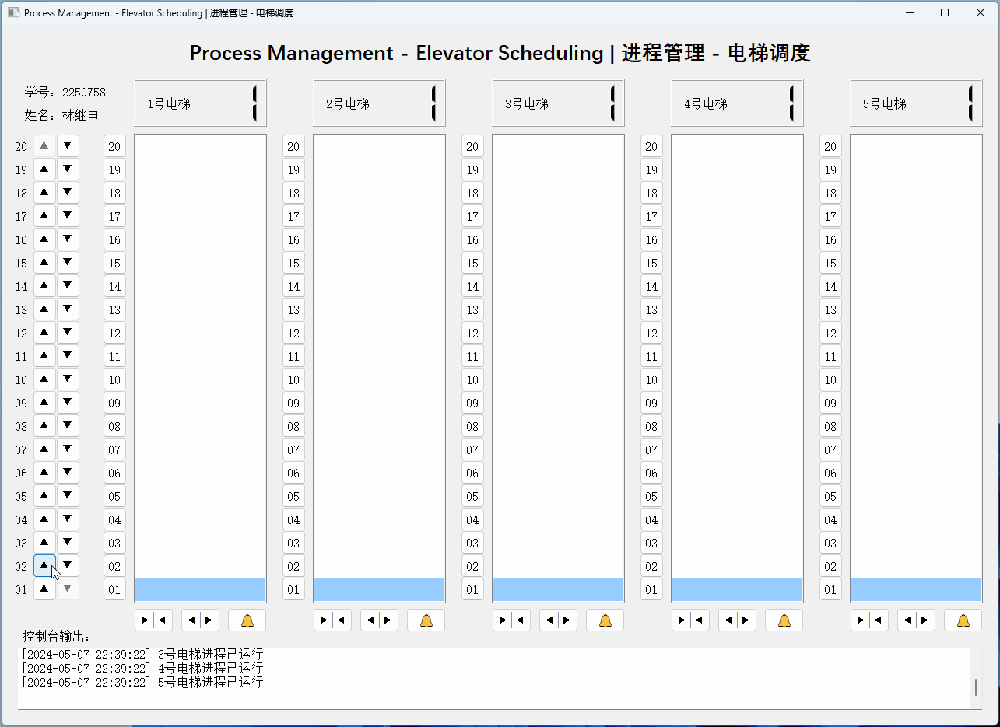

# Operating System Course Assignments

A collection of my operating system course assignments.

2024年同济大学操作系统课程作业合集。

> ***Relevant course***
> * Operating System 2024 (2024年同济大学操作系统)

## 仓库组成

* [File Management](File_Management)
文件管理项目：虚拟文件系统管理器

* [Memory Management](Memory_Management)
内存管理项目：动态分区分配方式模拟和请求分页分配方式模拟

* [Process Management](Process_Management)
进程管理项目：电梯调度

## 项目展示

### 文件管理项目：虚拟文件系统管理器

### 内存管理项目：动态分区分配方式模拟和请求分页分配方式模拟

### 进程管理项目：电梯调度

## 相关仓库

* [Minmus Operating System in Rust](https://github.com/MinmusLin/Minmus_Operating_System_in_Rust)
MinmusOS：基于 Rust 语言的操作系统的设计与实现

## 免责声明

The code and materials contained in this repository are intended for personal learning and research purposes only and may not be used for any commercial purposes. Other users who download or refer to the content of this repository must strictly adhere to the **principles of academic integrity** and must not use these materials for any form of homework submission or other actions that may violate academic honesty. I am not responsible for any direct or indirect consequences arising from the improper use of the contents of this repository. Please ensure that your actions comply with the regulations of your school or institution, as well as applicable laws and regulations, before using this content. If you have any questions, please contact me via [email](mailto:minmuslin@outlook.com).

本仓库包含的代码和资料仅用于个人学习和研究目的，不得用于任何商业用途。请其他用户在下载或参考本仓库内容时，严格遵守**学术诚信原则**，不得将这些资料用于任何形式的作业提交或其他可能违反学术诚信的行为。本人对因不恰当使用仓库内容导致的任何直接或间接后果不承担责任。请在使用前务必确保您的行为符合所在学校或机构的规定，以及适用的法律法规。如有任何问题，请通过[电子邮件](mailto:minmuslin@outlook.com)与我联系。

## 文档更新日期

2024年9月23日
